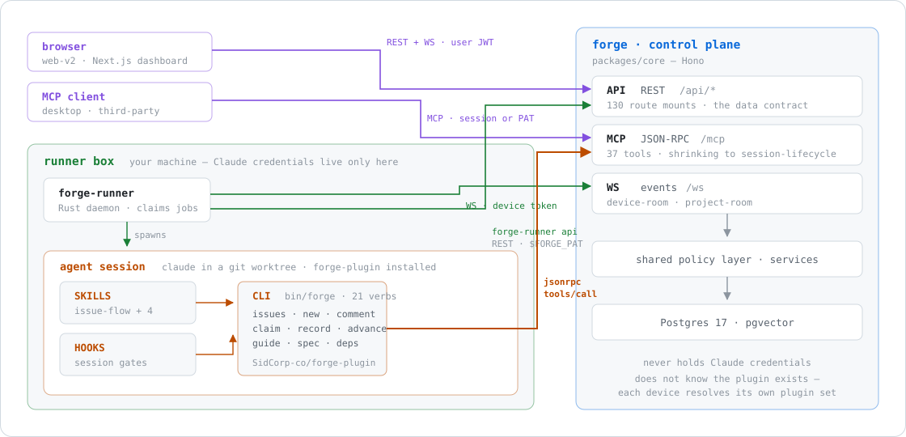

# Forge

> Open-source control plane for Claude Code. Your devices run `claude`; Forge routes the work,
> gates it, and keeps the receipts. **The server never holds your Claude credentials.**

[](https://github.com/SidCorp-co/forge/actions/workflows/ci.yml)
[](LICENSE)
[]()

**Status:** alpha. Breaking changes across `v0.x`.

## Architecture



Three boundaries hold the shape:

- **Control plane vs. runtime.** The server queues jobs and streams events; your machines run
  Claude. A server compromise leaks no Claude credentials — they never leave your box.
- **Two principals, one policy layer.** A user (JWT) and a device (long-lived, revocable) are
  separate principals; every access goes through the same checks.
- **Core does not know the plugin exists.** A project *designates* plugins; each device resolves
  its own set and installs them. Nothing in this repo can gate that one —
  [`SidCorp-co/forge-plugin`](https://github.com/SidCorp-co/forge-plugin) ships the CLI, the
  session hooks and the driver skill on its own clock.

### The plugin boundary, close up

The driver skill, the `forge` CLI and the session hooks live in a second repository on its own
clock. The CLI is not `forge-runner` — it carries its own HTTP client and its own declared route
table, and reaches REST with a Bearer PAT. This is the surface those three reach core through, the
one thing in it that carries a version, and the place an agent can pick the wrong tool:


The agent's surface, the data plane and where both are going: [`docs/proposals/destination/`](docs/proposals/destination/) — one set, measured, with its own coverage stated.

## Quickstart

```bash
git clone https://github.com/SidCorp-co/forge.git && cd forge
cp .env.example .env
docker compose up -d
```

API <http://localhost:8080> · dashboard <http://localhost:3000>. Then pair a device:
`curl <core-url>/install.sh | sh` and `forge-runner login --code <code>`.

Full walkthrough: [docs/quickstart.md](docs/quickstart.md).

## Packages

| Package | Role |
|---|---|
| [`packages/core/`](packages/core/) | Control plane — Hono, Drizzle, pg-boss, WebSocket, MCP |
| [`packages/web-v2/`](packages/web-v2/) | Next.js dashboard — kanban, replay, pipeline health, devices |
| [`packages/runner/`](packages/runner/) | `forge-runner` — the Rust device agent |
| [`packages/contracts/`](packages/contracts/) | Types and registries shared across apps |

## Documentation

[Vision](docs/VISION.md) · [Quickstart](docs/quickstart.md) ·
[Architecture](docs/proposals/destination/) · [Modules](docs/modules/) ·
[RFCs](docs/rfcs/) · [Proposals](docs/proposals/) · [Changelog](CHANGELOG.md)

## Contributing

[CONTRIBUTING.md](CONTRIBUTING.md). Trunk-based: one `main`, branches under a day, feature flags
absorb what is in flight. Significant changes need an [RFC](docs/rfcs/).

Security vulnerabilities: **never a public issue** — use
[private reporting](https://github.com/SidCorp-co/forge/security/advisories/new).

## License

[Apache-2.0](LICENSE) © Forge contributors.
