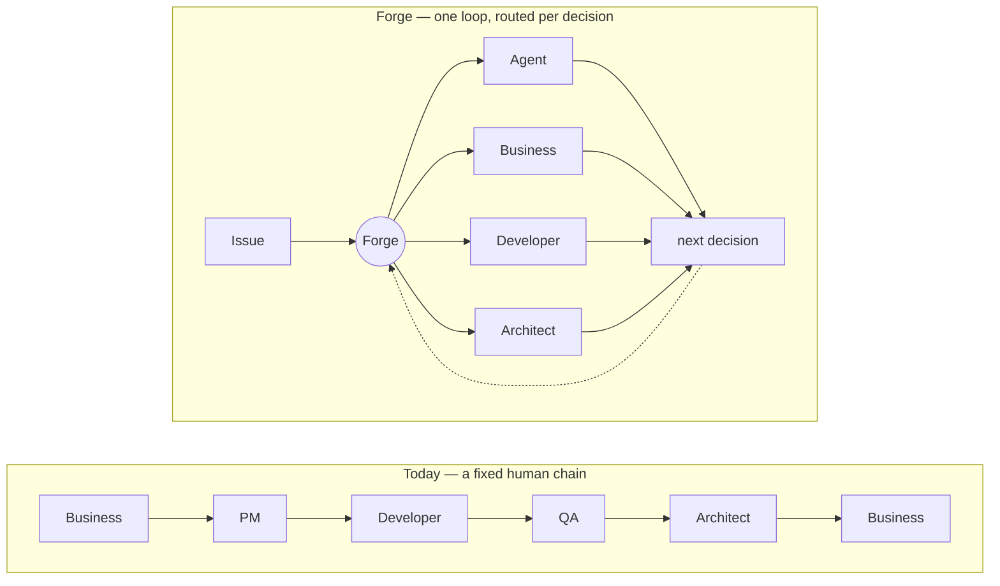

# Forge — Vision

> **Single source of truth for intent.** README, landing, GitHub description and product messaging
> derive from §1; on contradiction, this document wins — update the others.
>
> **Intent only.** No architecture, no components, no package names, no versions, no roadmap, no
> current implementation status, no metric formulas — every one of those changes on its own clock
> and has its own home. A change of direction edits THIS doc first, then its dependents, then
> project memory.
>
> **Cite principles by name, never by number** — `VISION: state-never-lies`, not `VISION №10`.
> The numbers below are reading order and will move; the names are the identifiers and will not.

---

## 1. What Forge is

**An open-source control plane for the software lifecycle — agents and humans working one
accountable loop, on infrastructure the team controls.**

An issue enters the right pipeline, agents execute wherever automation is safe, skills and project
memory supply the context, evidence proves what happened, and the next decision reaches the
participant with the judgment and the authority to make it.

Forge does not remove humans from the loop. **It removes unnecessary human work and human
bottlenecks.**

### North star

> **A team that truly understands its projects operates N of them through agents — watching and
> deciding, not doing what agents can safely do.**

The qualifier is **understanding + engagement**, not seniority or headcount. A developer's highest
contribution is architecture, judgment, risk, complex debugging, and deciding when an agent must not
proceed — not typing every change. A business user should create issues, clarify requirements and
make product decisions without depending on a developer for each step.

### The loop

**Issue → Pipeline → Skills + Memory → Agent/Human → Evidence → State → Outcome → Memory → next
issue**

Forge is not a pipeline engine, an agent runner, a memory store or a dashboard in isolation. **The
lifecycle makes skills and memory part of execution rather than optional context.** Evidence makes
state trustworthy. Outcomes feed the next run. The dashboard exists for **control** — see, audit,
intervene, know when a human must join. Speed is a side effect.

### The leverage

Software organizations scale by adding people because human attention is required at every stage.
Forge changes the unit economics — from **more projects → more handoffs → more people** to **more
projects → more agents → humans concentrated on judgment**. The organization does not become
humanless; it becomes **less bottlenecked by human execution and coordination**.

> **Agents execute. Humans decide. Forge makes sure the right one is involved at the right time.**

Every product decision should strengthen the ability to operate more software with less unnecessary
human work, while preserving correctness, accountability, and trust.

---

## 2. Why

Existing tools cover slices. AI coding tools optimize individual execution. PM tools track issues
without orchestrating. Monitoring detects without remediating. Agent frameworks give building
blocks, not a trusted operating model. Humans move context, decisions and work between them by hand
— and as project count grows, that coordination becomes the bottleneck.

Forge exists to answer, continuously: what needs to happen · which pipeline handles it · can an
agent safely execute it · what context does it need · what evidence is required · does this decision
need a human · who has the authority and expertise to decide · can the lifecycle continue
automatically afterwards.

**Sequential handoffs become context-aware routing.**

The vocabulary is older than the agents: **human task · candidate group · claim · skill-based
routing · maker-checker · escalation**. Workflow and ITSM systems have assigned work by role and
authority for years. What is new is that most of the work on the other side of the routing decision
is now done by an agent, and the same lifecycle must hold both.

---

## 3. Who

**For:** teams delivering client software · internal product and engineering teams · organizations
operating multiple projects · business users evolving product capabilities · developers and
architects who want their time on judgment · privacy-bound teams that must keep execution
credentials on their own infrastructure.

**Not for:** teams without a supported local agent runtime · chat-UI-first users wanting an
assistant rather than a lifecycle system · enterprises expecting SSO/SOC2 maturity today · teams
wanting another ticket tracker.

Autonomy does not mean "humans are removed" — different work needs different participants, and the
goal is never to eliminate a role. It is that **each role spends its time where its judgment has the
highest leverage.**

| Participant | Owns |
|---|---|
| **Agents** | work that can be safely delegated |
| **Developers / architects** | technical judgment, architecture, risk, complex debugging, constraints, decisions where wrong automation is costly |
| **Business / product** | intent, requirements, business logic, prioritization, acceptance |

---

## 4. Principles

Grouped for recall. The **bold name** is the identifier — cite it, not the number.

### Custody and trust

1. **server-never-holds-credentials** — execution credentials stay on infrastructure the team
   controls. What matters is custody, not where a machine physically sits. Forge orchestrates; it
   never becomes your model provider.
2. **trust-over-features** — correctness, recoverability, state integrity and safe operation
   outrank feature breadth.
3. **state-never-lies** — no state transition without evidence; no failure that isn't observable.
   A silent wedge, false failure, phantom advance, fabricated evidence, plan-less approval or
   unescalated stuck state is a kernel bug. Forge must always distinguish what happened · what was
   verified · what failed · what may retry · what needs quarantine · what needs human judgment.
4. **kernel-hard-policy-soft** — mechanism and policy are separated. The kernel owns strict
   invariants (job · session · run · state · evidence · transition · retry · failure · escalation)
   and guarantees safety; policy stays soft (pipeline · skills · prompts · project config · gates ·
   routing) so projects control behaviour.

### The unit of work

5. **lifecycle-is-the-unit** — not the commit. A commit is an artifact inside **intent → issue →
   execution → verification → deployment → operation → maintenance**.
6. **issue-is-the-currency** — every decision, execution, evidence and outcome traces to an issue.
   No important work depends on chat folklore.
7. **pipelines-configurable-not-prescribed** — Forge provides lifecycle primitives and guarantees;
   projects define policy.
8. **memory-must-be-trustworthy** — memory is part of the lifecycle's learning loop, not passive
   storage. Its provenance, correctness, relevance and lifecycle are core system concerns.

### Who acts

9. **agents-and-humans-share-the-lifecycle** — not separate workflows. The system decides who acts
    next by capability, context and authority.
10. **route-judgment-not-bottlenecks** — not approval everywhere, not involvement nowhere: **the
    right human, at the right decision, with the right context, at the right time.**
11. **measured-together-never-apart** — a single operating number is a number that can be gamed.
    Driving interventions toward zero by no longer surfacing what needs one is `state-never-lies`
    wearing an improving metric. No number is read alone.
12. **trust-gates-capability** — new capability ships only when the lifecycle it runs on is
    trustworthy. Reach is earned by the kernel, not scheduled.

---

## 5. Boundaries

What Forge will not become, regardless of demand:

- **Not a coding-agent replacement.** Forge orchestrates agents; it does not reimplement them.
- **Not a chat UI.** The primary surface is a lifecycle a team can audit, not a conversation.
- **Not a model provider, and never a holder of model credentials.** This one is load-bearing:
  the whole custody argument collapses if it is ever traded away for convenience.
- **Not a ticket tracker with automation bolted on**, and not an agent-framework abstraction layer.
- **Not multi-tenant SaaS in core** — one instance, one tenant.
- **Not an enterprise governance suite.** Organization and project roles exist because the lifecycle
  needs them; SSO and audit-grade permissioning are a different product.
- **Not an attempt to automate every decision**, and never a design in which developers disappear.

**Apache-2.0 core.** The core stays Apache-2.0 and self-hostable; commercial work lives in separate
repositories.

**Direction, not yet reached.** Routing by expertise and authority is the destination this document
describes, and `route-judgment-not-bottlenecks` is the commitment to it. What is built today, and
what is next, belong to the [roadmap](../README.md#roadmap) and the issue tracker — never here.
