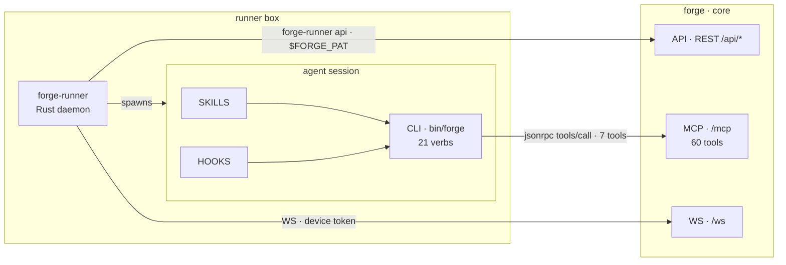
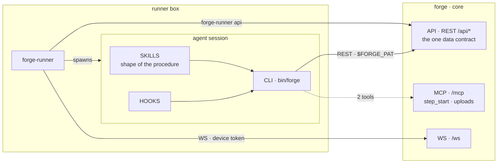

# The agent's surface: two CLIs, one shrinking MCP

How an agent reaches core, which CLI belongs to whom, and which MCP tools survive.
**Verified against the tree 2026-09-06.**

## Today

Two command-line surfaces reach the same data plane:

| | Built in | Transport | For |
|---|---|---|---|
| `forge-runner api` | this repo | REST, `$FORGE_PAT` | **the runner's own work.** It must never depend on the plugin — a daemon that cannot reach core until a Claude Code plugin is installed is a worse daemon |
| `forge` | [forge-plugin](https://github.com/SidCorp-co/forge-plugin) | MCP JSON-RPC | **the agent.** Skills call its verbs; it is the agent's whole surface |

Everything the plugin does goes through one function — `rpc("tools/call", …)` in
`src/tracker/rpc.mjs`. So MCP today is not a residue: **it is the plugin's spine.**

## Target

**One arrow changes port.** The CLI leaves `/mcp` for `/api`, and `/mcp` keeps only what cannot be
served to a shell, plus the clients that have no plugin — desktop chat and third parties.

Skills keep the **shape** of a procedure; core keeps each project's **answer** to it. Neither knows
the other's half, which is why a skill never names `runner-v*` or any project's command.

## Which tools stay

| Group | Tools | Why |
|---|---|---|
| **stay** | `forge_step_start`, `forge_uploads` | `step_start` opens the session every other call reports into and returns the issue body the runner did not inline; `uploads` returns an image content block, which a shell process cannot produce |
| **blocked on the plugin** | `forge_issues` `forge_comments` `forge_config` `forge_guide` `forge_knowledge` `forge_project_pm` `forge_projects.create` | the 7 the plugin CLI calls. Deleting one before the CLI moves breaks the CLI |
| **blocked on a credential decision** | ~20 taking device-token calls | 8 cron schedules. A schedule is not a job, so it can never hold a job PAT, and REST `requireAuth()` answers a device token 401 |
| **fenced by design** | `forge_orgs.list` `forge_orgs.members` `forge_collaborators` | they resolve no project, so a project-scoped PAT there is an account-scoped credential in disguise. Session only, on every transport |
| **free to go** | the rest | each has a REST twin — see [data-plane-surface.md](data-plane-surface.md) |

## The deletion rule, paid for once

A tool is clear to delete only when its **device count is 0** *and* the replacement route
**accepts a device token**.

Read `mcp_audit_log` split on `device_id IS NOT NULL` / `token_id IS NOT NULL` — never on
`user_id`, which is stamped `device.ownerId` and so reads 100% user and 0 device for every tool.
Count the whole table with no date filter, and normalise with `replace(tool,'.','_')`: agents send
the underscore form their MCP client shows them.

Commit `7f0c5a56` deleted six tools after claiming the audit log had cleared them. The split was on
the wrong column; the fleet hit one of them at 09:07 the same day and read `not_found`.

**The count is only readable with direct database access.** There is no aggregate route over
`mcp_audit_log` — the one route that reads the table at all is `GET /api/pat/:id/audit`, per-token
and last-N rows, and `/api/pat` is off `PAT_ALLOWED_PREFIXES` for the reason the fence section of
[data-plane-surface.md](data-plane-surface.md) gives. So an agent session on a runner box cannot
satisfy this rule and must not delete on an estimate; whether the fence should grow a read-only
aggregate is undecided (`ISS-926`).

## Who delivers the target

| Half | Issue |
|---|---|
| the CLI moves to REST | `ISS-508` on the **forge-plugin** project — critical |
| the waves themselves, and the record of the ones already run | `ISS-894` here, at `draft` |
| the boundary is written down | `ISS-926` here |

The deletions wait on `ISS-508`. A dependency edge does not cross projects, so the ordering lives in
both bodies as prose.

`ISS-894` is at `draft`, which no list or pool view of this project shows; it is reachable by its
displayId. That is why `registered-tools.ts` cites this page alongside the number — a `draft` row
cited by number alone reads as a reference to nothing.
