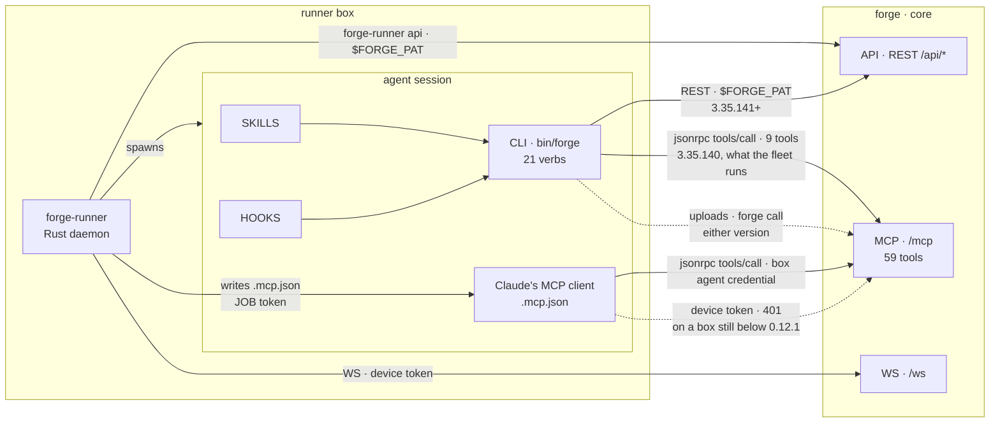
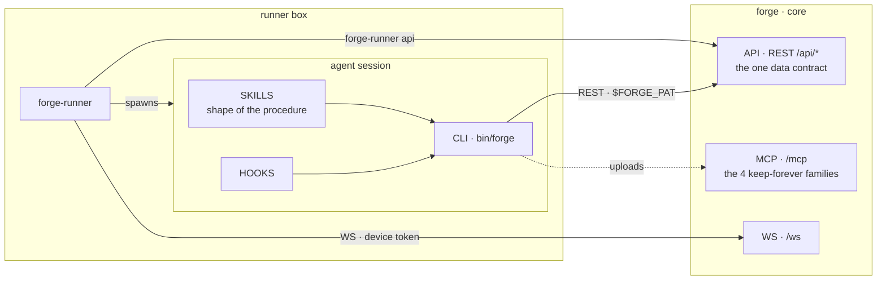

# The agent's surface: two CLIs, one shrinking MCP

How an agent reaches core, which CLI belongs to whom, and which MCP tools survive.
**Verified against the tree and the live tracker DB 2026-09-06, after `ISS-508`, `ISS-927` and
`ISS-931` all merged. The tool groups below were re-measured the same day against the
`forge-plugin` copy installed on a runner box — the fleet artifact, which this repo cannot see —
and three tools moved out of "free to go" as a result. The credential and fleet claims were
re-measured live 2026-09-08 against the deployed instance, from a dispatched job on `forge-vm`;
what moved is marked with that date.**

## Today

Two CLI arrows because two copies are live: the one `ISS-508` shipped and the one the boxes still
run. The nine tools the second arrow carries cannot go while it exists — that is the fleet-upgrade
row in the table below, drawn rather than only stated. **That arrow survives `ISS-931`**: the CLI
authenticates with a `forge_pat_*`, not a device token, so `requirePat` accepts it. The dashed
device arrow is the other population, and it is the one that has started to empty: `runner-v0.12.1`
carries the per-job `.mcp.json` write, and a box on it puts a `forge_pat_*` in each one — measured
on `forge-vm` 2026-09-08. Since ISS-932 wave 4 that PAT is the BOX's own agent credential rather
than one minted per job; the arrow and the tag are unchanged. A box still below that tag keeps 401ing.

Two command-line surfaces reach the same data plane:

| | Built in | Transport | For |
|---|---|---|---|
| `forge-runner api` | this repo | REST, `$FORGE_PAT` | **the runner's own work.** It must never depend on the plugin — a daemon that cannot reach core until a Claude Code plugin is installed is a worse daemon |
| `forge` | [forge-plugin](https://github.com/SidCorp-co/forge-plugin) | REST, `$FORGE_PAT` | **the agent.** Skills call its verbs; it is the agent's whole surface |

The plugin was the spine until `ISS-508` closed on 2026-09-06: every `forge` verb now goes to a
path under `/api`, keyed by a declared route table in `src/tracker/rest.mjs`, except what goes
through `forge_uploads` — which stays on `/mcp` by design, not by lag. **The fleet has not caught up** — the copy installed on `forge-vm` is
3.35.140 and still carries `src/tracker/rpc.mjs`, so what that copy names is held by a version
upgrade, not by a decision — nine wrapped verbs, plus whatever reaches `/mcp` through its
`forge call` passthrough.

**No device authenticates `/mcp` any more.** `requirePat` takes one species — `forge_pat_*` — and
refuses every other bearer with a 401 naming the class and the remedy
(`packages/core/src/middleware/require-pat.ts`). `forge-runner` writes each job's `.mcp.json` with
that job's own token, the same credential the spawn exports as `$FORGE_PAT`
(`packages/runner/crates/forge-runner-core/src/mcp/config.rs`). ISS-932 then removed the device
token itself: `/ws` and the REST routes behind `requireDevice` — chiefly the pool a master claims
from — now take an ordinary PAT or AAT whose `device_id` names the box, so there is one credential
species on every surface and no second verifier left to fall back to.

**So "no device authenticates `/mcp`" is now a statement about scope, not about the transport.**
Since `ISS-932` a paired box holds an ordinary PAT named `device:<deviceId>`, and `requirePat`
accepts it — measured 2026-09-08, `forge_health` answers 200 on `forge-vm`'s own credential. What
it cannot do is reach a project: that token is bound to none, `forge_projects.list` returns `[]` on
it, and every project-scoped tool answers `NOT_FOUND`. The 401 naming the credential class is what
a **pre-`ISS-932`** device token gets, and no such token verifies anywhere any more. A reader
checking that `/mcp` has no device branch should read `index.ts`'s `requirePat()` mount, not try to
present a box credential and expect a refusal.

**This ships on two clocks and the second one is a binary.** Core refuses the device at deploy; a
box only starts writing its agent credential when it installs a `forge-runner` that does. In between,
`claude`'s MCP client on an un-upgraded box gets 401 on every call, which is why the refusal says
*"needs a newer forge-runner binary"* rather than anything about PATs. The fleet when this landed:
three boxes, all `0.12.0`, all online; every other `devices` row `revoked`/`offline`. Device MCP
traffic in the 24h before: 1,565 calls against 82,722 on tokens.

**The second clock has started.** `runner-v0.12.1` (tagged `6de2d969`, 2026-09-07, on `main`) is
the release that carries the job-token write, and `forge-vm` is on it: the newest per-job
`.mcp.json` there carries a `forge_pat_*` that is the job's own token, and every tool on it
resolves that job. Measured 2026-09-08 on that one box only — this repo cannot enumerate the fleet's
binary versions, so a per-box check is the only honest form this claim has.

Two reachability changes come with it, and neither is a bug to file:

- **Admin-gated tools need the `admin` scope, which no machine token carries.** A paired device had
  no scopes at all, so `assertPrincipalIsAdmin`'s scope half was skipped for it and only the
  project role was asked. A box's agent credential is minted `['read','write']`
  (`devices/credential.ts`), so `forge_skills.register` /
  `.create` / `.update` / `.delete` / `.adopt` / `.push`, `forge_runners` register / retire /
  update_capabilities, `forge_config action=update`, `forge_schedules` create / update / delete /
  run and `forge_reconcile` now answer `FORBIDDEN: this token lacks the admin scope` to a pipeline
  agent. That traffic was operator-shaped and mostly dormant (`forge_skills.register` last
  2026-08-07, `.adopt` 08-09, `runners register` 08-12, `reconcile` 08-10); `forge_config
  action=update` and `forge_skills.update` were live, and both already had succeeding token
  callers. An operator who wants one of these from an agent mints a PAT with `admin` and sets it as
  the box's `$FORGE_PAT` — deliberately an operator decision, because the alternative is ambient
  admin authority, which is what `ISS-927` removed from REST.
- **A non-member now reads as not-found, not forbidden.** `assertDeviceOwnerIsMember` answered
  `FORBIDDEN: device owner is not a member`; `assertPrincipalIsMember` answers
  `NOT_FOUND: project not found or not accessible`, the existence-hiding semantics the rest of the
  surface already used. Fourteen tools moved onto it, and the move also closed what `ISS-150`'s
  review called blocker #1: the device helpers read only `ownerId`, so those fourteen never
  consulted the token's `projectIds` allowlist.

## Target

**One arrow changes port.** The CLI leaves `/mcp` for `/api`, and `/mcp` keeps only what cannot be
served to a shell, plus the clients that have no plugin — desktop chat and third parties.

Skills keep the **shape** of a procedure; core keeps each project's **answer** to it. Neither knows
the other's half, which is why a skill never names `runner-v*` or any project's command.

## Which tools stay

| Group | Tools | Why |
|---|---|---|
| **stay** | `forge_step_start`, `forge_phase`, `forge_step_handoff.*`, `forge_uploads` | the four families `ISS-931` rule 2 names, asserted by `packages/core/src/mcp/keep-forever-tools.test.ts`. `step_start` opens the session every other call reports into and returns the issue body the runner did not inline; `uploads` returns an image content block, which a shell process cannot produce; `phase` and `step_handoff.*` are session-lifecycle hooks, not data queries. **All four have REST twins, so the twin test does not protect them — this row does.** The wave-3 pass surfaced `forge_step_handoff.delete` as a device-free candidate on exactly that reasoning |
| **blocked on a fleet upgrade** | wrapped verbs: `forge_issues` `forge_comments` `forge_config` `forge_guide` `forge_knowledge` `forge_memory.search` `forge_project_pm` `forge_projects.get` `forge_projects.list` · reached through `forge call`: `forge_memory.write` `forge_memory.feedback` | what the installed plugin CLI names — counted by grepping the artifact, not this repo, because this repo cannot see it. That CLI has moved to `/api`; the copies on the boxes have not. **This CLI holds a PAT, so `ISS-931` did not take its access away** — its calls are ordinary `token_id` traffic. The second group is not hard-coded anywhere: `forge call <tool>` is a raw `tools/call` passthrough, and the CLI's own guide text tells agents to reach the memory verbs through it (`src/guides/guides.mjs`) |
| **paused, not cleared** | ~20 that took device-token calls | `ISS-931` made `/mcp` refuse a device and `mcp/config.rs` write a credential `/mcp` accepts, so `mcp/server.ts` stamps `device_id` NULL on every new row. That did NOT retire these callers: it 401s them until their box installs a `runner-v*` that writes one, at which point **the same sessions return, calling the same tools, on a PAT**. A non-zero device count is therefore a forecast, not history — read the rule below. `runner-v0.12.1` is that release and `forge-vm` is on it as of 2026-09-08, so the return has begun and this row is now discharged **per tool by reappearing `token_id` traffic**, never by the tag existing |
| **fenced by design** | `forge_orgs.list` `forge_orgs.members` `forge_collaborators` | they resolve no project, so a project-scoped PAT there is an account-scoped credential in disguise. Session only, on every transport |
| **free to go** | the rest, and only after all three rows above are checked against it | each has a REST twin — see [data-plane-surface.md](data-plane-surface.md). A REST twin is necessary and not sufficient, and this row has been wrong three times for that reason: `forge_memory.search`, `forge_projects.get` and `forge_projects.list` all sat here with twins while the fleet's CLI called the tool and not the route |

## The deletion rule, paid for once

A tool is clear to delete only when **no caller loses it** — including the callers that are
currently refused and are coming back. `ISS-931` did not reduce the caller set; it split it into
three, and each has its own end condition.

1. **The paused device population.** ~20 tools took device-token calls. `requirePat` now 401s
   those boxes on every `/mcp` call, so their counts stopped rising — but the sessions behind them
   have not gone anywhere. A box installs a `runner-v*` that writes its agent credential and the same
   Claude MCP client resumes, calling the same tools off the same tool list, on a `forge_pat_*`.
   **So a non-zero device count is a forecast of returning traffic, not a record of dead traffic**,
   and it stays a refusal. It is discharged for a tool when that traffic has actually reappeared as
   `token_id` rows and can be judged on its merits — never by the count merely ceasing to grow.
2. **The fleet's `forge` CLI.** It holds a PAT, so `ISS-931` left its access untouched and its
   calls are indistinguishable from any other token traffic. Two channels, and the second is why a
   grep for hard-coded tool names is not sufficient on its own: the wrapped verbs in the row above,
   and `forge call <tool>`, a raw `tools/call` passthrough whose whole purpose is the tools no verb
   wraps. `ISS-508` moved the wrapped verbs to `/api`; whether it also retired the passthrough is
   not knowable from this repo, and guessing is what the forge-plugin carve-out exists to prevent.
   The observable half: the installed copy at
   `~/.config/forge-runner/marketplaces/sidcorp-co__forge-plugin/plugin` is 3.35.140 and carries
   `src/tracker/rpc.mjs` with no `src/tracker/rest.mjs`. `rest.mjs` present on every box discharges
   the **wrapped verbs**; the `forge call` targets need the newer CLI read, not a filesystem check.
3. **Everything else on a token.** `token_id IS NOT NULL` rows, `skills.skill_md` on the live
   instance, and the runner's own bundled text — the orientation
   `packages/runner/crates/forge-runner-core/src/workspace/orientation.rs` writes into every
   workspace names `forge_memory_search` and `forge_memory_write` by hand, and no audit query would
   have told you that.

A tool with a caller in any of the three is refused **by name**. It is not deleted behind a widened
filter, and the caller is not left to find out as `not_found`.

**Rules 1 and 2 are static evidence, and static evidence can never be sufficient here.** `forge call
<tool>` takes a tool name as an ARGUMENT, so any registered tool can be invoked without its name
appearing in any source, artifact or import graph anywhere. `forge_memory.write` and
`forge_memory.feedback` are the proof: zero hard-coded references in the installed plugin, and the
CLI's own guide text routes agents to both through the passthrough. A grep that comes back empty
therefore means *"no static reference"*, never *"no caller"* — including for the tools this page has
already cleared.

So rule 3 is not one input among three; **it is the only one that can settle the question**, and
`mcp_audit_log` is the only place that holds it. `mcp/server.ts` stamps `tool: request.params.name`
on every `tools/call` before dispatch — including calls to names it does not recognise, which land
as `not_found` rows — so a passthrough call is recorded exactly like a wrapped one. That is the
evidence rules 1 and 2 cannot supply. It was, until `ISS-946`, evidence no surface exposed at all;
`GET /api/admin/mcp-audit/tools` now answers it, and the section below says why that route is
admin-only and what it therefore costs. No tool reachable through `forge call` is *proven* safe to
delete on greps alone, whatever they say — the clearance comes off that route or the deletion does
not happen.

**What `ISS-931` did change is the credential the replacement must accept.** The old rule asked for
a route that accepts a *device token*. Every caller that returns holds a `forge_pat_*` instead, so
that is the test now. `/api/skill-facts` is where the clause was bought and it still reads
correctly under the new credential: `forge_skill_facts.get` had 23 **device** calls and
`requireAuth()` refuses a *device*, so the route was nowhere those callers could go. It does accept
a PAT, and is on `PAT_ALLOWED_PREFIXES` — which is exactly the point. Check which species the
callers hold and which the middleware admits, not whether a route is mounted.

**The device counts are frozen, and that is the pruner's doing rather than `ISS-931`'s.** They
could not fall before either: the table declares 90-day retention and nothing calls
`enforceMcpAuditRetention`. Wiring it would drain every device count to zero within 90 days of the
last device call — and that must not be read as clearing 20 tools at once, because rule 1 above is
about callers who return, not about rows that expire. Whoever wires the pruner rewrites rule 1 in
the same commit, or the drain silently licenses the deletions it was never evidence for.

**The zero-rows amnesty survives, unchanged and still priced.** A tool at zero rows lifetime under
both spellings has nobody to strand and nobody to come back, so it needs no reachable replacement.
It is available exactly once per tool, buys nothing for any tool with traffic, and
`forge_memory.revisions` was deleted under it on 2026-09-06. If a caller for such a tool ever
appears in `mcp_audit_log` after a deletion taken this way, the reading was wrong and the tool
comes back.

**"Whole table" is a lifetime count only while the pruner stays unwired.** `mcp_audit_log` declares
90-day retention — `drizzle/migrations/0063_mcp_audit_log.sql` says so and
`auth/mcp-audit.ts:enforceMcpAuditRetention` implements it — and **nothing calls that function**.
So today a zero really does mean "never called". Wire it to a tick and the same query answers
"not called in 90 days", which would license deleting a quarterly-called tool with nothing going
red: the `7f0c5a56` shape again, arriving through the measurement rather than the column. Whoever
wires the pruner rewrites this paragraph in the same commit. Until then, read that function before
spending a zero, and note that `forge_memory.revisions` — added `f568c503` on 2026-09-05, deleted
the next day — is a zero under any retention, so it did not test this clause.

Read `mcp_audit_log` split on `device_id IS NOT NULL` / `token_id IS NOT NULL` — never on
`user_id`, which is stamped `device.ownerId` and so reads 100% user and 0 device for every tool.
Count the whole table with no date filter, and normalise with `replace(tool,'.','_')`: agents send
the underscore form their MCP client shows them.

**LEFT join the registry onto the aggregate.** A tool nothing has ever called has no row in
`mcp_audit_log` at all, so an inner join silently drops exactly the tools this rule exists to
find. The wave-3 pass reported one device-free tool and named `forge_step_handoff.delete`, which
is on the keep-forever list, and read that as "no candidates"; `forge_memory.revisions` was
sitting at zero rows lifetime and was invisible to the query. It was deleted 2026-09-06.

Commit `7f0c5a56` deleted six tools after claiming the audit log had cleared them. The split was on
the wrong column; the fleet hit one of them at 09:07 the same day and read `not_found`.

**A deletion shifts every `tools/list` index below it, and three `cm:guard`s in `server.ts` say
callers pin to that order.** Those guards govern *insertion* — they exist so a new tool is appended
rather than spliced in. Deletion cannot honour them: there is no position that leaves the tail where
it was. The shrink this page describes is a sequence of deletions, so the pinning premise cannot
survive it, and a deletion is the caller-visible change an insertion was written to avoid. Say so in
the commit that takes one out, and treat a caller that pins by index as already broken.

**The count is readable, and not by the agent that needs it. `GET /api/admin/mcp-audit/tools`
answers rule 3, behind `requireAdmin`, and that is `ISS-946`'s answer.** It returns one row per
tool — `deviceCalls`, `tokenCalls`, `unattributedCalls`, `notFoundCalls`, `totalCalls`,
`firstSeen`, `lastSeen` — over the whole table with no date filter, spelling normalised on both
sides, and the registry FULL OUTER joined to the aggregate so a never-called tool comes back at
zero and a *called but unregistered* name comes back too. It carries no request bodies, no ips and
no payload digests: the deletion rule needs counts, and nothing here is shaped to answer any other
question.

**`ISS-946` offered three roads and the fence closed the one that would have been convenient.** A
cross-project aggregate inside `PAT_ALLOWED_PREFIXES` was not rejected as risky, it is excluded by
what the fence *is*: a resource in `auth/pat-permissions.ts` may cover a prefix only when the route resolves a project
for the scope to bite on, and a tool's callers span every project on the instance. That is the
`/api/me/ops-health` shape exactly. **And a project-scoped twin is worse than no route at all** —
a tool at zero calls in this project and four hundred in the next would read CLEAR, which is not a
smaller version of the evidence but the `7f0c5a56` substitution with a fresh coat on it. It is
refused by name here so nobody builds it as a courtesy later.

**So the rule is two-party from here, and that is the price `ISS-946` paid rather than a shortfall
it left.** An agent on a runner box gathers the *refusals* — rules 1 and 2, the static half, which
is what caught `forge_memory.search`, `forge_projects.get` and `forge_projects.list`, all three of
which the "free to go" row had held. It cannot gather the *clearance*, and it must still not
delete on an estimate. A human with admin runs this route and puts the numbers on the issue, where
the next reader can check them; what changed is that the number is now reproducible from a named
route instead of requiring a psql session and a hand-written query nobody reviewed. The third
option `ISS-946` listed — gate deletions on something an agent *can* read — stays closed for the
reason the section above gives: `forge call <tool>` makes static evidence insufficient for every
tool, so there is nothing greppable to promote into a clearance.

`enforceMcpAuditRetention` is still unwired, so these are lifetime counts — and the route does not
merely assert that. It returns `oldestRow`, the oldest row in the table, so a reader sees the
window instead of trusting this paragraph. Wire the pruner and that field starts reading ~90 days
back, which is the signal that this page's rule 1 and the "whole table" clause both need rewriting
in that same commit.

## Who delivers the target

| Half | Issue | Where it stands |
|---|---|---|
| the CLI moves to REST | `ISS-508` on the **forge-plugin** project | closed, merged 2026-09-06T14:13Z — the boxes still run the old copy |
| one credential form for the API | `ISS-927` here | closed, merged `3291d537` |
| the runner stops handing sessions a device token | `ISS-931` here | closed, merged — `requirePat` on `/mcp` + a `/mcp`-accepted credential in `mcp/config.rs`. The `runner-v*` release it needed is `runner-v0.12.1`; `forge-vm` runs it and writes one, verified 2026-09-08 |
| the device token stops existing at all | `ISS-932` here | all four waves landed. Waves 1-3: `users.kind` + the AAT, pairing issues a PAT/AAT, `verifyDeviceToken` deleted and `devices.token_hash`/`token_prefix` dropped. Wave 4 deleted the per-job and per-session credentials with the whole token-NAME family, so `agency` is `users.kind === 'agent'` and a box holds exactly one credential |
| the waves themselves, and the record of the ones already run | `ISS-894` here | unblocked — every `blocks` edge on it is merged. Wave 4 reads the deletion rule above, and what it waits on is the fleet-upgrade row, not an issue |
| the boundary is written down | `ISS-926` here | closed, merged 2026-09-06T07:46Z |
| the rule becomes evaluable at all | `ISS-946` here | answered — `GET /api/admin/mcp-audit/tools` aggregates the whole table. NOT by the thing that runs it: the counts are cross-project, so the route is admin-only and the rule is two-party by design, not by omission |

A dependency edge does not cross projects, so `ISS-508`'s ordering lived in both bodies as prose;
it is discharged, and so is `ISS-931`'s edge. What the remaining deletions wait on is no longer an
issue at all — it is a version on the boxes, which is why the end state above is written as a file
that has to appear rather than as a row that has to close.
