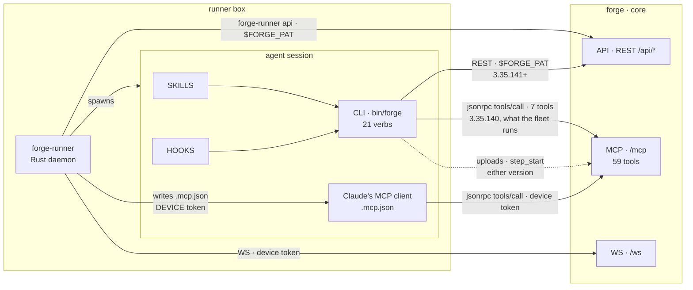
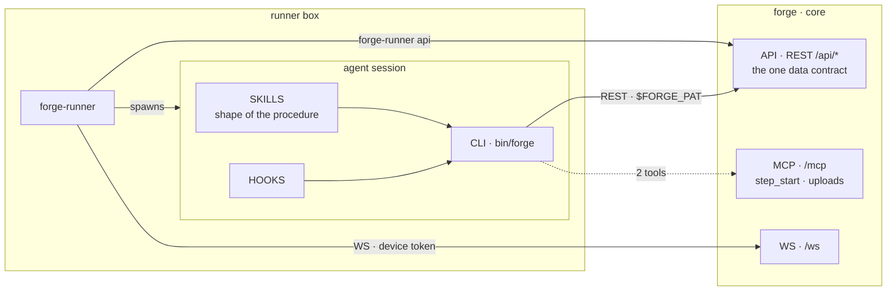

# The agent's surface: two CLIs, one shrinking MCP

How an agent reaches core, which CLI belongs to whom, and which MCP tools survive.
**Verified against the tree and the live tracker DB 2026-09-06, after `ISS-508` and `ISS-927`
both merged.**

## Today

Two CLI arrows because two copies are live: the one `ISS-508` shipped and the one the boxes still
run. The seven families cannot go while the second arrow exists — that is the fleet-upgrade row in
the table below, drawn rather than only stated.

Two command-line surfaces reach the same data plane:

| | Built in | Transport | For |
|---|---|---|---|
| `forge-runner api` | this repo | REST, `$FORGE_PAT` | **the runner's own work.** It must never depend on the plugin — a daemon that cannot reach core until a Claude Code plugin is installed is a worse daemon |
| `forge` | [forge-plugin](https://github.com/SidCorp-co/forge-plugin) | REST, `$FORGE_PAT` | **the agent.** Skills call its verbs; it is the agent's whole surface |

The plugin was the spine until `ISS-508` closed on 2026-09-06: every `forge` verb now goes to a
path under `/api`, keyed by a declared route table in `src/tracker/rest.mjs`, except the two that
route through `forge_uploads` and `forge_step_start` — which stay on `/mcp` by design, not by lag. **The fleet has not caught up** — the copy installed on `forge-vm` is
3.35.140 and still carries `src/tracker/rpc.mjs`, so the seven families that copy names are held
by a version upgrade, not by a decision.

**The caller that now holds the surface open is not a CLI at all.** `forge-runner` writes each
job's `.mcp.json` with the **device token**
(`packages/runner/crates/forge-runner-core/src/mcp/config.rs`), so every agent session reaches
`/mcp` as a device and calls whatever the tool list shows it. Measured over the whole
`mcp_audit_log`: 55,643 device calls on `forge_issues`, 24,122 on `forge_comments`. That file,
not the plugin, is what the deletion rule below is waiting on.

## Target

**One arrow changes port.** The CLI leaves `/mcp` for `/api`, and `/mcp` keeps only what cannot be
served to a shell, plus the clients that have no plugin — desktop chat and third parties.

Skills keep the **shape** of a procedure; core keeps each project's **answer** to it. Neither knows
the other's half, which is why a skill never names `runner-v*` or any project's command.

## Which tools stay

| Group | Tools | Why |
|---|---|---|
| **stay** | `forge_step_start`, `forge_uploads` | `step_start` opens the session every other call reports into and returns the issue body the runner did not inline; `uploads` returns an image content block, which a shell process cannot produce |
| **blocked on a fleet upgrade** | `forge_issues` `forge_comments` `forge_config` `forge_guide` `forge_knowledge` `forge_project_pm` `forge_projects.create` | the 7 the pre-`ISS-508` plugin CLI calls. That CLI has moved to `/api`; the copies running on the boxes have not. Deleting one before the fleet upgrades breaks those copies |
| **blocked on the runner's `.mcp.json`** | ~20 taking device-token calls | the credential question is settled — `ISS-927` merged 2026-09-06, an unattended session mints a `session:<id>` PAT on `agent:start` and `requireAnyAuth`'s device branch is gone. What is left is mechanical: `/mcp` still accepts a device through `requirePatOrDevice`, and `mcp/config.rs` still writes the device token into every job's `.mcp.json`. Schedules, measured 2026-09-06: 16 rows, **0 enabled** |
| **fenced by design** | `forge_orgs.list` `forge_orgs.members` `forge_collaborators` | they resolve no project, so a project-scoped PAT there is an account-scoped credential in disguise. Session only, on every transport |
| **free to go** | the rest | each has a REST twin — see [data-plane-surface.md](data-plane-surface.md) |

## The deletion rule, paid for once

A tool is clear to delete only when its **device count is 0** *and* the replacement route
**accepts a device token**.

**The second clause protects a caller, so a tool with no callers at all does not need it.**
`/api/skill-facts` failed it and mattered: `forge_skill_facts.get` had 23 device calls, and
`requireAuth()` answers a device 401, so those callers had nowhere to go. A tool at **zero rows
lifetime** has nobody to strand, and demanding a device-reachable twin for it would freeze the
surface until `ISS-931` lands. So the clause is read as: *device count 0, and — if that count was
ever above 0 — a replacement the callers it had can actually reach.* `forge_memory.revisions` was
deleted 2026-09-06 under the second half of that reading; `GET /api/memory/revisions` is
`requireAuth()` and would refuse a device, which is the same shape `/api/skill-facts` had and is
only safe here because the count is zero rather than small. **This is an amnesty and it has a
price:** it is available exactly once per tool, on evidence of zero rows over the whole table under
both spellings, and it buys nothing for any tool with traffic.

**"Whole table" is a lifetime count only while the pruner stays unwired.** `mcp_audit_log` declares
90-day retention — `drizzle/migrations/0063_mcp_audit_log.sql` says so and
`auth/mcp-audit.ts:enforceMcpAuditRetention` implements it — and **nothing calls that function**.
So today a zero really does mean "never called". Wire it to a tick and the same query answers
"not called in 90 days", which would license deleting a quarterly-called tool with nothing going
red: the `7f0c5a56` shape again, arriving through the measurement rather than the column. Whoever
wires the pruner rewrites this paragraph in the same commit. Until then, read that function before
spending a zero, and note that `forge_memory.revisions` — added `f568c503` on 2026-09-05, deleted
the next day — is a zero under any retention, so it did not test this clause. If a device caller for such a tool
ever appears in `mcp_audit_log` after a deletion taken this way, the reading is wrong and the tool
comes back.

Read `mcp_audit_log` split on `device_id IS NOT NULL` / `token_id IS NOT NULL` — never on
`user_id`, which is stamped `device.ownerId` and so reads 100% user and 0 device for every tool.
Count the whole table with no date filter, and normalise with `replace(tool,'.','_')`: agents send
the underscore form their MCP client shows them.

**LEFT join the registry onto the aggregate.** A tool nothing has ever called has no row in
`mcp_audit_log` at all, so an inner join silently drops exactly the tools this rule exists to
find. The wave-3 pass reported one device-free tool and named `forge_step_handoff.delete`, which
is on the keep-forever list, and read that as "no candidates"; `forge_memory.revisions` was
sitting at zero rows lifetime and was invisible to the query. It was deleted 2026-09-06.

Commit `7f0c5a56` deleted six tools after claiming the audit log had cleared them. The split was on
the wrong column; the fleet hit one of them at 09:07 the same day and read `not_found`.

**A deletion shifts every `tools/list` index below it, and three `cm:guard`s in `server.ts` say
callers pin to that order.** Those guards govern *insertion* — they exist so a new tool is appended
rather than spliced in. Deletion cannot honour them: there is no position that leaves the tail where
it was. The shrink this page describes is a sequence of deletions, so the pinning premise cannot
survive it, and a deletion is the caller-visible change an insertion was written to avoid. Say so in
the commit that takes one out, and treat a caller that pins by index as already broken.

**The count is only readable with direct database access.** There is no aggregate route over
`mcp_audit_log` — the one route that reads the table at all is `GET /api/pat/:id/audit`, per-token
and last-N rows, and `/api/pat` is off `PAT_ALLOWED_PREFIXES` for the reason the fence section of
[data-plane-surface.md](data-plane-surface.md) gives. So an agent session on a runner box cannot
satisfy this rule and must not delete on an estimate; whether the fence should grow a read-only
aggregate is undecided (`ISS-926`).

## Who delivers the target

| Half | Issue | Where it stands |
|---|---|---|
| the CLI moves to REST | `ISS-508` on the **forge-plugin** project | closed, merged 2026-09-06T14:13Z — the boxes still run the old copy |
| one credential form for the API | `ISS-927` here | closed, merged `3291d537` |
| the runner stops handing sessions a device token | `ISS-931` here | open, holds a `blocks` edge onto `ISS-894` |
| the waves themselves, and the record of the ones already run | `ISS-894` here | `waiting` on `ISS-931` |
| the boundary is written down | `ISS-926` here | |

A dependency edge does not cross projects, so `ISS-508`'s ordering lived in both bodies as prose;
it is discharged. What the remaining deletions wait on is `ISS-931`, and that one is an edge.
