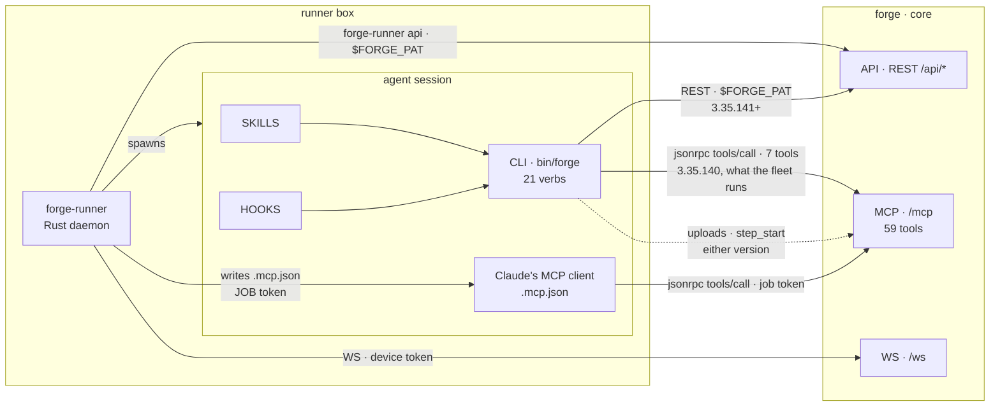
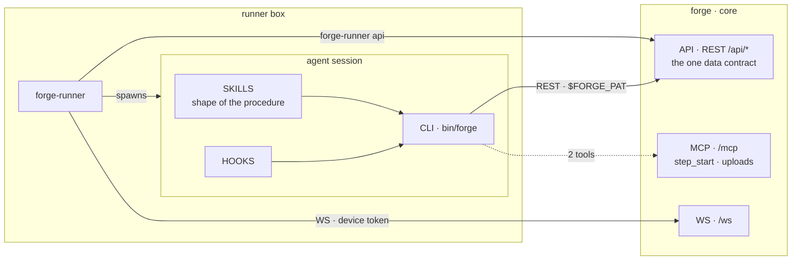

# The agent's surface: two CLIs, one shrinking MCP

How an agent reaches core, which CLI belongs to whom, and which MCP tools survive.
**Verified against the tree and the live tracker DB 2026-09-06, after `ISS-508`, `ISS-927` and
`ISS-931` all merged.**

## Today

Two CLI arrows because two copies are live: the one `ISS-508` shipped and the one the boxes still
run. The seven families cannot go while the second arrow exists — that is the fleet-upgrade row in
the table below, drawn rather than only stated.

Two command-line surfaces reach the same data plane:

| | Built in | Transport | For |
|---|---|---|---|
| `forge-runner api` | this repo | REST, `$FORGE_PAT` | **the runner's own work.** It must never depend on the plugin — a daemon that cannot reach core until a Claude Code plugin is installed is a worse daemon |
| `forge` | [forge-plugin](https://github.com/SidCorp-co/forge-plugin) | REST, `$FORGE_PAT` | **the agent.** Skills call its verbs; it is the agent's whole surface |

The plugin was the spine until `ISS-508` closed on 2026-09-06: every `forge` verb now goes to a
path under `/api`, keyed by a declared route table in `src/tracker/rest.mjs`, except the two that
route through `forge_uploads` and `forge_step_start` — which stay on `/mcp` by design, not by lag. **The fleet has not caught up** — the copy installed on `forge-vm` is
3.35.140 and still carries `src/tracker/rpc.mjs`, so the seven families that copy names are held
by a version upgrade, not by a decision.

**No device authenticates `/mcp` any more.** `requirePat` takes one species — `forge_pat_*` — and
refuses every other bearer with a 401 naming the class and the remedy
(`packages/core/src/middleware/require-pat.ts`). `forge-runner` writes each job's `.mcp.json` with
that job's own token, the same credential the spawn exports as `$FORGE_PAT`
(`packages/runner/crates/forge-runner-core/src/mcp/config.rs`). ISS-932 then removed the device
token itself: `/ws` and the REST routes behind `requireDevice` — chiefly the pool a master claims
from — now take an ordinary PAT or AAT whose `device_id` names the box, so there is one credential
species on every surface and no second verifier left to fall back to.

**This ships on two clocks and the second one is a binary.** Core refuses the device at deploy; a
box only starts writing the job token when it installs a `forge-runner` that does. In between,
`claude`'s MCP client on an un-upgraded box gets 401 on every call, which is why the refusal says
*"needs a newer forge-runner binary"* rather than anything about PATs. The fleet when this landed:
three boxes, all `0.12.0`, all online; every other `devices` row `revoked`/`offline`. Device MCP
traffic in the 24h before: 1,565 calls against 82,722 on tokens.

Two reachability changes come with it, and neither is a bug to file:

- **Admin-gated tools need the `admin` scope, which no machine token carries.** A paired device had
  no scopes at all, so `assertPrincipalIsAdmin`'s scope half was skipped for it and only the
  project role was asked. A `job:`/`session:` token is minted `['read','write']`
  (`jobs/job-token.ts`, `agent-sessions/session-token.ts`), so `forge_skills.register` /
  `.create` / `.update` / `.delete` / `.adopt` / `.push`, `forge_runners` register / retire /
  update_capabilities, `forge_config action=update`, `forge_schedules` create / update / delete /
  run and `forge_reconcile` now answer `FORBIDDEN: this token lacks the admin scope` to a pipeline
  agent. That traffic was operator-shaped and mostly dormant (`forge_skills.register` last
  2026-08-07, `.adopt` 08-09, `runners register` 08-12, `reconcile` 08-10); `forge_config
  action=update` and `forge_skills.update` were live, and both already had succeeding token
  callers. An operator who wants one of these from an agent mints a PAT with `admin` and sets it as
  the box's `$FORGE_PAT` — deliberately an operator decision, because the alternative is ambient
  admin authority, which is what `ISS-927` removed from REST.
- **A non-member now reads as not-found, not forbidden.** `assertDeviceOwnerIsMember` answered
  `FORBIDDEN: device owner is not a member`; `assertPrincipalIsMember` answers
  `NOT_FOUND: project not found or not accessible`, the existence-hiding semantics the rest of the
  surface already used. Fourteen tools moved onto it, and the move also closed what `ISS-150`'s
  review called blocker #1: the device helpers read only `ownerId`, so those fourteen never
  consulted the token's `projectIds` allowlist.

## Target

**One arrow changes port.** The CLI leaves `/mcp` for `/api`, and `/mcp` keeps only what cannot be
served to a shell, plus the clients that have no plugin — desktop chat and third parties.

Skills keep the **shape** of a procedure; core keeps each project's **answer** to it. Neither knows
the other's half, which is why a skill never names `runner-v*` or any project's command.

## Which tools stay

| Group | Tools | Why |
|---|---|---|
| **stay** | `forge_step_start`, `forge_uploads` | `step_start` opens the session every other call reports into and returns the issue body the runner did not inline; `uploads` returns an image content block, which a shell process cannot produce |
| **blocked on a fleet upgrade** | `forge_issues` `forge_comments` `forge_config` `forge_guide` `forge_knowledge` `forge_project_pm` `forge_projects.create` | the 7 the pre-`ISS-508` plugin CLI calls. That CLI has moved to `/api`; the copies running on the boxes have not. Deleting one before the fleet upgrades breaks those copies |
| ~~blocked on the runner's `.mcp.json`~~ **cleared** | ~20 that took device-token calls | `ISS-931` closed it: `/mcp` refuses a device and `mcp/config.rs` writes the job's token. Their device counts stop rising the moment a box upgrades, so the deletion rule below is now a question about a count's HISTORY rather than about live traffic — which does NOT make a nonzero one spendable; read the clause and its price |
| **fenced by design** | `forge_orgs.list` `forge_orgs.members` `forge_collaborators` | they resolve no project, so a project-scoped PAT there is an account-scoped credential in disguise. Session only, on every transport |
| **free to go** | the rest | each has a REST twin — see [data-plane-surface.md](data-plane-surface.md) |

## The deletion rule, paid for once

A tool is clear to delete only when its **device count is 0** *and* the replacement route
**accepts the credential its callers hold**. That was written as "accepts a device token" until
ISS-932 deleted the species; the clause is unchanged in substance, because what it protects is a
caller with nowhere to go.

**The second clause protects a caller, so a tool with no callers at all does not need it.**
`/api/skill-facts` failed it and mattered: `forge_skill_facts.get` had 23 device calls, and
`requireAuth()` answers a device 401, so those callers had nowhere to go. A tool at **zero rows
lifetime** has nobody to strand, and demanding a device-reachable twin for it would freeze the
surface until `ISS-931` lands. So the clause is read as: *device count 0, and — if that count was
ever above 0 — a replacement the callers it had can actually reach.* `forge_memory.revisions` was
deleted 2026-09-06 under the second half of that reading; `GET /api/memory/revisions` is
`requireAuth()` and would refuse a device, which is the same shape `/api/skill-facts` had and is
only safe here because the count is zero rather than small. **This is an amnesty and it has a
price:** it is available exactly once per tool, on evidence of zero rows over the whole table under
both spellings, and it buys nothing for any tool with traffic.

**"Whole table" is a lifetime count only while the pruner stays unwired.** `mcp_audit_log` declares
90-day retention — `drizzle/migrations/0063_mcp_audit_log.sql` says so and
`auth/mcp-audit.ts:enforceMcpAuditRetention` implements it — and **nothing calls that function**.
So today a zero really does mean "never called". Wire it to a tick and the same query answers
"not called in 90 days", which would license deleting a quarterly-called tool with nothing going
red: the `7f0c5a56` shape again, arriving through the measurement rather than the column. Whoever
wires the pruner rewrites this paragraph in the same commit. Until then, read that function before
spending a zero, and note that `forge_memory.revisions` — added `f568c503` on 2026-09-05, deleted
the next day — is a zero under any retention, so it did not test this clause. If a device caller for such a tool
ever appears in `mcp_audit_log` after a deletion taken this way, the reading is wrong and the tool
comes back.

**Since `ISS-931` a device count is a HISTORICAL count.** Nothing writes a non-null `device_id`
any more — `mcp/server.ts` stamps it `null` on every row — so a tool's device number is frozen at
whatever it reached, and it will never fall to zero on its own. That does not license spending it:
the clause asks whether the callers a tool HAD can reach its replacement, and those callers are
exactly the un-upgraded boxes the fleet-upgrade row above is about. The column stays in the schema
for that reason; a table with no device column would answer this question with silence instead of
a number.

Read `mcp_audit_log` split on `device_id IS NOT NULL` / `token_id IS NOT NULL` — never on
`user_id`, which is stamped `device.ownerId` and so reads 100% user and 0 device for every tool.
Count the whole table with no date filter, and normalise with `replace(tool,'.','_')`: agents send
the underscore form their MCP client shows them.

**LEFT join the registry onto the aggregate.** A tool nothing has ever called has no row in
`mcp_audit_log` at all, so an inner join silently drops exactly the tools this rule exists to
find. The wave-3 pass reported one device-free tool and named `forge_step_handoff.delete`, which
is on the keep-forever list, and read that as "no candidates"; `forge_memory.revisions` was
sitting at zero rows lifetime and was invisible to the query. It was deleted 2026-09-06.

Commit `7f0c5a56` deleted six tools after claiming the audit log had cleared them. The split was on
the wrong column; the fleet hit one of them at 09:07 the same day and read `not_found`.

**A deletion shifts every `tools/list` index below it, and three `cm:guard`s in `server.ts` say
callers pin to that order.** Those guards govern *insertion* — they exist so a new tool is appended
rather than spliced in. Deletion cannot honour them: there is no position that leaves the tail where
it was. The shrink this page describes is a sequence of deletions, so the pinning premise cannot
survive it, and a deletion is the caller-visible change an insertion was written to avoid. Say so in
the commit that takes one out, and treat a caller that pins by index as already broken.

**The count is only readable with direct database access.** There is no aggregate route over
`mcp_audit_log` — the one route that reads the table at all is `GET /api/pat/:id/audit`, per-token
and last-N rows, and `/api/pat` is off `PAT_ALLOWED_PREFIXES` for the reason the fence section of
[data-plane-surface.md](data-plane-surface.md) gives. So an agent session on a runner box cannot
satisfy this rule and must not delete on an estimate; whether the fence should grow a read-only
aggregate is undecided (`ISS-926`).

## Who delivers the target

| Half | Issue | Where it stands |
|---|---|---|
| the CLI moves to REST | `ISS-508` on the **forge-plugin** project | closed, merged 2026-09-06T14:13Z — the boxes still run the old copy |
| one credential form for the API | `ISS-927` here | closed, merged `3291d537` |
| the runner stops handing sessions a device token | `ISS-931` here | closed, merged — `requirePat` on `/mcp` + the job token in `mcp/config.rs`; needs a `runner-v*` release before a box stops writing the device token |
| the device token stops existing at all | `ISS-932` here | waves 1-3 landed: `users.kind` + the AAT, pairing issues a PAT/AAT, `verifyDeviceToken` deleted and `devices.token_hash`/`token_prefix` dropped. Wave 4 (kill `job:` tokens and the `agency` axis) is NOT in it — see the issue's own comment for why the two halves are one unit and what it is blocked on |
| the waves themselves, and the record of the ones already run | `ISS-894` here | unblocked by `ISS-931`; wave 4 reads the deletion rule below, not this row |
| the boundary is written down | `ISS-926` here | |

A dependency edge does not cross projects, so `ISS-508`'s ordering lived in both bodies as prose;
it is discharged. What the remaining deletions wait on is `ISS-931`, and that one is an edge.
