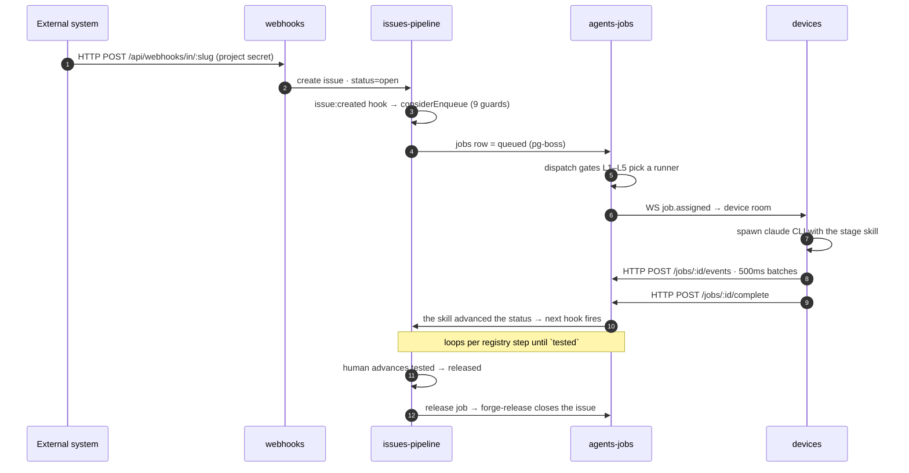
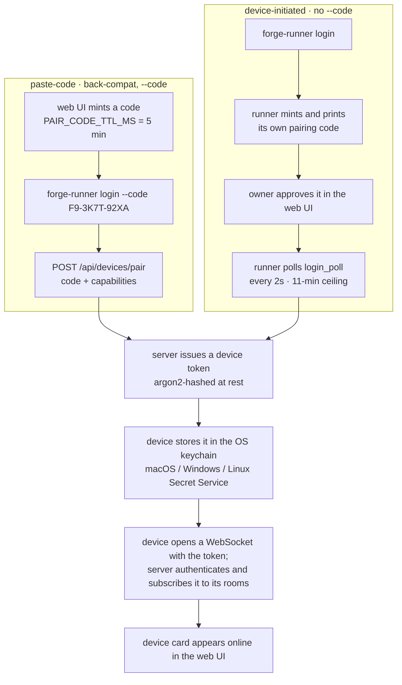
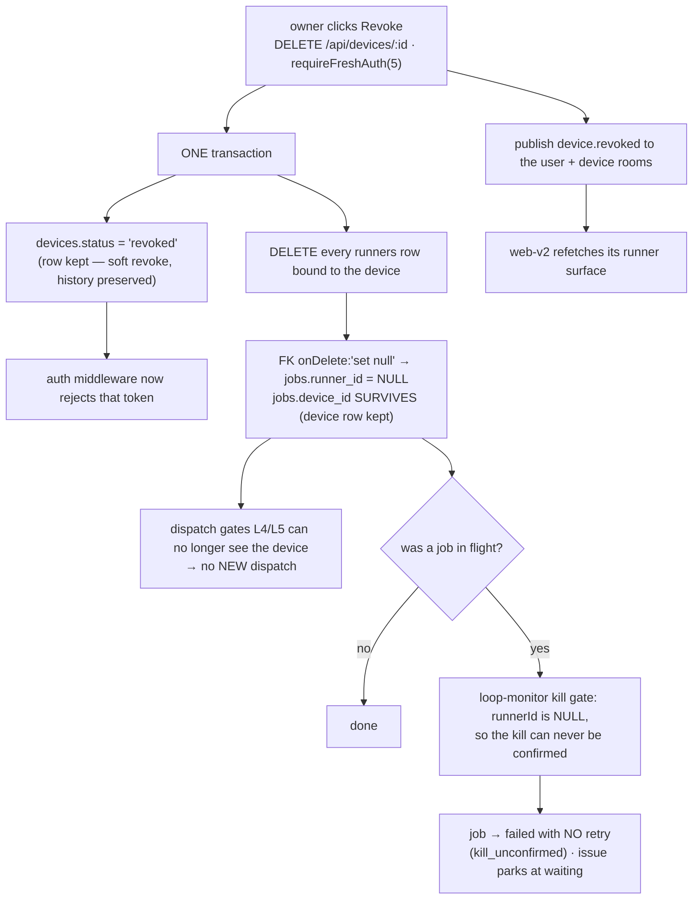

# Cross-Module Flows

How modules chain for primary journeys. Module detail: [../modules/{module}/README.md](../modules/).

Each figure draws what the step list cannot: **which module boundary is crossed, and over what**
(HTTP in, a DB lifecycle hook, pg-boss, WebSocket, HTTP back). The status ladder itself is drawn once
in [../modules/issues-pipeline/status-pipeline.md](../modules/issues-pipeline/status-pipeline.md) and not repeated here.

## Flow: Webhook issue → pipeline → close

Trigger: external system (GitHub, Sentry, custom) POSTs to `/api/webhooks/in/<project-slug>` (web origin). Route resolves project by **slug**, not id — see [`packages/core/src/webhooks/inbound-routes.ts`](../../packages/core/src/webhooks/inbound-routes.ts) (`POST /in/:slug`).

1. **[webhooks]** authenticates via project webhook secret, creates issue in status `open`.
   → [../modules/issues-pipeline/README.md](../modules/issues-pipeline/README.md)
2. **[issues-pipeline]** `issue:created` hook fires; if `autoTriage` enabled, enqueues a `forge-triage` job. The guard chain that decides enqueue-or-refuse: [../modules/agents-jobs/README.md](../modules/agents-jobs/README.md#from-transition-to-queued-job)
3. **[agents-jobs]** dispatcher picks an eligible runner, sends `job.assigned` over WebSocket to that device's room.
   → [../modules/devices/README.md](../modules/devices/README.md)
4. **[devices]** agent spawns `claude` CLI locally with the triage skill prompt.
   → [../modules/skills/README.md](../modules/skills/README.md)
5. **[agents-jobs]** device POSTs JobEvents in 500ms batches as Claude emits stdout / tool calls / diffs.
6. **[issues-pipeline]** on job `complete`, if triage checks pass, issue advances to `confirmed`; if `autoPlan` enabled, next job enqueued. A job reaching `done` and the issue advancing are **two** events — the skill writes the status, and that write fires the next hook.
7. Loop the registry steps: triage → clarify → plan → code → review → test → release (reopen → fix on failure). The test step merges to the target branch, deploys, and live-verifies, then sets `tested` (the single manual release gate); a human advances `tested → released`. `pass`/`staging` were removed from the lifecycle (unify gate model).
8. **[issues-pipeline]** `released` is not terminal — it *dispatches* `forge-release` (registry `released → release → forge-release`), which writes the release note, deletes the branch and closes the issue. **`closed` is the final status.** Webhook-out fires if configured.

Cross-cutting:
- Each job creates `agent-session` → `audit-log` entries.
- Memory embeddings (issue description, job output) indexed to Postgres `pgvector` for retrieval.

## Flow: Pair a new device

Two flows reach the same token, and the runner picks between them on whether `--code` was passed
(`packages/runner/crates/forge-runner/src/cmd/login.rs`). The paste-code path is labelled
*back-compat* in that file.

Capabilities posted at pair time: `{ claudeCode.version, git.version, node.version }`. Pairing-code
rejections are typed (`INVALID_PAIRING_CODE`, `PAIRING_CODE_EXPIRED`, `PAIRING_CODE_CONSUMED`,
`PAIRING_CODE_GONE`, `PAIRING_CODE_NOT_FOUND`) in `devices/login-routes.ts`.

Cross-cutting:
- `auth` module creates the token record.
- WebSocket rooms updated for both device and user principals.

## Flow: Run a custom user-authored skill

Trigger: issue advances to a stage with a registered custom skill. No figure — it crosses no boundary
the first flow does not already show.

1. **[issues-pipeline]** transition enqueues job with the custom skill name.
2. **[skills]** resolver finds the skill in the project's skill registry (not built-in). No skill at all → the run pauses `missing_skill:` or the stage soft-skips.
3. **[agents-jobs]** dispatcher routes job to an eligible runner.
4. **[devices]** agent runs `claude` with the custom skill (from project `.claude/skills/`).
5. JobEvents stream back; pipeline advances normally.

Cross-cutting:
- Skill sync is hash/report-based (no pinning column). The `GET /api/projects/:projectId/skill-sync-status` REST wrapper was **dropped in `8081a742`** (2026-07-24); the underlying function survives for MCP (`forge_skills_sync_status`) and smoke-verify. Do not link the REST path — it 404s.
- Skill install/update propagates via WebSocket `skill.updated` (and `skill.sync` to push a pull to targeted devices) — see [`ws/broadcast-subscribers.ts`](../../packages/core/src/ws/broadcast-subscribers.ts).

## Flow: Device revocation

Trigger: owner clicks **Revoke** on a device card. `DELETE /api/devices/:id`, gated by
`requireFreshAuth(5)` — the owner must have authenticated within the last 5 minutes.

1. **[devices]** one transaction sets `devices.status = 'revoked'` (the row is kept — history) and **deletes** every `runners` row bound to the device. Nothing sets runners `offline`; they cease to exist.
2. `jobs.runner_id` is `onDelete: 'set null'`, so every job that pointed at those runners loses its runner id. `jobs.device_id` survives (the device row is not deleted), so a parked job can still be traced to the device it ran on.
3. The auth middleware rejects the revoked token from here on; a reconnect attempt gets 401 and the agent surfaces "Device revoked, please re-pair." The revoke handler itself does not close the socket — it publishes `device.revoked`, which only [web-v2] consumes (to refetch); the runner notices via its heartbeat loop.
4. Dispatch stops because the runner rows are gone, not because anything was cancelled.

**What revocation does NOT do** — verified, not assumed:

- It does not cancel or reap in-flight jobs. `grep revoked` across `jobs/` and `pipeline/` returns zero hits, and there is no `device_revoked` reason anywhere in the repo.
- An in-flight job is left to the loop monitor's heartbeat/result hops. Because `jobs.runner_id` is now NULL, `resolveKillConfirmation` returns early un-confirmed (it needs the owning runner's heartbeat to stand in for an ack), so the reap lands on the unconfirmed branch: the job is failed with `precomputedRetry {scheduled:false, reason:'kill_unconfirmed'}` and the issue parks at `waiting`, wedge action "check the assigned device and kill any agent process still running for this job".
- That conservative outcome is **correct, not a defect**: a dead token stops the agent reporting to Forge, it does not stop the local `claude` process from mutating the git worktree. Auto-retrying elsewhere is exactly the two-agents-on-one-worktree hazard the kill gate exists to prevent (ISS-37).
- The cost is operational, not correctness: revoking a device with N jobs in flight yields N parked issues needing a manual resume each, and nothing warns about that at revoke time.

Cross-cutting:
- Runner rows are deleted, so no `offline` sweep or broadcast about them happens.
- Queued jobs are not touched. They stay `queued` and simply stop being selectable on that device; another eligible runner can pick them up.
