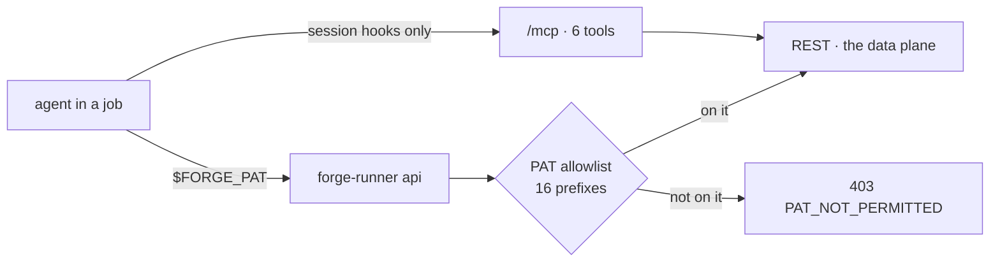

# The data plane: which MCP tool, which REST route

**Most MCP tools that read or write data have a REST twin the CLI reaches.** This table is what an
agent or a skill author calls instead. Six tools stay on MCP by design; four have a REST route the
CLI cannot reach yet, and one has no route at all.

Verified 2026-09-01 against `registered-tools.ts`, the mounts in `index.ts`, and
`PAT_ALLOWED_PREFIXES` in `middleware/pat-rest-surface.ts`. Where a route is listed, it was checked
to call the same service as the tool — not merely to carry a similar name.



The fence is an allowlist, not a deny-list: **a new REST route is 403 to every PAT until its prefix
is added.** That is deliberate — a forgotten entry costs a caller an error they report, where a
forgotten deny-list entry is a silent leak nobody reports.

**The allowlist only governs routes that authenticate.** A router mounted with no auth middleware
never reaches `beginPatRequest`, so the fence never runs and the prefix is irrelevant — `/api/guides`
is the live example. Read the mount and its middleware, not the prefix alone.

## Reachable from the CLI today

| MCP tool | REST | 
|---|---|
| `forge_issues` | `/api/issues`, `/api/projects/:id/issues` |
| `forge_issues` mark_merged / unmark | `POST` / `DELETE /api/issues/:id/merge` |
| `forge_comments` | `/api/comments` |
| `forge_memory.*` (5) | `/api/memory` |
| `forge_knowledge` | `/api/knowledge`, `/api/knowledge-edges`, `/api/projects/:id/knowledge` |
| `forge_config` | `/api/projects/:id/pipeline-config` |
| `forge_skills.*` (11) | `/api/skills`, `/api/projects/:projectId/skills` |
| `forge_skill_facts.*` (2) | `/api/skill-facts` |
| `forge_jobs.*` (5) | `/api/jobs`, `/api/projects/:id/jobs` |
| `forge_pipeline_runs.get` | `/api/pipeline-runs` |
| `forge_project_pipeline_runs` | `/api/projects/:id/pipeline-runs` |
| `forge_projects.*` (4) | `/api/projects`, `/api/projects/:id` |
| `forge_project_pm`, `forge_pm.set_dependency` | `/api/projects/:projectId/pm` |
| `forge_coolify_deploy` | `/api/projects/:projectId/integrations/coolify[/status\|/deploy]` |
| `forge_metrics.*` (4) | `/api/projects/:id/metrics` |
| `forge_agent_sessions.*` (2) | `/api/projects/:id/agent-sessions` |
| `forge_reconcile` | `/api/projects/:projectId/reconcile-runs` |
| `forge_ux_findings` | `/api/projects/:id/ux-findings` |
| `forge_schedules` | `/api/schedules` |
| `forge_health` | `/health` (public), `/api/projects/health` |
| `forge_guide` | `/api/guides`, `/api/guides/:slug` — unauthenticated by design, so the fence does not apply |

Two fields were MCP-only until 2026-09-01 and are now on `PATCH /api/issues/:id`:
`sessionContext` and `detectorKey`. `sessionContext.branch` is the direct-ship marker
`pipeline/work-evidence.ts` reads as proof that work exists, so an agent that cannot write it
cannot satisfy the evidence gate on `developed`, `testing` or a merge claim.

## Staying on MCP

| Tool | Why it cannot move |
|---|---|
| `forge_uploads` | returns an **image content block** to a multimodal model; a shell process cannot |
| `forge_step_start` · `forge_phase` | session lifecycle hooks, not data queries |
| `forge_step_handoff.write` / `.get` / `.delete` | same — the handoff is session state |

## Not reachable from the CLI

| Tool | REST route | Why not |
|---|---|---|
| `forge_orgs.list` · `forge_orgs.members` | `/api/orgs` | prefix not on the allowlist |
| `forge_runners` | `/api/runners` | prefix not on the allowlist |
| `forge_feedback` | `/api/feedback-reports` | prefix not on the allowlist |
| `forge_collaborators` | `/api/me/collaborators` | `/api/me` resolves no project, so a project-scoped token has nothing to be fenced on |
| `forge_storefront_target` | — | no REST route exists |

Two exclusions are permanent and must not be "fixed" by adding a prefix:

- **`/api/me/ops-health`** fans out across every project the caller can see. A token locked to one
  project that could read it would be outside its own fence. The per-project twin
  (`/api/projects/:id/ops-health`) is the one a PAT reaches.
- **`/api/agent-sessions`** (the unscoped list) returns every session of every visible project,
  `messages[]` included. The project-scoped twin under `/api/projects/:id` is the PAT surface.

## Calling it

```
forge-runner api issues                          # GET  /api/issues
forge-runner api issues/<id>/merge -X POST -d '{"target":"main"}'
forge-runner api projects/<id>/integrations/coolify/deploy -X POST -d '{}'
```

`issues`, `/issues` and `/api/issues` are the same path. The credential is a **personal access
token**, not the device token — a device token answers 401 on every route behind `requireAuth`. In a
job the runner exports one as `$FORGE_PAT`, minted for that job and revoked when it goes terminal.
Full flag and exit-code reference: [`packages/runner/README.md`](../../packages/runner/README.md).
