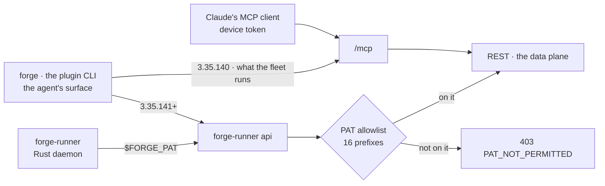

# The data plane: which MCP tool, which REST route

**This page documents `forge-runner api` — the Rust daemon's own reach into core, over REST on a
`$FORGE_PAT`.** It is not the agent's surface. An agent's whole surface is `forge`, the 21-verb CLI
built in [forge-plugin](https://github.com/SidCorp-co/forge-plugin), and a skill calls that and
nothing else. Since `ISS-508` closed on 2026-09-06 that CLI reaches `/api` too, so the table below
is the map for both callers rather than a translation between them — except on a box still running
3.35.140, which posts JSON-RPC. Which CLI belongs to whom, and why the runner must never acquire a
dependency on a plugin it does not ship: [agent-surface.md](agent-surface.md).

**Most MCP tools that read or write data have a REST twin.** The table below maps them, and it is
true whoever calls the route. Two tools stay on MCP by design, three sit behind a fence that is
deliberate and permanent, two are open questions, and one has no route at all.

Verified 2026-09-06 against `registered-tools.ts`, the mounts in `index.ts`, and
`PAT_ALLOWED_PREFIXES` in `middleware/pat-rest-surface.ts`. Where a route is listed, it was checked
to call the same service as the tool — not merely to carry a similar name.



The fence is an allowlist, not a deny-list: **a new REST route is 403 to every PAT until its prefix
is added.** That is deliberate — a forgotten entry costs a caller an error they report, where a
forgotten deny-list entry is a silent leak nobody reports.

**The allowlist only governs routes that authenticate.** A router mounted with no auth middleware
never reaches `beginPatRequest`, so the fence never runs and the prefix is irrelevant — `/api/guides`
is the live example. Read the mount and its middleware, not the prefix alone.

## Reachable over REST today

**A row here is not permission to delete the tool.** It answers "does a REST twin exist", which is
one input to the deletion rule in [agent-surface.md](agent-surface.md) and not the rule. Nine of
these tools are called by the `forge` CLI the fleet still runs, which calls the TOOL and not the
route — `forge_memory.search` and `forge_projects.get`/`.list` among them, all three of which had
been read off this table as free to go. Check that page's fleet-upgrade row before removing
anything.

| MCP tool | REST | 
|---|---|
| `forge_issues` list | `/api/projects/:id/issues` — **there is no `GET /api/issues`**; the collection is project-scoped only |
| `forge_issues` get / update / delete | `/api/issues/:id`, and `PATCH /api/issues/batch` |
| `forge_issues` mark_merged / unmark | `POST` / `DELETE /api/issues/:id/merge` |
| `forge_comments` create / list | `/api/issues/:id/comments` — `/api/comments/:id` is edit, delete and replies only, and has no collection route |
| `forge_memory.*` (5) | `/api/memory` — the sixth, `forge_memory.revisions`, was deleted 2026-09-06 (ISS-894); `GET /api/memory/revisions` is the only way in |
| `forge_knowledge` list / get / upsert / delete | `/api/knowledge`, `/api/knowledge-edges`, `/api/projects/:id/knowledge[/:slug]` |
| `forge_knowledge` search | `POST /api/projects/:id/knowledge/search` — body `{query, topK?, scope?, strategy?}`, the action's own fields with its own defaults (`knowledge`, 10, `semantic`). **`POST`, because `GET` on that path is the `/:slug` handler and answers *knowledge entry not found*.** There is no `sourceFilter`: the MCP action never had one either — that argument is `POST /api/memory/search`'s, and `runUnifiedSearch` takes no such parameter |
| `forge_config` | `/api/projects/:id/pipeline-config` |
| `forge_skills.*` (11) | `/api/skills`, `/api/projects/:projectId/skills` |
| `forge_skill_facts.*` (2) | `/api/skill-facts` |
| `forge_phase` start / end / resume_point | `POST /api/pipeline-runs/:id/phases`, `POST /api/pipeline-runs/:id/phases/end`, `GET /api/pipeline-runs/:id/resume-point` |
| `forge_step_handoff.*` (3) | `/api/issue-step-contexts` |
| `forge_jobs.*` (5) | `/api/jobs`, `/api/projects/:id/jobs` |
| `forge_pipeline_runs.get` | `/api/pipeline-runs` |
| `forge_project_pipeline_runs` | `/api/projects/:id/pipeline-runs` |
| `forge_projects.*` (4) | `/api/projects`, `/api/projects/:id` |
| `forge_project_pm`, `forge_pm.set_dependency` | `/api/projects/:projectId/pm` — **reads only.** `pm/read-routes.ts` covers `snapshot`/`graph`/`runner-load`; `pm/routes.ts` is config, policies, decision READS and the escalation respond. `dispatch` and `write_decision` have no REST route at all, and since `ISS-931` no MCP route either (`docs/proposals/pm-dispatch-has-no-rest-twin.md`) |
| `forge_coolify_deploy` | `/api/projects/:projectId/integrations/coolify[/status\|/deploy]` |
| `forge_metrics.*` (4) | `/api/projects/:id/metrics` |
| `forge_agent_sessions.*` (2) | `/api/projects/:id/agent-sessions` |
| `forge_reconcile` | `/api/projects/:projectId/reconcile-runs` |
| `forge_ux_findings` | `/api/projects/:id/ux-findings` |
| `forge_schedules` | `/api/schedules` |
| `forge_health` | `/health` (public), `/api/projects/health` |
| `forge_guide` | `/api/guides`, `/api/guides/:slug` — unauthenticated by design, so the fence does not apply |

Two fields were MCP-only until 2026-09-01 and are now on `PATCH /api/issues/:id`:
`sessionContext` and `detectorKey`. `sessionContext.branch` is the direct-ship marker
`pipeline/work-evidence.ts` reads as proof that work exists, so an agent that cannot write it
cannot satisfy the evidence gate on `developed`, `testing` or a merge claim.

## Staying on MCP

| Tool | Why it cannot move |
|---|---|
| `forge_uploads` | returns an **image content block** to a multimodal model; a shell process cannot |
| `forge_step_start` | it opens the session the other tools report into, and hands back the issue body the runner did not inline |

`forge_phase` and `forge_step_handoff` were listed here until 2026-09-02 as "session lifecycle
hooks, not data queries". Both were checked against their handlers and neither is: a phase keys on
`(run, phase, attempt)` — `issueId`, `jobId` and `agentSessionId` are optional provenance the
driver does not send — and a handoff keys on `(project, issue, run, step, attempt)`. Nothing in
either needs the session's identity, which is the whole reason a shell holding only `$FORGE_PAT`
can make the call. `forge_step_handoff` already had its REST twin and the row was simply never
re-checked.

## Fenced on purpose — do not "fix" these by adding a prefix

`PAT_ALLOWED_PREFIXES` names four prefixes as the ones *"where being wrong once ends the fence for
good"*: `/api/pat`, `/api/orgs`, `/api/admin`, `/api/me`. None of them resolves a project, so a
project-scoped token there is an account-scoped credential wearing a project-scoped label.

| Tool | REST route | Why it stays out |
|---|---|---|
| `forge_orgs.list` · `forge_orgs.members` | `/api/orgs` | org-wide by definition; a token bound to one project has no business enumerating the org |
| `forge_collaborators` | `/api/me/collaborators` | `/api/me` is caller-scoped, not project-scoped |
| — | `/api/pat` | a scoped token that can mint an unscoped one has no scope. This is the entry whose absence collapses every other one |

Two more are fenced for the same reason even though their prefix IS allowlisted:

- **`/api/me/ops-health`** fans out across every project the caller can see. The per-project twin
  (`/api/projects/:id/ops-health`) is the one a PAT reaches.
- **`/api/agent-sessions`** (the unscoped list) returns every session of every visible project,
  `messages[]` included. The project-scoped twin under `/api/projects/:id` is the PAT surface.

A caller that genuinely needs one of these uses a session (browser/desktop login), or gets a
project-scoped twin built for it — not a widened fence.

## Open — no PAT route yet, and no decision recorded either way

| Tool | REST route | State |
|---|---|---|
| `forge_runners` | `/api/runners` | fleet-wide, but a project-scoped twin is plausible; nothing decided |
| `forge_feedback` | `/api/feedback-reports` | project-scoped in practice; nothing decided |
| `forge_storefront_target` | — | no REST route exists at all |

## Who calls `forge-runner api`, and who does not

Exactly two callers, and neither of them is a skill:

- **the daemon's own subcommands** (`packages/runner/crates/**`) — pairing, plugin sync, job claim
  and everything the box does before any agent exists. This is the whole reason the passthrough
  exists: a daemon that could not reach core until a Claude Code plugin was installed would be a
  worse daemon.
- **the drive-job shell**, because core's drive prompt (`packages/core/src/prompt/`) hands it
  `$FORGE_PAT` and names this verb in the rules it injects. That is a runtime instruction from core
  to one process it spawned, not a surface a skill may build on.

**A skill never writes `forge-runner api`.** Skills are the plugin's, they ship on the plugin's
clock, and their verb is `forge` — see [agent-surface.md](agent-surface.md). A skill reaching for
this passthrough couples the plugin to a binary version the box happens to hold.

```
forge-runner api projects/<id>/issues            # GET  the issue list — project-scoped
forge-runner api issues/<id>                     # GET  one issue
forge-runner api issues/<id>/comments -X POST -d '{"body":"..."}'
forge-runner api issues/<id>/merge -X POST -d '{"target":"main"}'
forge-runner api projects/<id>/integrations/coolify/deploy -X POST -d '{}'
```

A drive-job shell is given `$FORGE_PAT`, `$FORGE_PROJECT_ID` and `$FORGE_PROJECT_SLUG` and nothing
else — no run id, no job id, no session id. A caller that knows only its issue reaches its run
through the list route, which is why the phase endpoints take the run as a path segment and resolve
the project from it rather than asking the caller for both:

```
forge-runner api "projects/$FORGE_PROJECT_ID/pipeline-runs?issueId=<issue>&status=running"
forge-runner api pipeline-runs/<run>/phases -X POST -d '{"phase":"code"}'
forge-runner api pipeline-runs/<run>/phases/end -X POST -d '{"phase":"code","attempt":1,"outcome":"ok"}'
```

`issues/<id>`, `/issues/<id>` and `/api/issues/<id>` are the same path — the CLI supplies the
prefix, it does not invent a route, so a path with no handler answers 404 rather than falling back
to anything.

The credential is a **personal access token**, not the device token — a device token answers 401 on
every route behind `requireAuth`. In a job the runner exports one as `$FORGE_PAT`, minted for that job and revoked when it goes terminal,
alongside `$FORGE_PROJECT_ID` and `$FORGE_PROJECT_SLUG` (runner 0.9.8+) — the PAT alone cannot build
a project-scoped path, because every such route takes the project UUID as a path segment and only
`/mcp` resolves `X-Forge-Project-Slug`.
Full flag and exit-code reference: [`packages/runner/README.md`](../../packages/runner/README.md).

## The caller class this covers since ISS-927

**A `schedules` run is not a job, so it could not hold a job PAT.** Schedules dispatch through
`agent:start` on the device room, and the mint was per-job, so these sessions authenticated to
`/mcp` with the device token. Measured 2026-09-02 in a window where no pipeline job ran at all: 20
registered tools still took device-token calls, timestamps matching the cron entries —
`pixelight-product-autopublish` (`0 */12 * * *`) against calls at 00:00:20 on two consecutive days,
three `0 9 * * *` schedules against 29 calls from one box starting 09:00:24.

`ISS-927` closed that gap on 2026-09-06 (`3291d537`): an unattended session — a scheduled run, a
RocketChat escalation, a RocketChat agent chat — mints its own `session:<id>` PAT on `agent:start`,
bound to one project, on the same 600/min ceiling a job token gets, revoked when the session ends.
The token binds to the **session**, not to the schedule run, which is why no new revoke hook was
needed. Interactive chat is the exception and keeps the operator's `$FORGE_PAT`.

So the credential question is answered and the caller class has a destination. `ISS-931` then moved
the transport to match: `/mcp` is `requirePat`, which accepts `forge_pat_*` and refuses every other
bearer by name, and `packages/runner/crates/forge-runner-core/src/mcp/config.rs` writes the job's
own `job:`/`session:` token into the per-job `.mcp.json` instead of the box's device token. So a
device-authenticated MCP caller is no longer a thing a data-tool deletion can break.

The residual is a clock, not a gap: core refuses at deploy and a runner box changes at binary
install, so a box still running an older `forge-runner` writes a device token that now 401s. The
refusal text names that remedy, and the deletion rule in
[agent-surface.md](agent-surface.md) reads `mcp_audit_log`'s device split as a HISTORICAL count from
this point on.
