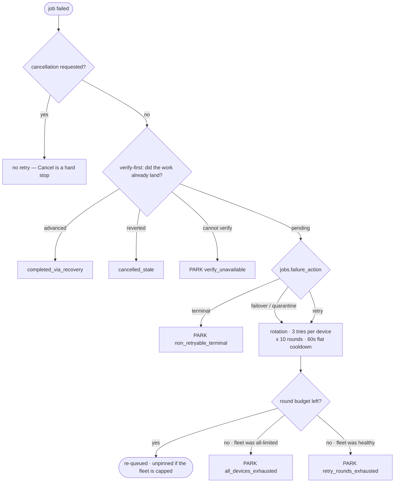

# ADR: Failure taxonomy + action policy

**Status:** Accepted · 2026-08-12 · ISS-812 (children: ISS-823, ISS-824, ISS-825, ISS-826)
**Scope:** the single classifier that answers "is this failure worth retrying, and does anyone find out?" for every failure surface — job dispatch, scheduled sessions, runner selection, and rescue observability. VISION [principle #10](../VISION.md#5-principles) ("state never lies") is the invariant this closes: a retry storm, a silently-lying `schedules.lastStatus`, and a stranded budget-exhausted job are all "false failure" / "unescalated stuck state" in different clothes.

## Problem

Four standing issues looked like four bugs. Read together they were one defect with four faces — nothing owned the retry-worthiness decision, so each surface answered it with its own ad-hoc string match, and every past fix widened a regex instead of adding a default branch:

- **ISS-757** — a non-retryable org spend-cap error, classified `infra`, retried 60× in 80 minutes. Rotation cannot help an org-wide cap.
- **ISS-806** — a box-scoped deterministic failure (broken push credentials) retried 90× across devices. The circuit breaker tripped correctly, but its own escape hatch ("better to try than to wedge") fell back to a tripped device when every device was tripped — turning a deterministic fault into a fleet-wide flap.
- **ISS-760** — `schedules.lastStatus` was written from dispatch-time optimism (did a session get *created*), never reconciled with the session's real terminal outcome. Exactly one regex (usage-limit) had a write path; everything else left the column lying.
- **ISS-811** — the control case: retry *correctly* rescues `preflight_failed: hooks_path`, and that correctness is what buries the signal — nothing counted an always-eventually-green failure mode as a problem.

A fifth face surfaced during triage (ISS-630/ISS-804): the same spend-limit failure retried 3× on `release`/`review`/`test` jobs and 0× on a `triage` job. Not a per-job-type gate — the pre-dispatch monthly-budget gate (`jobs/dispatcher.ts`) was a *private* terminal path, hardcoding `classifierVersion: 1` and failing the job without ever calling `finalizeFailedJob`: zero retries, no park, no comment, no run close, because the gate is configured per **pipeline state**, not per class.

## Design decision: kind stays the diagnosis, action is a new orthogonal axis

`FailureKind` (`code | infra | transient-cc | timeout`) is read by 23 consumers across core + web-v2, and `jobs.classifier_version` pins archived rows to their historical verdict. Redefining it retroactively would ripple through all of it. Instead `classifyFailure` (`packages/core/src/pipeline/failure-classifier.ts`) gained a second, orthogonal return value:

```ts
type FailureAction = 'terminal' | 'quarantine' | 'failover' | 'retry';
```

*Kind = what happened. Action = what to do.* Persisted on `jobs.failure_action` (migration `0171`); a historical `NULL` row falls back to `deriveActionFromKind(kind)`, which reproduces the pre-ISS-823 behaviour byte-for-byte (`code`→terminal, `transient-cc`→failover, `infra`/`timeout`→retry). `jobs/retry.ts` now branches on `action` exclusively — `grep "failureKind === '"` across `packages/core/src` returns zero hits outside the classifier itself. Widening a pattern can no longer change retry behaviour by accident.

## The decision, end to end



The two structural guards run BEFORE any classification, because either can make a retry
meaningless or destructive. Park reasons land on `pipeline_runs.metadata.parkReason` (see below).

## Park semantics: capacity vs judgement

A park at `waiting` means the STEP stopped, never that the work is undone. Two kinds hide behind
that one status, and they differ on who may release them:

| `RetryOutcome.reason` | Step reached a conclusion? | Release |
|---|---|---|
| `all_devices_exhausted` | No — cut off by provider quota | **capacity** · the fleet recovering releases it |
| `retry_rounds_exhausted` | Yes — kept failing on its own merits | human |
| `non_retryable_terminal` | Yes — terminal `failure_action` | human |
| `verify_unavailable` | Yes — deliberately failed safe | human |
| `monthly_budget_exhausted` | No, but the condition is a spend budget | human (see below) |
| `cancellation_requested` | Yes — an operator stopped it | human |

`pipeline/park-reasons.ts` owns that classification over `RetryOutcome.reason` values (NOT the
derived `WaitingCause` vocabulary). `finalize-failure.ts` records the reason on the run it is giving
up on — `metadata->>'parkReason'`, mirroring the existing `pauseReason` convention, before
`closeOpenRunForIssue` flips that row terminal. `bounce-replay-guard.ts` then releases a `waiting`
bounce when the reason is a capacity reason AND at least one healthy capable runner exists now; it
fails CLOSED, unlike its callers' fail-open, so a broken check leaves the refusal standing.

Deliberately narrow: **`waiting` only**, so a `parkReason` left by an earlier capacity park can never
release a later `needs_info` bounce (ISS-820's human-answer rule stays intact — the fleet is not even
consulted for it). `monthly_budget_exhausted` is excluded because its condition is a project spend
budget this module cannot re-check; admitting it would let a re-dispatch fire straight back into the
dispatcher's budget refusal and re-park on arrival. Parks predating the `parkReason` write carry no
reason and still need the human-comment exit.

## Mechanisms

| Face | Mechanism | Where |
|---|---|---|
| 757 | Org/account spend-cap string classifies `transient-cc`/`failover`, not the generic `infra` bucket that armed the 60-dispatch storm. | `runners/limit-detect.ts` (`isSpendLimitError`), `pipeline/failure-classifier.ts` |
| 757/630 | `finalize-failure.ts` stamps the exhausted runner's `rateLimitedUntil` **before** the retry decision reads it (a genuine ordering bug found in review round 1 — the old fire-and-forget stamp ran too late for `all_devices_exhausted` to ever fire). `retry.ts` distinguishes "every online box is limited" from "every box is merely offline" via `onlineCapableDeviceIds`'s health-gated vs. unfiltered sets. Neither parks on entry since 2026-08-12 (owner call): an all-limited fleet defers to the rotation (unpinned clone, dispatch picks whichever box frees first) and only the round budget ends it — reporting `all_devices_exhausted` so the wedge still names the cap. | `jobs/finalize-failure.ts`, `jobs/retry.ts`, `runners/select.ts` |
| 806 | Durable per-runner quarantine (`runners.quarantined_until`/`quarantine_reason`) after `RUNNER_QUARANTINE_STREAK` (default 3) identical box-scoped (`preflight_failed: <check>`) failures on one runner. Placed **inside** every candidate query in `select.ts` alongside `rate_limited_until` — the layer both `selectRunnerForJob` wrap-arounds cannot bypass (unlike the circuit breaker's `excludeDeviceIds`, which both wrap-arounds deliberately discard). Self-heals on TTL expiry (default 60m); clears on success. | `runners/quarantine.ts`, `runners/select.ts` |
| 760 | The schedule terminal path calls the SAME `classifyFailure` the job path calls (`finalizeScheduleSessionFailure`), not a bespoke regex — `failureReason` is now unconditional (never left `NULL`). `schedules.lastStatus` is written only by the session's real terminal report (`writeBackScheduleLastStatus`), gated on `lastSessionId = sessionId` so a superseded session's late report cannot clobber a newer run. Dispatch itself only ever writes `running`/`skipped`. | `agent-sessions/session-failure.ts`, `schedules/service.ts` |
| 811 | `retry_rescues` (migration `0175`) — a recursive view over `jobs.retry_of` chains, collapsing each rescued leaf to its furthest **failed** ancestor. Retroactive (works over historical data, no new write-time counter); a 24h per-project/per-reason threshold alert fires once per window via a partial unique index on `notifications.resolution_key`. | `pipeline/retry-rescue-alert.ts`, drizzle view `retry_rescues` |
| 630/804 | `jobs/dispatcher.ts`'s pre-dispatch budget gate stamps `failureAction: 'terminal'` with the real `CLASSIFIER_VERSION` and routes through `finalizeFailedJob` — the same terminal outcome (park + comment + close the run) as any other terminal action, instead of a private strand. | `jobs/dispatcher.ts`, `jobs/finalize-failure.ts` |

## Spec correction: spend-cap is `failover`, not `terminal`

The epic's own body assumed the org/account spend-cap was non-retryable (org-wide, so rotation can't help) and specified `terminal`. Real job data disproved that during ISS-823: issue `42ce58b2` failed 3× on device `d8caf576` with the exact string, then succeeded on device `0629f109` on the very next attempt — the limit is **per-account**, not per-org. Shipping `terminal` would have turned a self-recovering failure into a hard, human-gated park. The shipped behavior instead fails over immediately to another device, with memory: the exhausted device is stamped `rateLimitedUntil` (6h — the string carries no parseable reset and the real boundary is monthly) so `onlineCapableDeviceIds`'s health gate excludes it, and `retry.ts` reports `all_devices_exhausted` only when the round budget runs out with every device still exhausted (it defers to the rotation rather than parking on entry — see the 2026-08-12 owner call above). This is the correct behaviour for the evidence on hand; a genuinely org-wide cap (no per-account variance ever observed) would warrant revisiting.

## Deliberately unchanged / out of scope

- `getTrippedDeviceIds`'s soft `excludeDeviceIds` set (the pre-existing circuit breaker) is untouched — it still exists for the single-/few-device "better to probe than to wedge" trade its own doc comment describes. Quarantine is new, separate, durable state; it does not change the breaker's behavior for a transient fault.
- Retry mechanics (`RETRY_COOLDOWN_MS`, `RETRY_TRIES_PER_DEVICE`, `RETRY_MAX_ROUNDS`) are untouched.
- Parking on ANY future `rate_limited_until` (including a seconds-long provider throttle), not only a genuine exhaustion — spec-conformant, tracked as its own tuning question in ISS-832 rather than redesigned here.
- `preflight_failed: hooks_path`/`push_credentials` stay retryable in general; quarantine is about *repetition on one box*, not about reclassifying the failure itself (ISS-811's point).

## Composed behavior

`packages/core/tests/integration/failure-taxonomy-policy-e2e.test.ts` walks all five faces against real Postgres — a spend-cap failure on a single-runner fleet parks immediately instead of storming (757); three identical box-scoped failures quarantine their runner and a *different* failure does not, with the quarantine surviving the exclude-set wrap-around (806); an unrecognized schedule failure records a reason and an honest `lastStatus`, immune to a superseded session's late report (760); a retry chain that eventually succeeds is counted once, attributed to its original failure reason, while a first-try success is excluded (811); a budget-exhausted stage parks the issue and closes the run instead of stranding both (630/804). A sixth test proves the two runner-side mechanisms (quarantine from ISS-825, per-account exhaustion from ISS-823) compose correctly through the one shared gate (`onlineCapableDeviceIds`): a fleet exhausted by a *mix* of both reasons still reads as exhausted, not merely offline.

Each mechanism above also has its own, more granular unit/integration coverage from the child issue that built it (`failure-classifier.test.ts`, `retry.test.ts`, `finalize-failure.test.ts`, `limit-detect.test.ts`, `select.test.ts`, `quarantine.test.ts`, `session-failure.test.ts`, `schedules/service.test.ts`, `retry-rescue-alert.test.ts`, `budget-check-e2e.test.ts`) — this file does not re-derive those, only the sequence across them.

## Also preserved

ISS-765's deliberately-preserved orphan-job reproduction (anhome run `bbb3cfad-d62c-4186-a3eb-778379fb0843`) is a different defect (queued-orphan reaping) that shares the wedged-run symptom; no step of this epic touched or cancelled it.
