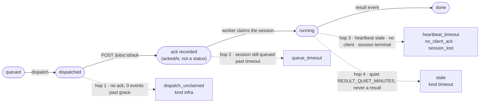

# The closed job loop (`jobs/loop-monitor.ts`)

**Status:** Accepted · ISS-449 (ISS-442 C3 / invariant I3), two-phase kill gate added ISS-785.

Models the job lifecycle as four hops — dispatch → ack → heartbeat → result — each with ONE
timeout and exactly ONE miss-handler. This module is the PRIMARY reaper for every non-progressing
kernel state; the four legacy sweepers (`sweepZombieSessions`, `reconcileOrphanedJobs`,
`reconcileNeverClaimedDispatches` in `pipeline/sweeper.ts` and `runStaleSweep` in
`jobs/stale-detector.ts`) are demoted to alarm-only: they keep their detection SELECTs but perform
no terminal writes — a row they still match after this loop ran is a loop MISS, logged as
`loop-miss` (coverage proof during the cutover; deletion happens at the ISS-442 parent
integration).

## Hops and their miss-handlers

Solid = the healthy path; dashed = the one miss-handler that owns that hop. `ack recorded` is a
timestamp and `result` is a job event — neither is a value of `jobs.status` (`queued · dispatched ·
running · done · failed · cancelled`). The loop watches finer milestones than the enum carries,
which is exactly why a job can read `running` and still be dead.

All terminal writes go via `applyKernelTransition`; all job reaps route through the SAME
`finalizeFailedJob` tail as a runner-reported failure (verify-first retry or park-at-`waiting`).

1. **dispatch→ack** — the runner explicitly acks a claim (`POST /jobs/:id/ack`, ISS-449; first
   `job_event` doubles as a fallback ack). A `dispatched` job with no ack and zero events past the
   grace window means no runner ever claimed it → fail `dispatch_unclaimed` (kind `infra`, fast
   failover). Replaces `reconcileNeverClaimedDispatches` (ISS-378).
2. **ack→heartbeat (claim)** — a pipeline/pm session sitting `queued` past the queue timeout was
   never picked up by a worker → fail the session `queue_timeout`. Replaces zombie pass 1.
3. **heartbeat** — (a) a `running` pipeline/pm session whose heartbeat went stale → fail
   `heartbeat_timeout`; (b) a chat/schedule session that never got a working client
   (`claudeSessionId` NULL) → fail `no_client_ack` (ISS-420); (c) a job whose linked session is
   terminal with no `result` event → fail `session_lost` (kind `infra`). Replaces zombie passes
   2–3 + `reconcileOrphanedJobs` (ISS-280).
4. **result** — a claimed job that emitted no event for `RESULT_QUIET_MINUTES` (and never a
   `result`) is a wedged worker → fail `stale` (kind `timeout`). Replaces `runStaleSweep`
   (ISS-258), now evaluated on the 1-minute loop tick instead of the old 5-minute schedule.

## Kill-before-reap (ISS-785)

The JOB-axis hops above (1, 3c, 4) are two-phase via `jobs/kill-gate.ts`: tick 1 requests the kill
(stamps `kill_requested_at`, publishes `job.cancel` to the runner) and leaves the job active; a
later tick fails it only once termination is confirmed (or, for the ack hop only, once the
unclaimed-grace elapses on a job no runner ever claimed). This prevents a false "silent death" from
spawning a genuine second agent racing the still-alive first one on the same worktree (ISS-37: the
first agent reverted a merge the retry had no idea about). The SESSION-axis hop (2, 3a/3b) is
unchanged — it fails an `agent_sessions` row directly, which has no runner process of its own to
kill.

**Confirmation** comes from exactly one of: the runner's `POST /jobs/:id/kill-ack` (outcome
`killed` or `not_found`), a terminal lifecycle report that raced the request, or the owning
runner's heartbeat being stale past `dispatchLivenessMs()` (`runner_gone` — the box is
unreachable, so there is no channel an answer could arrive on). Unconfirmed on an ONLINE runner is
the one state a reap must never retry: the job fails with `precomputedRetry {scheduled:false}` and
the issue parks at `waiting`, and its wedge tells the operator to kill the process on the device
before resuming.

**Episodes.** `kill_requested_at` / `kill_confirmed_at` / `kill_outcome` are per-job columns
describing ONE reap episode. A job can outlive an episode — an ack-hop kill request against a job
whose cold-clone preflight is merely slow gets a `not_found` (nothing to kill yet), then the job
acks and runs for an hour. Reading those columns later as if they answered the CURRENT reap would
fail-and-retry a live job whose runner was never told to stop. So a request older than
`killEpisodeWindowMs()` (2× the grace) is dead state: `isKillEpisodeLive` returns false, the next
reap opens a fresh episode, and `requestJobKill` clears the previous answer as it re-stamps. The
ack hop's forced confirmation records `never_claimed`, not a `not_found` no runner ever sent.

## Cross-cutting

- Every miss-handler emits a `pipeline_wedge` event (ISS-452 C6 / I7) carrying WHERE (the hop) +
  WHY (the reason) + WHAT a human should do, so `interventions/issue` is measurable.
- Strict-sequential dispatch is untouched — the loop only REAPS non-progressing state; it never
  relaxes terminal-before-next gating.
- Scheduling: `runLoopMonitor` runs as the FIRST pass of the per-minute pipeline-sweeper tick
  (`pipeline/sweeper.ts` `runPipelineSweep`), so the demoted alarm passes in the same tick only see
  rows the loop failed to handle.
