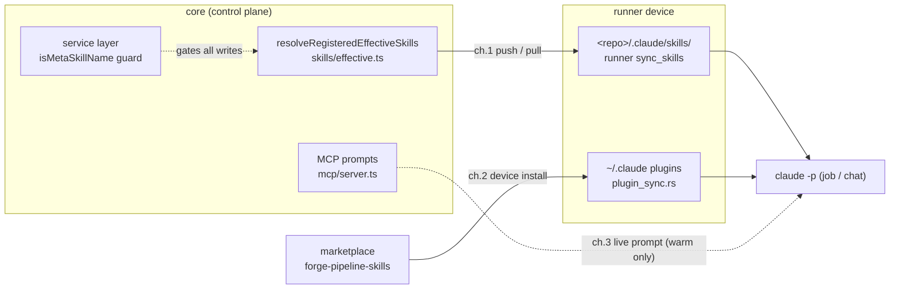

# ADR: Skill delivery — two kinds, three channels

**Status:** Accepted · 2026-07-24 · owner ai013
**Supersedes:** the earlier "two channels (meta = MCP-served)" framing.
**Scope:** how a skill's body reaches the Claude Code process that runs a job or chat.

> Canonical record. Channel-3 deep dive: [skill-delivery-plugin-channel.md](skill-delivery-plugin-channel.md). Usage / authoring: [../modules/skills/README.md](../modules/skills/README.md).

## TL;DR

Every skill is one of **two kinds**, each with **one canonical channel**; a third channel serves a live read-reference only.

1. **Per-project** → **disk sync** (shadow-by-name, deterministic).
2. **Meta** (Forge-owned, all-project) → **plugin** (device-scope, non-overridable).
3. `forge-skills` → **MCP-served read-reference** — not "meta", not an execution channel.

## Model

| # | Channel | Kind / skills | Overridable? | Works in cold `claude -p`? | Delivery |
|---|---------|---------------|--------------|----------------------------|----------|
| 1 | **Per-project (disk)** | pipeline stage + project custom | **yes** — project shadows a global by name | yes (slash-commands read at CLI init) | server computes the effective set → runner writes `<repo>/.claude/skills/<name>/` |
| 2 | **Meta (plugin)** | Forge-owned, all-project (`forge-onboard`, …) | **no** — device-scope install is structurally non-overridable | yes | device installs a Claude Code plugin from marketplace `SidCorp-co/forge-pipeline-skills` |
| 3 | **MCP read-reference** | `forge-skills` | n/a — not installed | **no** — expands only when Forge MCP is already `connected` (warm session) | served live as an MCP prompt, zero disk |

## Decisions

- **Meta = plugin, not MCP.** Device-scope install is non-overridable *by construction* and reaches every job (jobs inherit the daemon config dir; no `CLAUDE_CONFIG_DIR` is set per job). It also works in headless `claude -p`, which the MCP-prompt channel does **not** (timing race — MCP must be `connected` before the slash is parsed).
- **Per-project = disk.** Determinism + per-project shadow + cold-`-p` availability. One project shadows a global by name (no fork/override mechanism — ISS-388).
- **MCP-served = read-reference only.** Kept for a warm interactive session that wants always-latest meta guidance; never relied on for execution.
- **Deferred (high blast radius):** making MCP prompts expand in headless `-p` needs switching the runner's shared `-p` exec path to stream-json + warm-up — pipeline-wide risk. The plugin channel already gives robust invoke without touching the exec path, so this is not pursued.

## Anchors — where to code

| Concern | Single source of truth |
|---|---|
| *What installs* (per-project) | `resolveRegisteredEffectiveSkills` — `packages/core/src/skills/effective.ts` |
| *How it installs* | runner `sync_skills` — `packages/runner/crates/forge-runner-core/src/workspace/skill_sync.rs` |
| *Who may write a skill* | the `service` layer (`createProjectSkill`/`updateProjectSkill`) — carries `isMetaSkillName`; **never `db.insert(skills)` directly** |
| *Meta reservation* | `META_SKILL_NAMES` — `packages/core/src/skills/meta-skills.ts` |
| *MCP read-reference set* | `MANAGED_META_SKILLS` + `resolveManagedMetaPrompts` — `skills/effective.ts` → `mcp/server.ts` |
| *Plugin install* | `ensure_plugins` — `forge-runner-core/src/workspace/plugin_sync.rs`; config `[plugins]` in `config.rs` |

### Channel-1 fan-out (one worker, many triggers)

- **Server trigger (only one):** `skillSyncRequested` bus → per-device `skill.sync` — `ws/broadcast-subscribers.ts`. Entered via `forge_skills.push` (MCP), `POST /api/skills/bulk-push`, onboard, agent-session lifecycle, template-drift rebase. (`skill.updated` is web-UI cache-invalidation only — never triggers a device pull.)
- **Device pull (4, all call `sync_skills`):** job provision (`workspace/provision.rs`) · `skill.sync` event (`daemon/dispatch.rs`) · background auto-pull, ISS-736 (`daemon/skill_pull.rs`, `[skills] auto_pull` default **on**) · CLI `forge-runner sync`, ISS-740 (`cmd/sync.rs`).
- **Transports:** WS+REST (`/api/devices/me/skills*`) for CLI/desktop runners; deterministic ZIP (`runners/skills-zip.ts`) for `host='remote'`.

## Load-bearing — do NOT "clean" without a migration

Verified against the forge-beta DB (2026-07-24) — these LOOK like dead legacy code but are not:

- **registration→global name-match** (`effective.ts` `resolveRegisteredEffectiveSkills`): **14/166** live `skill_registrations` still point at a `scope='global'` skillId; the by-name resolution keeps them working. Removing it drops those stages' skills. The register API rejects *new* global-pointing regs, but old rows persist.
- **prompt-only `skill_md IS NULL` read-fallback** (`effective.ts` `globalEffectiveMd`; back-fill on edit at `service.ts`): 0 rows on beta, but defensive for older deployments — remove only alongside a bulk backfill + `NOT NULL` migration.

## Removed — do NOT reintroduce

- **Override/fork** (`projectSkillOverrides` table, `override-routes.ts`, `override_set/delete`) — ISS-388; shadow-by-name only.
- **Meta disk-install path** (`syncManagedSkills`, `resolveInstallableSkills`) — replaced by channels 2+3.
- **install_only bridge for meta skills** (`SHARED_INSTALL_ONLY_SKILLS` held `forge-onboard`) — ISS-742; the seed-list is empty and is only for a genuinely per-project shared utility. Meta ships via the plugin.

## Status / history

| Date | Change | Ref |
|---|---|---|
| 2026-07-24 | forge-onboard published to the marketplace; plugin canary proven fleet-wide on dev1 (6/6 config dirs) | plugin 0.3.0 · runner v0.6.11+ |
| 2026-07-24 | install_only meta bridge retired (seed-list emptied) | ISS-742 · commit 29d8a62a |
| 2026-07-24 | device-token `skills/sync` route now enforces the meta guard (was a raw-insert bypass) | task 703cc186 · commit 07106b02 |
| 2026-07-24 | dropped the orphan `GET /skill-sync-status` REST wrapper (fn kept for MCP/smoke-verify) | commit 8081a742 |

## Links

- [skill-delivery-plugin-channel.md](skill-delivery-plugin-channel.md) — channel 3 mechanism (marketplace add/install/enable, SHA-pin, sweep).
- [../modules/skills/README.md](../modules/skills/README.md) — usage, scope & shadowing, authoring.
- Project memory: policy `skill-taxonomy-meta-vs-per-project`; gotcha `skills/legacy-shims-load-bearing-not-dead`.
