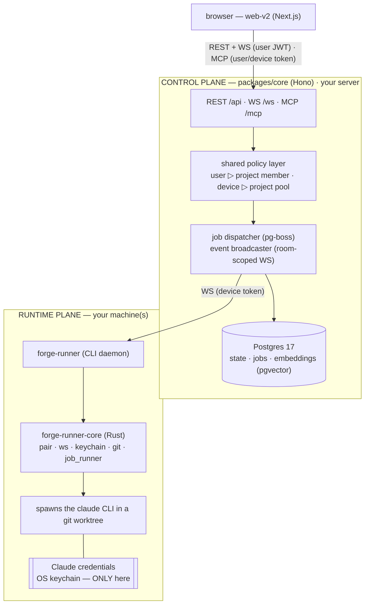

# Architecture

Canonical map of how Forge is laid out: control plane vs runtime, the device-runner split, dual-principal auth.

## Two planes

- **Control plane** — `packages/core` (Hono + Drizzle): REST, WebSocket, MCP. Holds project/issue state, queues jobs (pg-boss), embeddings (pgvector), streams events. **Never holds Claude credentials.**
- **Runtime plane** — device agents on users' machines: `forge-runner` (Rust CLI daemon). Pairs into the account, receives jobs over WS, spawns `claude` CLI in a git worktree, streams JobEvents back.

Two principals, one shared policy layer: **user** (JWT) and **device** (long-lived revocable token).

## Component map

## Non-goals

- Not multi-tenant SaaS (one instance = one tenant). Not tuned for >~1000 concurrent WS sockets (Redis pub/sub later). Not the Anthropic API — orchestrates the user's Claude Code CLI.
