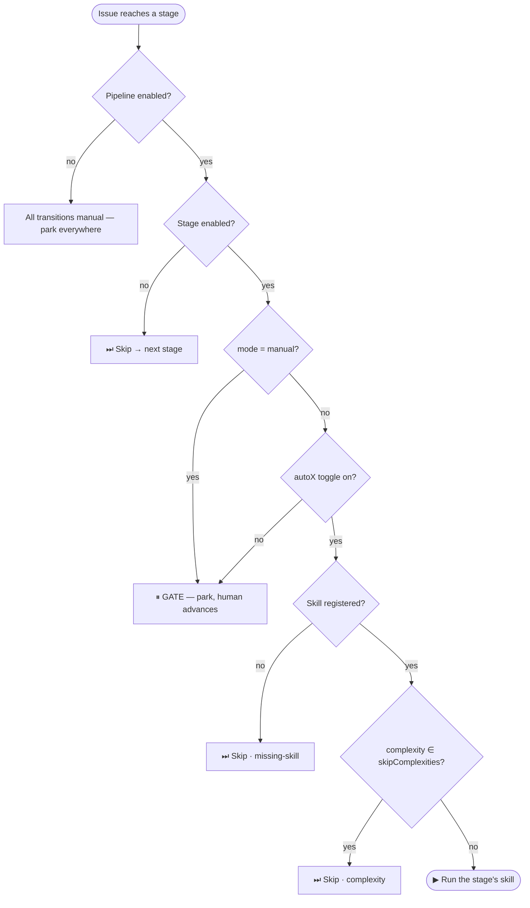
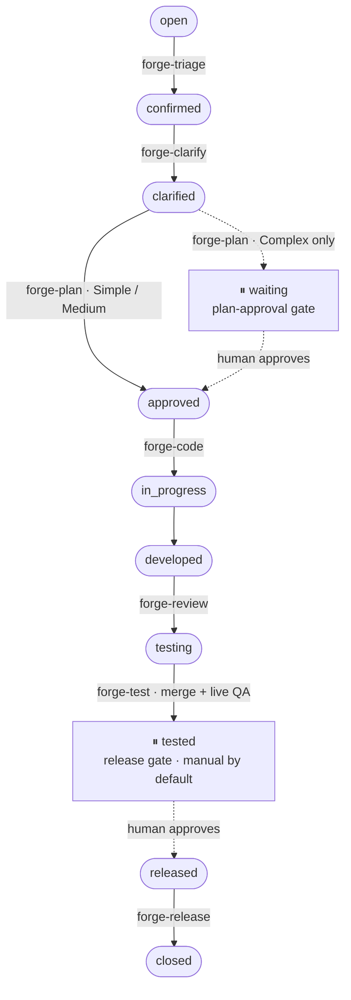
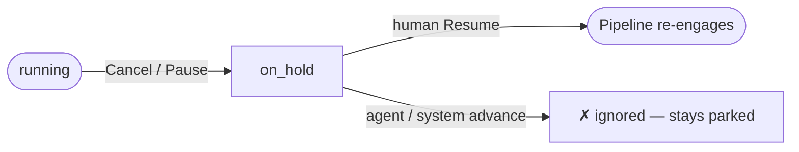

# Configure Pipeline Stages & the Release Gate

How to control which pipeline stages run automatically, which **pause for a human**, and which are skipped — for **anyone running a Forge project**. This is the day-to-day "how do I make the pipeline stop for approval / run hands-off" guide.

> Reference (the full status list + transition rules): [status-pipeline.md](../modules/issues-pipeline/status-pipeline.md). This guide is the practical layer on top.

**Prerequisites:** a Forge project with the pipeline enabled, and project-admin access (you'll use **Settings → Pipeline**).

## The model — one control per stage

Every pipeline stage is governed by **one setting** with three choices. Forge does **not** have special "gate statuses" — any stage can be a gate. The setting collapses the engine's dispatch rule into a single picker:

| Mode | What it means | What the pipeline does |
|------|---------------|------------------------|
| **Auto** | Run this stage's skill automatically | Dispatches the moment an issue reaches the stage |
| **Manual** | **Gate** — wait for a human | The issue **parks** here. It is **never auto-skipped**. Only a person (or an explicit manual run) advances it |
| **Skip** | Bypass this stage | The pipeline jumps forward to the next enabled stage |

Under the hood, when an issue reaches a stage the engine walks a single decision. The Auto/Manual/Skip picker sets the inputs to it — so **configure here, don't hand-edit `pipelineConfig` JSON** (raw edits are how stale, invisible gates creep in):

The engine auto-runs a stage **only when every gate above is green** — pipeline enabled, stage enabled, mode not `manual`, the `autoX` toggle on, a skill registered, and the issue's complexity not in the stage's skip list. The predicate lives in [`pipeline/orchestrator.ts`](../../packages/core/src/pipeline/orchestrator.ts); the three **Skip** outcomes are distinct (see [The three ways a stage gets skipped](#the-three-ways-a-stage-gets-skipped)).

## The lifecycle and the single release gate

The happy path runs automatically until the one gate that matters:

- **`tested` = "Awaiting release"** is the single production-approval gate, **Manual by default**. The test stage merges + deploys and runs QA against the live deploy; on PASS it parks the issue at `tested`. A **human** advances `tested → released`, which dispatches the release (close + branch cleanup).
- **`waiting` is the plan-approval gate — and it is *not* a configurable stage.** `forge-plan` parks an issue at `waiting` **automatically, only when the issue is classified Complex**; Simple/Medium issues go straight to `approved`. There is no `autoWaiting` toggle and setting a "mode" on `waiting` does nothing — it never dispatches a skill. To force a plan checkpoint for issues of **all** sizes, set the **code stage (`approved`) to Manual** (see presets).

## Where can it stop? — the gate map

Every place an issue can park, and who releases it:

| Park point | When it parks | Who releases it |
|------------|---------------|-----------------|
| `waiting` | plan written **and** issue is **Complex** (automatic) | human → `approved` |
| `approved` | only if you set the **code stage = Manual** | human → `in_progress` *(applies to all sizes)* |
| `tested` | QA passed — the **default release gate** | human → `released` |
| `needs_info` | a stage can't proceed without reporter input | human answers → `confirmed` / `open` |
| `on_hold` | paused, cancelled, or infra failure | **human Resume only** (see below) |
| `reopen` (held) | too many `reopen → fix` cycles — auto-fix stops | human re-triggers fix |
| `draft` | AI-proposed issue, not yet confirmed (Dream / Doc-Sync) | human → `open` |

> **`draft` vs `open`:** a `draft` issue is **inert** — the pipeline never picks it up. An `open` issue is auto-triaged the moment it's created (it consumes a runner slot). File speculative/follow-up issues as `draft`, not `open`.

### Pausing & resuming — `on_hold`

`on_hold` is the reliable manual park. The non-obvious rule: **only a human Resume re-engages the pipeline** — an agent or system transition out of `on_hold` is ignored, so a parked issue stays parked until you act.

## The three ways a stage gets skipped

"Skip" in the picker is only one of three skip paths the engine resolves — all three land the issue at the next enabled stage with telemetry (`pipeline_runs.metadata.skipChain`):

| Skip kind | Cause | How to set it |
|-----------|-------|---------------|
| **Explicit** | stage `mode = Skip` (or `enabled: false`) | the picker |
| **Missing-skill** | the stage is Auto but no skill is registered for it | leave the skill slot empty |
| **Complexity** | the issue's t-shirt size is in the stage's `skipComplexities` | e.g. `skipComplexities: ["xs","s"]` on `confirmed` |

**Complexity skip** lets small issues bypass heavyweight stages: a stage with `skipComplexities: ["xs","s"]` is skipped for issues sized `xs`/`s` (complexity is set at triage). **Unsized issues never skip.** A `manual` stage is **never** skipped by any of these paths — Manual always wins.

## Recommended presets

Pick the one that matches how much you want the pipeline to do unattended:

| Preset | Set it up as | Use when |
|--------|--------------|----------|
| **Ship-with-approval** *(default — recommended)* | Everything **Auto**; `tested` = **Manual** | Most projects. The pipeline runs all the way to a verified build, then one person approves the release. |
| **Full auto-ship** | Job stages **Auto**; set `tested` = **Skip** (`tested` is a no-skill checkpoint — the picker offers only Manual/Skip, and **Skip** flows it straight `tested → released` where Auto-release closes it). Keep **Auto release** on. | You fully trust the live end-to-end verification and want hands-off shipping. For a production Coolify deploy, also set `autoProdDeploy: true` to skip the one-time deploy confirm. |
| **Plan-gate (cautious)** | **`approved` (code) = Manual** *and* `tested` = **Manual** | Higher-risk work — a human approves the **plan** before any code is written *and* the **release** before production. (Use `approved`, not `waiting` — `waiting` only fires for Complex issues.) |
| **Review-heavy** | `developed` = **Manual** | You want a person to eyeball the written code before it's merged + verified. |
| **Lean (skip a stage)** | The stage = **Skip** (or `skipComplexities: ["xs","s"]` on a stage) | Small issues that don't need, e.g., the clarify step. |

## How to apply it

1. Open **Settings → Pipeline** for the project.
2. For each stage, choose **Auto / Manual / Skip** and (for Auto stages) pick the skill that runs there.
3. Save. The change takes effect on the next issue that reaches each stage.

**`mergeStates`** (same settings page) tells the engine which status stamps `merged_at` — the verified side-effect used to unblock issues that depend on this one (`blocked_by`). It stamps when an issue **leaves** the `baseBranch` status. Trunk-based projects leave it at `released`; set `baseBranch = tested` if you want dependents to unblock as soon as QA passes (at the gate) rather than at final close.

### What the validator rejects

Saving is guarded — the picker can't produce these, but they're why hand-editing JSON is unsafe ([`pipeline/pipeline-config-service.ts`](../../packages/core/src/pipeline/pipeline-config-service.ts)):

| If you try to… | Result |
|-----------------|--------|
| Disable the `open` stage | **Rejected (400)** — nothing could ever enter the pipeline |
| Disable the `baseBranch` status | **Rejected (400)** |
| Enable an Auto stage with **no skill** registered | **Rejected (409)** |
| Create a dead-end (a disabled stage with no forward path) | **Rejected (400)** |
| Set the `baseBranch` status to **Manual** | **Warning** — `merged_at` never stamps, so `blocked_by` dependents never unblock |

## Advanced per-stage tuning

Beyond Auto/Manual/Skip, each stage accepts optional overrides (Zod schema in [`pipeline/pipeline-config-schema.ts`](../../packages/core/src/pipeline/pipeline-config-schema.ts)). Most projects never need these — reach for them only when a stage needs special treatment:

- **`runner` / `model`** — run a specific stage on a chosen runner or model (`{ enabled, runner, model }`).
- **`sessionGroups`** — let consecutive stages share one Claude CLI session (warm context) instead of a fresh session each.
- **`skipComplexities`** — per-stage complexity skip (above).
- **`timeoutSeconds`, `permissionMode`, `allowedTools`, `mcpServers`** — sandbox/permission tuning for a stage.
- **`systemPrompt`, `userPromptPolicy`, `budget`** — prompt/cost overrides for a stage.

## Golden rules

1. **One gate by default — `tested`.** Don't rebuild a multi-gate flow.
2. **`Manual` is the gate primitive.** It works on *any* stage, parks even when no skill is registered there, and is never auto-skipped — that's the whole mechanism.
3. **`waiting` is automatic, not a picker.** It's the plan-approval gate for **Complex** issues only; gate the plan for all sizes via `approved` = Manual.
4. **Two-branch projects (staging → production) do not need a separate staging status.** The code stage deploys to staging, `tested` is the human approval, and the release stage promotes to the production branch.
5. **Configure in Settings → Pipeline, never by editing `pipelineConfig` JSON by hand** — raw edits can leave gates the UI can't show, so the saved config silently drifts from what you see.

> Historical note: earlier Forge versions had separate `pass` / `staging` statuses as extra gates. They were removed entirely (unify gate model) — `tested` is now the single pre-production gate, and deploy-to-staging happens inside the code stage. Any old config or doc mentioning `pass`/`staging` as a live status is stale.
