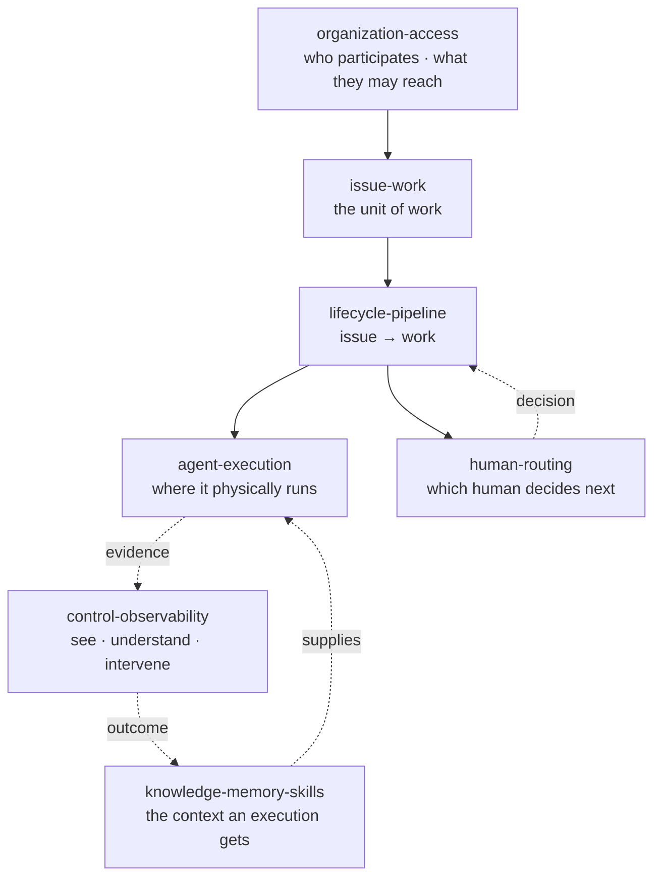

# Modules

**How a feature works, and where its data comes from.** Seven domains, one per unit of the
lifecycle. Intent lives in [`../VISION.md`](../VISION.md); this tree describes what is built.

## Map

| Folder | Answers | Read when | Updated by |
|---|---|---|---|
| [organization-access](organization-access/) | Who is in this org/project, and what may they reach? | `before-change` | the change itself |
| [issue-work](issue-work/) | What is an issue made of, and how do issues relate? | `before-change` | the change itself |
| [lifecycle-pipeline](lifecycle-pipeline/) | How does an issue become work, and what gates it? | `before-change` | the change itself |
| [agent-execution](agent-execution/) | Where does a job actually run, and how does it report? | `before-change` | the change itself |
| [human-routing](human-routing/) | How does a decision reach the right human? | `before-change` | the change itself |
| [knowledge-memory-skills](knowledge-memory-skills/) | What context does an execution get, and where from? | `before-change` | the change itself |
| [control-observability](control-observability/) | What is running, what is blocked, and what proves it? | `orientation` | the change itself |

A domain folder gains its **own** map table the moment it holds a second file. Until then this
table is the whole map.

## Rules for these docs

- **Open with a figure or a table** — before the first `##`. A diagram carries system correlation
  that prose spends a page on.
- **Cite an anchor, never a line number** — `schema.ts:issueStatuses`, not `schema.ts:973`. A line
  number goes stale in silence.
- **Do not restate what a tool derives.** No file inventories, no "which class handles this", no
  progress narration, no "may be stale" header.
- **Better missing than wrong.** A claim you cannot verify against the code is deleted, not
  softened. Where a capability is not built, say so and point at the intent.
