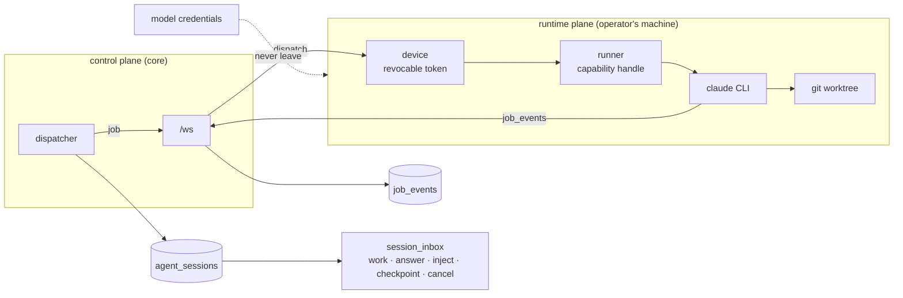

# Agent & Execution

**Forge is not an agent — it orchestrates agents.** This is the plane where work physically runs, on
infrastructure the team controls.

## What it owns

| Concern | Where it lives |
|---|---|
| Device pairing, revocation, binding | `core/src/devices/`, `schema.ts:devices`, `schema.ts:pairingCodes` |
| Runner capability and selection | `core/src/runners/`, `schema.ts:runners` (`capabilities` jsonb) |
| Job dispatch and event stream | `core/src/jobs/`, `schema.ts:jobEvents`, `schema.ts:jobEventKinds` |
| Agent sessions and their inbox | `core/src/agent-sessions/`, `schema.ts:agentSessions`, `schema.ts:sessionInbox` |
| Interactive chat (not a pipeline job) | `core/src/chat/`, `core/src/chat-logs/` |
| Transport | `core/src/ws/` |
| Worktree and git work | `core/src/git/` |
| The daemon itself | `packages/runner` (crates `forge-runner`, `forge-runner-core`) |
| Evidence retention | `core/src/jobs/retention-sweeper.ts` |
| UI | web `features/runners/`, `pairing/`, `sessions/`, `session/`, `conversations/`, `agents/` |

## Vocabulary

| Set | Values |
|---|---|
| `schema.ts:sessionInboxKinds` | `work` · `answer` · `inject` · `checkpoint` · `cancel` |
| `schema.ts:jobEventKinds` | the streamed event taxonomy — the only routing lever the runner's plain error string gives the classifier |

## Guards

- **Execution credentials stay on the runtime plane.** Forge orchestrates; it never becomes the
  model provider and never holds model credentials (`VISION: server-never-holds-credentials`). A
  runner is reached only through its own revocable device token.
- **A runner is a capability handle, not a machine.** The dispatcher targets capabilities; concrete
  behaviour lives on the device.
- **Chat and pipeline jobs share the runner, not the entry.** Chat is a conversation with no issue
  status to advance; a job is one step of a run. Both exec through the same shared path, so a change
  there touches chat and schedules too.
- **`job_events` are pruned at 30 days** for jobs in terminal states. Anything that must outlive
  that belongs in `activity_log` or memory, not in the event stream.

## Boundaries

What a job is *allowed* to do next is [lifecycle-pipeline](../lifecycle-pipeline/). What context it
is handed is [knowledge-memory-skills](../knowledge-memory-skills/).
