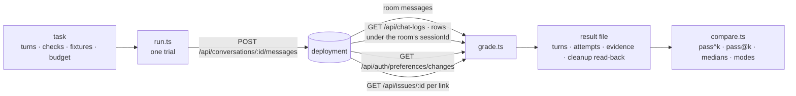

# Assistant benchmark

**Ten fixed tasks walked through the browser's chat door against a served build, graded from what
the deployment itself recorded, repeated, and compared between builds as pass^k.**

| | |
|---|---|
| Run | `pnpm --filter @forge/core bench:assistant run --api <url> --project <slug> --out <file> [--tasks a,b] [--trials 3] [--k 3]` |
| Compare | `pnpm --filter @forge/core bench:assistant compare <before.json> <after.json>` |
| Credentials | `FORGE_BENCH_TOKEN`, or `FORGE_BENCH_EMAIL` and `FORGE_BENCH_PASSWORD` — the environment only, never a file |
| Code | `core/src/assistant/bench/` — `task.ts` (the check vocabulary), `tasks/` (one module per task), `client.ts`, `trail.ts`, `grade.ts`, `run.ts`, `result.ts`, `compare.ts`, `cli.ts` |
| Proof | `core/src/assistant/bench/*.test.ts` over `fake-deployment.ts`, a scripted deployment; the live run is evidence on an issue, never part of `pnpm test` |

## What a grade reads

Four sources, all through the deployment's own authenticated routes, none through a database role
or a model judge:

- **The room** — the assistant message the send delivered, or none.
- **The trail** — every `chat_logs` row whose `sessionId` is the room, split among the sends by
  row-id boundaries taken around each send (`trail.ts:pairTrail`). Text is never matched: two sends
  may say the same thing, a screen repair is a second row for one send, and a fallback is a
  delivered text no row carries. Evidence the boundaries cannot place is refused by row id.
- **The preference trail** — the `preference_changes` rows gained during the send.
- **Issue lookups** — one `GET /api/issues/:id` per issue link the reply carries; 200 resolves,
  404 is `dead_link`, anything else stops the trial rather than being read as either.

Every failure is a mode named from a fact a reader can point at (`grade.ts:FAILURE_MODES`):
`wrong_link_shape`, `dead_link`, `unanswered`, `language_mismatch`, `fallback_sent`, `over_budget`,
`forbidden_tool`, `missing_tool`, `help_roundtrip`, `placeholder_argument`, `repeated_call`,
`screen_repair`, `noop_trail_row`, `preference_not_moved`. The result file carries the fact beside
the mode.

## The tasks

The shipped set is `tasks/index.ts:SHIPPED_TASKS`; each module names its exact messages, the
checks bound to each turn, the fixtures its placeholders read from the deployment (`{issueKey}`,
`{issueId}` from the project's first open issue, `{projectName}`), the preference it sets before
its first turn, and its budget in seconds. A task is complete on its own: a follow-up's antecedent
is an earlier turn of the same task, and a task that reads a style sets that style first.
`task.test.ts` loads the set whole and refuses a duplicate id, a turn with no check, a check outside
the vocabulary, a placeholder no fixture fills, and a preference move with no restore.

## Reading a comparison

Per task and per side: `n` trials, `s` trials whose every turn passed, the pass rate, and two
estimators over the trials observed with `k` = 3 unless a file names another:

| | |
|---|---|
| pass^k | `C(s,k) / C(n,k)` — the chance that `k` trials drawn from those observed all pass |
| pass@k | `1 − C(n−s,k) / C(n,k)` — the chance that at least one of `k` passes |

Pass/pass/fail at `k` = 3 is pass^3 = 0 and pass@3 = 1, not two thirds. A side with fewer than `k`
trials is marked `thin` and gets no estimator. Medians of seconds and tool calls and the modes
tallied stand beside the estimators, and the lines end with what separates the two files: commit,
api, model, `k`, trial count. **There is no composite figure**, in the object or the lines — a
weighted mean is where the task that cliffs goes to hide (`compare.test.ts` asserts the keys).

## What the run leaves behind

Values come back; records stay. Each trial reads the account's preference values before it starts,
deletes its room and reads the deletion back (`GET` → 404), writes the baseline values back and
reads them back equal, and records expected, observed and time for both in the file. What it cannot
remove it counts: a preference move and its restore each leave a `preference_changes` row through
the one writer (`preference-changes.ts:writeAssistantPreferences`, which has no delete), and every
attempt leaves a `chat_logs` row. Both carry the bench room's id (`conversation_id`, `session_id`),
the file lists every room it opened (`cleanup.room.id`), and a reading of the corpus excludes the
benchmark's rows by those ids. `auditRowsAdded` in each trial is that count.

## What it does not do

- Judge quality with a model, even advisory.
- Walk the `POST /api/chat` or Rocket.Chat doors; only the browser's door is benchmarked.
- Decide language: the `language` check is a diacritic heuristic (`grade.ts:vietnameseWords`).
  After code spans, URLs and double-quoted spans are removed it counts words carrying a Vietnamese
  letter or tone mark; `vi` needs three, `en` fails at two. A Vietnamese name in an English reply
  passes `en`; it says nothing about grammar or register.
- Write to `chat_logs.quality_signals` or compare windows of live traffic — a follow-up that reuses
  `grade.ts`.
