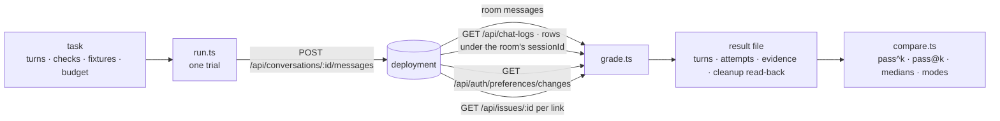

# Assistant benchmark

**Ten fixed tasks walked through the browser's chat door against a served build, graded from what
the deployment itself recorded, repeated, and compared between builds as pass^k.**

| | |
|---|---|
| Run | `pnpm --filter @forge/core bench:assistant run --api <url> --project <slug> --out <file> [--tasks a,b] [--trials 3] [--k 3] [--judge <model>]` |
| Compare | `pnpm --filter @forge/core bench:assistant compare <before.json> <after.json> [--across-projects]` |
| Credentials | `FORGE_BENCH_TOKEN`, or `FORGE_BENCH_EMAIL` and `FORGE_BENCH_PASSWORD` — the environment only, never a file |
| Code | `core/src/assistant/bench/` — `task.ts` (the check vocabulary), `tasks/` (one module per task), `client.ts`, `trail.ts`, `grade.ts`, `run.ts`, `brief.ts`, `result.ts`, `compare.ts`, `cli.ts` |
| Proof | `core/src/assistant/bench/*.test.ts` over `fake-deployment.ts`, a scripted deployment; the live run is evidence on an issue, never part of `pnpm test` |



## What a grade reads

Four sources, all through the deployment's own authenticated routes, none through a database role
or a model judge:

- **The room** — the assistant message the send delivered, or none.
- **The trail** — every `chat_logs` row whose `sessionId` is the room, split among the sends by
  row-id boundaries taken around each send (`trail.ts:pairTrail`). Text is never matched: two sends
  may say the same thing, a screen repair is a second row for one send, and a fallback is a
  delivered text no row carries. Evidence the boundaries cannot place is refused by row id.
- **The preference trail** — the `preference_changes` rows gained during the send.
- **Issue lookups** — one `GET /api/issues/:id` per issue link the reply carries; 200 resolves,
  404 is `dead_link`, anything else stops the trial rather than being read as either.

A request whose fetch threw, so that no response reached the client at all, is re-sent once after
five seconds (`client.ts:ClientOptions.retryDelayMs`) when it is a `GET` or a `DELETE`; a `POST` is
never re-sent, since the send may have reached the room before the connection dropped and a second
copy would be answered twice and graded as one turn. A second failure ends the trial with an error
naming the method, the path, the cause and the first attempt (`client.ts:FetchFailure`), so a dead
trial reads `fetch failed (cause: ECONNRESET) on GET /api/chat-logs ...` rather than `fetch failed`.
Every trial records `retried`, the retries the client spent in it; a file written before the retry
existed reads as `0`.

Every failure is a mode named from a fact a reader can point at (`grade.ts:FAILURE_MODES`):
`wrong_link_shape`, `dead_link`, `unanswered`, `language_mismatch`, `fallback_sent`, `over_budget`,
`forbidden_tool`, `missing_tool`, `help_roundtrip`, `placeholder_argument`, `repeated_call`,
`screen_repair`, `noop_trail_row`, `preference_not_moved`. The result file carries the fact beside
the mode.

## The project brief: what the judge is held to

Every judged turn of every task carries a **project brief** in the judge's reference block, read
once per run from the deployment before the first turn (`brief.ts:readProjectBrief`,
`brief.ts:projectBrief`) and written whole into the result file under `project.brief` with
`project.readAt`.

Before ISS-1066 the judge saw the task's own filled fixtures and the earlier turns and nothing else,
so on `summary-in-style`, `filing-guidance` and `memory-question` — which declare no fixtures — it
had no project to hold a reply against and "served" was a reading of tone. On `forge-plugin` on
2026-09-17 the assistant answered *"763 open issues"* against a project holding 682 and the judge
said yes on both trials.

The brief has two budgets, not one. The **grounding block** is never truncated: the project's name
and slug, its issue counts by status, its effective pipeline in order, its filing rules (the issue
key prefix, and whether the intake gate parks a filing at `draft` for a person to admit), and the
issue waiting on information or a line saying there is none. It is bounded by the project's own
shape rather than by anything an author typed, and it is what the claims a project-understanding
task makes are checked against. What is left of `brief.ts:BRIEF_MAX_CHARS` (6,000) is shared among
the four author-text sections — description, project facts, knowledge entries, the newest twenty
issue titles — each cut to its own share and each naming its own cut, so a 20,000-character
description cannot take the counts with it. A section with no room left says it was dropped.

Knowledge is read through `GET /api/projects/:id/knowledge`, the route `forge_knowledge` action=list
reads; that route serves no body, so the brief pulls the bodies of the `injection: 'always'` entries
only (`brief.ts:BRIEF_KNOWLEDGE_BODIES`) — the ones the product itself injects into a prompt. A
project holding no knowledge gets a section saying so rather than no section. A credential that
cannot read that route refuses the whole run by name before the first turn, rather than leaving the
judge to grade project answers against a silently empty brief. A personal access token is refused
there too, before any room: every trial reads and restores the person's preferences and
`/api/auth/preferences` resolves no project, so a PAT run would fail all of a run's trials after
paying for each one's turns and report them as the assistant's failures. The benchmark needs
`FORGE_BENCH_EMAIL` and `FORGE_BENCH_PASSWORD` for an account that holds the project.

Two details of that read are load-bearing on a large project. The always-injected entries are asked
for with the route's own `injection` filter rather than found by filtering the index, because the
index arrives as a prefix once it passes the deployment's response cap
(`knowledge/service.ts:MAX_RESPONSE_CHARS`), and an entry past that prefix would otherwise
contribute none of its prose while the brief read as complete. What the cap left out and the
filtered read did not recover is disclosed as a count. And the entries whose bodies the brief
fetched are rendered **before** the title-only ones: the knowledge section is cut at its end, so a
long enough prefix of titles would spend the section's whole allowance and slice off the very rule
the second read paid a request for.

A task's `judgeRubric` is handed to the judge on **every** judged turn of that task, so a multi-turn
rubric says which turn each requirement belongs to: `memory-question`'s first turn asks only that the
assistant remember a window, and a rubric demanding the window back would have failed the
acknowledgement that served it.

In the judge's messages the brief stands under its own sub-header (`judge.ts:BRIEF_HEADER`) between
the filled fixtures and the earlier turns. An input carrying no brief produces the byte-identical
block it produced before the split — `judge.test.ts` pins that against the pre-change text for
fixtures alone, turns alone, both and neither, rather than against the function that builds both
sides.

## A task the project cannot be asked

A task whose fixture the project's own shape cannot supply is recorded `notApplicable` with its
reason and **no trial is run** (`brief.ts:fixtureNotApplicable`): today, `project-waiting-issue` on a
project holding no `needs_info` issue, and `open-issues-linked` on a project holding no open issue.
The refusal was always right; three failed trials were the wrong figure for it, and on the
2026-09-17 `forge-plugin` run it read as a capability the assistant lacked. Such a task is charged to
no denominator — not the score, not the capability's `full n/m`, not the ladder's thin mark — and
its reason is printed on the run, on the ladder and in the comparison in place of
`0/0 trials passed (thin: 0 < 3)`, which is a different fact about a different thing.

## The effective pipeline

`prompt/facts/effective-ladder.ts:effectivePipelineStates` is the one function both the benchmark and
the product's prompt layer answer from: the canonical ladder (`prompt/facts/registry.ts:CANONICAL_LADDER`)
minus every stage the project set `enabled: false`. The stored `pipelineConfig.states` map is
per-stage **configuration** over four optional keys and is not a sequence — `forge-plugin` stores one
of them — so the `pipelineStates` fixture reading its keys asked the assistant for a one-state
pipeline and would have graded the right answer wrong. An empty stored map means every canonical
rung, never none, and the refusal that used to stand there was a wrong refusal rather than a loud
one. `prompt/facts/resolve.ts:buildLadder` is still a second copy of that filter while ISS-1048 holds
that file; `effective-ladder.test.ts` reads its text and goes red if the condition drifts or a second
copy appears in it.

The fixture-bound checks (`task.ts:CHECK_KINDS`) read a value the deployment supplied. A literal
pattern is matched on a word boundary at each end that has one (`grade.ts:literal`), because an
issue key is a prefix of another issue key: `ISS-2` matched inside `ISS-25`, and `ISS-10` inside an
`ISS-1056` that a title carried, so `open-issues-linked` could not be passed at all on the QA
project — a reply listing all five in the deployment's own order was reported as naming them out of
order. `listInOrder`
holds every member of a filled list to its place; `onlyFrom` fails a reply naming a registry status
(`pipeline-registry.ts:REGISTRY_ISSUE_STATUSES`, whole words, `in_progress` one token) outside that
list, so a reply reciting the product's whole lifecycle no longer passes the pipeline-states task
because the three configured states happen to stand in order among ten; `labeled` reads the number
beside a label in its clause; `linkTo` needs a link whose segment is the filled issue id;
`maxNotesKept` reads the notes the trial kept, as the cleanup counted them (`cleanup.memories.found`),
and fails the turn under `repeated_call` when more were kept than the task allows, or when the
listing was refused and the count is unknown (ISS-1064).

## The tasks

The shipped set is `tasks/index.ts:SHIPPED_TASKS`; each module names its capability
(`task.ts:CAPABILITIES`), its exact messages, the checks bound to each turn, the fixtures its
placeholders read from the deployment (`task.ts:FIXTURE_KEYS`: `{issueKey}` and `{issueId}` from
the project's first open issue, `{openIssueKeys}` / `{openIssueId}` from its five newest open ones,
`{projectName}`, and the ISS-1061 fixtures below), the preference
it sets before its first turn, and its budget in seconds. A task is complete on its own: a follow-up's antecedent
is an earlier turn of the same task, and a task that reads a style sets that style first.
`task.test.ts` loads the set whole and refuses a duplicate id, a turn with no check, a check outside
the vocabulary, a placeholder no fixture fills, a preference move with no restore, a task with no
capability, a judge rubric over one line, a multi-turn task whose rubric does not name the turn it
is about, and a new room asked for on a first turn.

## Reading a comparison

Per task and per side: `n` trials, `s` trials whose every turn passed, the pass rate, and two
estimators over the trials observed with `k` = 3 unless a file names another:

| | |
|---|---|
| pass^k | `C(s,k) / C(n,k)` — the chance that `k` trials drawn from those observed all pass |
| pass@k | `1 − C(n−s,k) / C(n,k)` — the chance that at least one of `k` passes |

Pass/pass/fail at `k` = 3 is pass^3 = 0 and pass@3 = 1, not two thirds. A side with fewer than `k`
trials is marked `thin` and gets no estimator. Medians of seconds and tool calls and the modes
tallied stand beside the estimators, and the lines end with what separates the two files: commit,
api, model, `k`, trial count. **There is no composite figure**, in the object or the lines — a
weighted mean is where the task that cliffs goes to hide (`compare.test.ts` asserts the keys).

## What the run leaves behind

Values come back; records stay. Each trial reads the account's preference values before it starts,
deletes every room it opened and reads each deletion back (`GET` → 404), writes the baseline values back and
reads them back equal, and records expected, observed and time for both in the file. What it cannot
remove it counts: a preference move and its restore each leave a `preference_changes` row through
the one writer (`preference-changes.ts:writeAssistantPreferences`, which has no delete), and every
attempt leaves a `chat_logs` row. Both carry the bench room's id (`conversation_id`, `session_id`),
the file lists every room it opened (`cleanup.rooms[].id`), and a reading of the corpus excludes the
benchmark's rows by those ids. `auditRowsAdded` in each trial is that count.

## History: the same graders over what real people asked

`pnpm --filter @forge/core bench:assistant history --api <url> --project <slug> --from <date> --to <date> --out <file> [--source s] [--resolve] [--budget-seconds 60] [--max-iterations 8] [--exclude run.json]...`
reads every `chat_logs` row of the window through `GET /api/chat-logs` and grades each row on what
a row alone can show (`history/grade-row.ts:gradeRow`): the benchmark's own checks that need no
task expectation, run through `grade.ts:gradeTurn` over a synthetic turn (`linkShape`,
`notFallback`, `noHelp`, `noPlaceholder`, `noRepeatedCall`, `maxIterations`, `maxSeconds`, and
`linksResolve` only under `--resolve`, one `GET /api/issues/:id` per distinct link), plus three rules
history alone has: a row whose `query` is the door's corrective instruction
(`fallback-replies.ts:CORRECTIVE_PREFIX`) is a `screen_repair`; a row with an `error` is
`unanswered` whatever text it left; a question with three or more Vietnamese-marked words answered
with none is a `language_mismatch`. What a row cannot show is not graded: `mustMatch`,
`toolsRequired`, `preferenceRows` and the other task-bound checks need an expectation no row
carries.

The file (`history/result.ts`) holds the window, the served commit, the budgets, and per model and
source: rows, sessions, `thin` under 30 rows, every mode's count **and** rate, medians of duration,
tool calls and iterations; then `flagged`, every row that carried a mode, newest first, with its
`chat_logs` id, session, modes and the fact behind each. Rates, not pass^k: a row is not a trial and
a session is not a task. `bench:assistant compare-history <before> <after>` prints two windows side
by side per model and source, every rate beside its count, and what separates the files (commit,
window, budgets, rows). There is no total line.

The benchmark's own rows are traffic too. `--exclude <run.json>` reads a `bench:assistant run`
file and drops every row whose `session_id` is a room that run opened (`cleanup.rooms[].id`), naming
the sessions and the count dropped in the file. A bench room whose run file is not to hand is
dropped too, by the one mark its rows keep: every row of the session is a shipped task's turn message
(`history/bench-sessions.ts:benchSessions`, placeholders read as wildcards) AND the room answers 404
(`client.ts:roomGone`; the bench deletes every room with a read-back, while a person's room still
answers 200, or 403 to someone outside it). A session that sent one task-shaped question beside
anything else stays, and so does one whose room is standing. Those sessions and rows are counted
apart, `excludedSessionsByTask` and `excludedRowsByTask`, and the closing line prints both counts.
The weekly report (`weekly/read-rows.ts:readWeekRows`) applies the same two marks in-process, since
its title lookup against `conversations` finds nothing once the rooms are gone. The verb writes
result files and nothing else: `chat_logs.quality_signals` stays untouched.

## Judge: a second model asked one question, never the last word

The judge never rescues a failed check. `--judge <model>` on `bench:assistant run` and on
`bench:assistant history` asks a second model, on a different family from the one under test, the
one question the rules cannot answer: was this person served. It reads the query, the reply, the
`forge` argv of every tool call and the row's error (`judge.ts:judgeMessages`) and answers one JSON
object, `{ intent, served: yes | partial | no, reason, quote }`, where `quote` is a span copied
from the reply that the reason rests on. The endpoint is named by `FORGE_BENCH_JUDGE_URL` and
`FORGE_BENCH_JUDGE_KEY`, environment only, spoken on the OpenAI wire through
`providers/openai.ts:createOpenAIProvider`, at temperature 0, one request per judged turn or row.
A task may carry a one-line `judgeRubric` that tells the judge what served means for it;
`out-of-reach-tests` carries one that reads a plain refusal naming where the tests run as served,
after the judge called such a refusal unserved on 2026-09-16.

The verdict is a sidecar. It is stored under `judge` on the turn record or on the history file's
`judge.rows`, beside `modes`, and nothing reads it back: `pass`, pass^k, pass@k, every mode count
and every rate are byte for byte what they are without the flag. `compare` and `compare-history`
print the judge counts beside the mode counts (`judge yes 31/40, partial 6/40, no 3/40, unreadable
0/40`) and two agreement figures that say whether the judge is worth reading: of the rows the rules
called `fallback_sent` or `unanswered`, how many the judge also called `no`; of the rows with no
mode, how many it called `yes` (`judge.ts:agreement`). There is no weighted line.

An answer the parser cannot read (`judge.ts:parseVerdict`: not a JSON object, a key missing, a
`served` outside the set, a `quote` the reply never said) is stored as `judge.error` on that row
and counted as `unreadable`, never as a verdict. A judge whose model is one the trail names is
refused by name before any call, and a run stops there with the refused trial's grades and room id
in the partial file. `history --judge` judges the newest `--judge-sample` kept rows (default 40)
after `--exclude` has dropped the bench rooms; `run --judge` judges every turn of every trial.

## Ladder: one printed score, never printed alone

`pnpm --filter @forge/core bench:assistant ladder <run.json>... [--history <history.json>]... [--out ladder.md]`
ranks the run files given, best first, **one table per project** (`ladder.ts:groupByProject`), on one
score defined once in `ladder.ts:score` and printed under every ladder: **the mean of pass^k over the
tasks the run walked, 0–100, ties broken by the lowest task**, at one k per project group, the largest
that group names, as `compare` does. The group is why k is not taken across every file: a task's pass
rate is about the project it was walked on, and a complete three-trial run was otherwise marked thin
because another project's file named a larger k. For the same reason `compare` refuses two files
naming two different projects, printing both slugs, unless `--across-projects` is given; a file
written before a run recorded its project reads as `project: null` and is never refused. ISS-1051 refused a composite because a mean hides a task that cliffs; the owner
reversed that on 2026-09-16 because a benchmark that cannot rank two builds is not one, and the
reversal is made safe by the row, not the number: every score has the lowest task and its pass^k on
the same row (`ladder.test.ts` plants a task at 0% on the run with the best mean and reads it
there), the count of tasks at 100%, the judge's served rate as a column that never enters the score,
the median seconds, and the marks `partial (7 of 10 tasks)` and `thin`. A `delta` line closes the
run table with the gap between the top two rows, column by column. A second table ranks history
files by served rate (judge `yes` over judged rows) and then by the fewest flagged rows, with rows
and sessions beside them and `thin` under 30 rows. `--out` writes the same tables as Markdown.

A ladder printed from the two ISS-1051 live runs, the ISS-1051 verification run and the ISS-1054
judged history reading (`bench:assistant ladder beta-run.json beta-run2.json beta-verify.json --history beta-history-judged.json`):

```
runs
#  run               commit    model             score  lowest task         full  judge served  median  marks
1  beta-run.json     3012f636  cx/gpt-5.6-terra  50.0   filing-guidance 0%  5/10  —             9.7s    —
2  beta-run2.json    99c1002a  cx/gpt-5.6-terra  40.0   filing-guidance 0%  4/10  —             9.6s    —
3  beta-verify.json  2343225c  cx/gpt-5.6-terra  —      —                   0/2   —             6.6s    partial (2 of 10 tasks), thin
score = mean of pass^k over the tasks walked at k = 3, 0-100; tie: the lowest task; the judge is a column, never in the score
delta (1st over 2nd): score +10.0; lowest task 0% vs 0%; full tasks +1; judge served — vs —; median +0.1s
history windows
#  window file               commit    window                                                   rows  sessions  served       flagged  marks
1  beta-history-judged.json  63a54a44  qa-project-available-for-testing 2026-09-14..2026-09-17  48    26        78% (31/40)  18/48    —
served = judge yes over judged rows; flagged = rows carrying a mode over rows
```

The verification run walked two tasks once each, so no task has an estimator at k = 3, its score is
`—` and it is marked `partial` and `thin`; the two full runs share the same lowest task at 0%, and
the mean alone would not have said so.

## Advice: what the numbers ask of the harness

Every `compare` and `compare-history` ends with an `advice:` block for the after side, and
`bench:assistant advise <run.json|history.json>` prints the same block for one file. The block is
derived from the flagged rows and the judge column already in the file (`advice.ts:advise`): no
model is asked, nothing is written, and no count changes. A count is rows, so a turn that carries
both `screen_repair` and `fallback_sent` is one row of that pattern. One line per pattern over its
threshold, each carrying the count it rests on, the bar it crossed and the surface it points at:

- `screen_repair`/`fallback_sent` rows with no readable verdict → `bench:assistant run --judge` /
  `history --judge`: judge these rows before touching the screen. A missing verdict is never
  evidence that a safeguard is too strict, and a group judged on a sample keeps this line for the
  rows the sample missed.
- `screen_repair`/`fallback_sent` rows the judge called `yes` or `partial` →
  `conversations/screened-reply.ts:screenReply`: the repair served. The verdict is on the repaired
  reply, never on the one the screen rejected (`history/grade-row.ts:gradeRow` marks the retry row;
  a run turn's delivered text is its last attempt), so the line sends the reader to the rejected
  attempt in the row and says to loosen the shape check only where that attempt answered the
  question.
- `screen_repair`/`fallback_sent` rows the judge called `no` → the repair did not serve either; the
  fault is upstream of the screen, keep it.
- `help_roundtrip` above 10% of rows (`advice.ts:THRESHOLDS`) → `guides/assistant-method-guide.ts:ASSISTANT_METHOD_GUIDE`:
  the method guide sends the model to `-h` for every verb; carry the verbs' usage so no `-h` call
  is needed.
- `wrong_link_shape`/`dead_link` → `messaging/text-rules.ts:ISSUE_NAV_RE` and the link line in
  `assistant/door-persona.ts:assistantOpening`: the link line is not landing; state the one URL shape
  the web opens, `/projects/<slug>/issues/<documentId>`.
- `over_budget`/`repeated_call` → `assistant/run-turn-core.ts:runTurnEvents`: the loop lacks a stop.
- `language_mismatch` → `assistant/door-persona.ts`: the persona does not bind the reply language.
- `unanswered` → `conversations/turn-runner.ts`: a provider error or an empty reply reached the person.

A clean file prints `advice: none - every pattern is under its threshold`. The change a line names
lands under its own issue with a before/after compare; the block never applies anything.

The block printed on 2026-09-16 from `bench:assistant advise beta-history-judged.json` (the
ISS-1054 judged window, 48 rows of `cx/gpt-5.6-terra` on the web door, 40 of them judged by
`cx/gpt-6-astra`):

```
advice:
  cx/gpt-5.6-terra / web: screen_repair/fallback_sent 5/48 (10%) above 0, repaired reply judged yes/partial -> conversations/screened-reply.ts:screenReply: the repair served; the verdict is on the repaired reply, not the rejected one - read the rejected attempt in the row, and loosen the shape check only where it answered the question
  cx/gpt-5.6-terra / web: help_roundtrip 12/48 (25%) above 10% -> guides/assistant-method-guide.ts:ASSISTANT_METHOD_GUIDE: the method guide sends the model to -h for every verb; carry the verbs' usage so no -h call is needed
  cx/gpt-5.6-terra / web: wrong_link_shape/dead_link 5/48 (10%) above 0 -> messaging/text-rules.ts:ISSUE_NAV_RE and the link line in assistant/door-persona.ts:assistantOpening: the link line is not landing; state the one URL shape the web opens, /projects/<slug>/issues/<documentId>
```

The same block at the end of `compare beta-run.json beta-run2.json` (the two ISS-1051 live runs,
neither judged) asks for a judge before it says anything about the screen; the tasks below are two
of ten:

```
advice:
  summary-in-style: screen_repair/fallback_sent 3/3 (100%) above 0, unjudged -> bench:assistant run --judge / history --judge: the screen rejected replies and nothing says whether they were right; judge these rows before touching the screen
  summary-in-style: unanswered 3/3 (100%) above 0 -> conversations/turn-runner.ts: the door lets a provider error or an empty reply reach the person; retry once or say so
  filing-guidance: help_roundtrip 3/3 (100%) above 10% -> guides/assistant-method-guide.ts:ASSISTANT_METHOD_GUIDE: the method guide sends the model to -h for every verb; carry the verbs' usage so no -h call is needed
```

The first block is the evidence ISS-1057 starts from: five screen rejections whose repair the judge
read as served, so the five rejected attempts are the reading ISS-1057 owes before it touches the
shape check; twelve of forty-eight turns spent on `-h`; and five links in a shape the web does not open.

## Harvest: judged rows become candidate tasks

`pnpm --filter @forge/core bench:assistant harvest <history.json> --out <dir>` reads a judged
history file and writes one candidate task module per row the judge called `no` or `partial`
whose intent no shipped task covers (`harvest.ts:harvest`). It reads a file and writes files:
no model is asked and the deployment is never called. A file with no `judge` key, or one judged
before its rows carried the person's `query` (`history --judge` writes `query` and `askedBy` on
every judged row since ISS-1055), is refused by name with `history --judge` as the way to a file
it can read.

A candidate is a `Task` in the benchmark's own shape, ready to be moved into `tasks/` by a
person's commit and nowhere else: the scrubbed real query as the message, the judge's `intent`
as the task's `intent` line, `budgetSeconds: 90`, and `checks: []` — the one field a person must
write, and the reason `validateTasks` refuses the candidate (`turn 1 carries no check`) until
they do. Its header carries the provenance: the `chat_logs` id, the room (`session_id`), the
created-at time, and the judge's verdict and reason. Every shipped task carries an `intent` line
for the same reason; coverage (`harvest.ts:coverage`) is the share of the row's intent content
words (letters only, four or more, minus `STOPWORDS`) found in one task's intent and id, covered
at `COVERED_SHARE` (0.6) or above. No model is asked.

Every text the module carries is scrubbed first — the query, and the judge's intent and reason,
which repeat what the person wrote (`harvest.ts:scrubQuery`): e-mail addresses become `<email>`,
`@handles` and the name the row knows the asker by (`askedBy`) become `<person>`, issue keys
become `ISS-<n>`, UUIDs `<uuid>`, and a URL's host `<host>`. Nothing is guessed from
capitalisation. The rows skipped are printed with the reason: `judged yes`, `intent covered by
<task> (<share>)`, `unreadable verdict`, `query too short` (under `MIN_QUERY_WORDS`, three).

The printout on 2026-09-16 over the QA project window 2026-09-14..17 on beta, re-read with
`history --judge cx/gpt-6-astra` at this change (40 judged rows: 31 yes, 8 partial, 1 no); the
skipped list is cut to the rows not judged `yes`:

```
$ bench:assistant harvest beta-history-judged.json --out /tmp/a1055/candidates
wrote 3 candidate(s) to /tmp/a1055/candidates
  assistant-identify-itself-explain-role-2110b11a.ts — The person wanted the assistant to identify itself and explain its role in two sentences.
  proof-archiving-keeps-message-7418d242.ts — The person wanted proof from ISS-<n> of whether archiving keeps the message.
  filed-profile-page-header-remaining-cc2f3a23.ts — The person wanted a bug filed for the profile page header remaining light in dark mode.
skipped 37:
  8646c47d — intent covered by out-of-reach-tests (80%)
  8ee70263 — retry row, not a person's query
  64d3da6d — retry row, not a person's query
  031a5b1e — intent covered by open-issues-linked (100%)
  81f8607b — intent covered by open-issues-linked (100%)
  e6264100 — retry row, not a person's query
  ... 31 rows — judged yes

$ bench:assistant harvest <the ISS-1054 file, judged before query was recorded> --out /tmp/old
beta-history-judged.json was judged before ISS-1055 and its rows carry no query; run history --judge on the window again
```

One of the three, as written (`checks: []` is the person's to fill; the query's issue key, had it
carried one, would read `ISS-<n>`):

```ts
// Harvested by bench:assistant harvest (ISS-1055) from a judged history row.
// chat_logs id: cc2f3a23-bdfa-46d6-928b-d3f7bfed0efc
// room (session_id): 7419a207-d918-4a84-80aa-a9b300ebbad5
// created at: 2026-09-14T17:37:34.233Z
// judge cx/gpt-6-astra said partial: The assistant drafted a relevant bug report and requested some useful details, but explicitly did not file it and also imposed unnecessary requirements.
import type { Task } from '../task.js';

/** The expectations are a person's to write: `validateTasks` refuses the empty checks list until then. */
export const filedProfilePageHeaderRemainingCc2f3a23: Task = {
  id: "filed-profile-page-header-remaining-cc2f3a23",
  intent: "The person wanted a bug filed for the profile page header remaining light in dark mode.",
  budgetSeconds: 90,
  turns: [{ message: "The header on the profile page stays light when I turn dark mode on. Can you file that as a bug?", checks: [] }],
};
```

The door's retry rows — a query that is the corrective instruction the screen sent back, marked
`screen_repair` by history — are skipped as `retry row, not a person's query`: a task built on one
would send the model a system check.

## Weekly reading: the history, the judge, the compare and the harvest on a schedule

Every day at 04:00 UTC a pg-boss cron entry (`assistant/weekly/register.ts`, queue
`assistant-weekly-report`) runs `assistant/weekly/run.ts:runAssistantWeeklyOnce` over every
project that opted in, and posts one comment per ISO week on that project's pinned issue:
Monday's tick is the first for a new week, and the six that follow name the same week and skip
when its report is already there. The comment is the
report and its attachments are the files: `assistant-history-<week>.json` (the history file, the
one `history --compare` and `harvest` read), `assistant-compare-<week>.txt` when a previous week's
file is on the issue, and one `candidate-<id>.ts.txt` per candidate. Nothing else is written: no
`chat_logs` column, no task file, no issue.

A project opts in through `pipelineConfig.assistantWeekly` (`pipeline/pipeline-config-schema.ts`,
mirrored on the Pipeline tab of the project's settings): `enabled`, `pinnedIssue` (an issue key on
the project, `ISS-1060`), `judgeProviderId` (a provider the app registered from its environment,
`providers/bootstrap.ts`), `judgeModel`, and one `source` when one door is wanted. Absent is off, as
`knowledgePromotion` is; a cron nobody watches never reads a project that did not ask. The judge
needs no credential of its own: `bench/judge.ts:createJudgeFromProvider` asks the registered
provider the sidecar's one question at temperature 0, and the app's `LITELLM_*` (or whichever
provider the id names) is the key.

The week is the ISO week before the tick's — Monday 00:00 UTC to Monday 00:00 UTC
(`weekly/window.ts:weekBefore`) — so Monday's tick and a Tuesday retry name the same window, and
the window's id (`2026-09-07..2026-09-14`) is what the first line, the attachment names and the
already-posted check carry. The steps run in order and post once: read the week in-process
(`weekly/read-rows.ts` reads `chat_logs` by project slug and bound and excludes the benchmark's
own rooms by the title `bench/run.ts` gives them, `weekly/run.ts:readWeek` grades, summarizes and
judges the newest forty kept rows); compare with the newest `assistant-history-*.json` on the
pinned issue (`weekly/previous.ts`), or say the comparison starts next week; harvest the judged
`no` and `partial` rows against the shipped tasks; post as the project's creator
(`weekly/post.ts`). The comment is whole or absent: a file that fails to attach removes what was
written and the comment row before the error leaves.

`POST /api/projects/:id/assistant-weekly/run` (`assistant/weekly/routes.ts`, org admin or owner;
the "Run the reading now" button beside the toggle) runs the same function for one project at
once, under the same window and the same already-posted check, and answers with the outcome
(`posted`, `skipped` with its reason, or `failed` with the error): the first report after flipping
the toggle, and a retry an operator does not want to wait a day for. A project whose config is off
is refused by name with the fields to save. The cron and the door share one exclusion: a
transaction-scoped advisory lock keyed by project and window (`assistant/weekly/lock.ts`), taken
before the already-posted check, so two runs of the same week — two admins, or the door over the
tick — post one report and the other skips as `another run holds <week> for this project`. A run
that fails holds nothing.

What the tick refuses or skips, by name in the log (`assistant.weekly: project skipped`) and never
with a comment: a pinned issue that does not resolve on the project, a judge provider that is not
registered, and a window whose report is already on the issue. A step that throws posts
`Assistant weekly reading <week> failed: <name>: <message>` instead of a report, and that line does
not start with the report's head, so the same window is tried again at the next day's tick; a
week that fails on all seven days stays failed, its failure comments on the issue. A judge
that is one of the week's models under test is refused before any row is judged
(`weekly/run.ts:JudgeIsUnderTest`): a model reading its own replies is the one thing the sidecar
exists to avoid.

The first line reads `Assistant weekly reading <week>: <rows> rows`, and ` — thin (under 30)` when
the week has fewer rows than `THIN_ROWS`; the rest is the per model/door counts with each mode's
count beside its rate, the judge's tally and agreement, the compare lines, and the candidates as
`<intent> — chat_logs <id> — <served>`. A test that plants the steps and asserts the order is
`weekly/run.test.ts`; the reads against real Postgres are `tests/integration/assistant-weekly-e2e.test.ts`.

## Capabilities: what a task measures, and the figures grouped by it

ISS-1061. Every task carries a `capability` (`task.ts:CAPABILITIES`): `method` for the ten tasks
from ISS-1051, which measure how the assistant works its tools; `project-understanding`,
`memory-storing` and `long-context` for the seven added here. The report groups by it and never
guesses it: `capability.ts:summarizeCapabilities` applies the ladder's own score rule per
capability over the tasks that carry it, with the lowest task, the count at 100% and the judge's
tally as a column, and a capability no task walked is absent rather than zero. The run prints one
line per capability after the task lines (`capability.ts:capabilityLines`), writes them under
`capabilities` in the result file (derived from `tasks`; a reader recomputes rather than trusts),
`compare` prints a `capabilities:` block before the differences line, and the ladder adds a
`capabilities` table, one column per capability, each cell a score beside its lowest task. A file
written before this change reads with every task as `method`, its one `cleanup.room` as the
one-element `cleanup.rooms`, and `memories: null` (`result.ts:readResult`).

**Project understanding** is graded against what the benchmark itself read from the project
before the turn, so a generic answer fails by literal: `issueCounts` fills `{openCount}`,
`{closedCount}` and `{draftCount}` from every page of the issue list counted by status
(`client.ts:projectReaders`), and the `labeled` check holds each count to its status: the number
that follows the label in its clause, or the one before it only when none follows
(`grade.ts:labelPairs`), so a swap, an inflated figure or a neighbour's count borrowed across an
"and" fails while prose and a table row both pass; `pipelineStates` fills
`{stateList}` with the pipeline config's state keys in declared order, and `listInOrder` requires
every member to match after the one before it, naming the one missing or out of place (the
`inOrder` check does the same over fixed patterns); `waitingIssue` fills `{needsInfoKey}` and
`{needsInfoId}` from the first issue at `needs_info`, the `linkTo` check requires a link to that
very issue, and it is its own fixture, so a project with none refuses only that task and still runs
the counts.

**Memory storing** uses two random tokens per trial, `{nonce}` and `{nonce2}` (`bench-` and twelve
hex characters, fresh from `TrialArgs.randomId`), so only a stored note can carry the fact into a
room that never saw it. A turn marked `room: 'new'` opens a fresh room for itself and the turns
after it; the trial pairs each room's trail on its own snapshots (`run.ts:pairRooms`), deletes every
room with a read-back, and a room that outlives the cleanup fails the trial. The cleanup then lists
every page of the project's notes, archived included
(`GET /api/memory?source=note&includeArchived=true`), and deletes every note the trial owns, by its
`sourceRef` (`DELETE /api/memory/by-source`): `forge_memory_note` writes
`conversation:<roomId>:<id>` as the sourceRef, so a note is the trial's when that room is one the
trial opened, or when its text carries either token; a note somebody else writes meanwhile is not
ours and stays (`run.ts:ownedBy`). It lists again and records
`cleanup.memories: { found, deleted, remaining }` on every trial that opened a room, not only the
memory tasks: the notes the assistant kept for "remember my deploy window" outlived every ISS-1051
run until this. `remaining > 0` fails the trial, and a listing or deletion the deployment refuses is
counted as remaining rather than read as clean; `null` means no room was opened. `memory-correction`
requires the fresh room to return the second token and refuses the first by `mustNotMatch`.

The assistant is held to what it keeps before the benchmark counts it. `forge_memory_note` meets a
gate in the turn loop (`assistant/tools/memory-note-gate.ts:judgeNote`, bound through
`run-turn-core.ts:TurnCoreArgs.preCall` by both chat doors): a fact nobody asked to keep that settles
nothing, a note that is the person's message copied back, a second note in a turn that stated one thing, one under 12 characters or over the
tool's cap, one the project already holds at the store's near-duplicate threshold, or one about the
conversation itself is refused as a tool error naming the rule and one note that would pass, and the
row it leaves in `chat_logs.tool_calls` carries `isError: true`, so a trail and a history reading
count the refusal. `long-context-thread` carries `maxNotesKept 2`: the release code name and the
deploy window are the two facts the person asks to keep, and the ISS-1061 runs kept 8 to 9.

**Long context** plants one fact in about 1,800 words of generated release notes
(`tasks/long-context-needle.ts`) and asks for it, capped at two tool calls and three iterations
so the answer comes from reading rather than searching; `long-context-thread` gives eight facts
over eight turns, displaces them with a tracker question, then asks for two of them in order and
refuses a reply that asks the person to repeat them.

**The judge reads the task's rule and the benchmark's facts.** A task may carry one
`judgeRubric` sentence, appended to the judge's system prompt as *For this exchange, "served" is
read by this rule as well: …*; and every judged turn carries a reference block under
`judge.ts:REFERENCE_HEADER` with the filled fixture values and the earlier turns' messages and
replies, which the assistant never saw. Without either the messages are the ones ISS-1054 defined.
The verdict stays a column: it is never read into `pass`, pass^k or any score.

Each new task is claimed by the prompt layer that owns what it measures (`prompt/tools.ts` for
project understanding and memory, `prompt/base.ts` for long context) and by `compose.test.ts`'s
manifest, so a layer edit that unclaims one fails the build.

## What it does not do

- Weight the judge into `pass`, pass^k or the ladder's score; `--judge` annotates, it never scores,
  and a task's `judgeRubric` changes what the judge is asked, never what the rules grade.
- Print a score without the lowest task beside it; the ladder's row is the unit, not its number.
- Walk the `POST /api/chat` or Rocket.Chat doors; only the browser's door is benchmarked.
- Decide language: the `language` check is a diacritic heuristic (`grade.ts:vietnameseWords`).
  After code spans, URLs and double-quoted spans are removed it counts words carrying a Vietnamese
  letter or tone mark; `vi` needs three, `en` fails at two. A Vietnamese name in an English reply
  passes `en`; it says nothing about grammar or register.
- Write to `chat_logs.quality_signals`; `history` reads the corpus and writes a file, and the
  weekly reading writes one comment and its files on the pinned issue.
