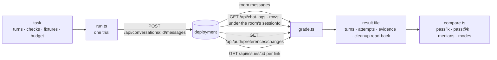

# Assistant benchmark

**Ten fixed tasks walked through the browser's chat door against a served build, graded from what
the deployment itself recorded, repeated, and compared between builds as pass^k.**

| | |
|---|---|
| Run | `pnpm --filter @forge/core bench:assistant run --api <url> --project <slug> --out <file> [--tasks a,b] [--trials 3] [--k 3]` |
| Compare | `pnpm --filter @forge/core bench:assistant compare <before.json> <after.json>` |
| Credentials | `FORGE_BENCH_TOKEN`, or `FORGE_BENCH_EMAIL` and `FORGE_BENCH_PASSWORD` — the environment only, never a file |
| Code | `core/src/assistant/bench/` — `task.ts` (the check vocabulary), `tasks/` (one module per task), `client.ts`, `trail.ts`, `grade.ts`, `run.ts`, `result.ts`, `compare.ts`, `cli.ts` |
| Proof | `core/src/assistant/bench/*.test.ts` over `fake-deployment.ts`, a scripted deployment; the live run is evidence on an issue, never part of `pnpm test` |

## What a grade reads

Four sources, all through the deployment's own authenticated routes, none through a database role
or a model judge:

- **The room** — the assistant message the send delivered, or none.
- **The trail** — every `chat_logs` row whose `sessionId` is the room, split among the sends by
  row-id boundaries taken around each send (`trail.ts:pairTrail`). Text is never matched: two sends
  may say the same thing, a screen repair is a second row for one send, and a fallback is a
  delivered text no row carries. Evidence the boundaries cannot place is refused by row id.
- **The preference trail** — the `preference_changes` rows gained during the send.
- **Issue lookups** — one `GET /api/issues/:id` per issue link the reply carries; 200 resolves,
  404 is `dead_link`, anything else stops the trial rather than being read as either.

Every failure is a mode named from a fact a reader can point at (`grade.ts:FAILURE_MODES`):
`wrong_link_shape`, `dead_link`, `unanswered`, `language_mismatch`, `fallback_sent`, `over_budget`,
`forbidden_tool`, `missing_tool`, `help_roundtrip`, `placeholder_argument`, `repeated_call`,
`screen_repair`, `noop_trail_row`, `preference_not_moved`. The result file carries the fact beside
the mode.

## The tasks

The shipped set is `tasks/index.ts:SHIPPED_TASKS`; each module names its exact messages, the
checks bound to each turn, the fixtures its placeholders read from the deployment (`{issueKey}`,
`{issueId}` from the project's first open issue, `{projectName}`), the preference it sets before
its first turn, and its budget in seconds. A task is complete on its own: a follow-up's antecedent
is an earlier turn of the same task, and a task that reads a style sets that style first.
`task.test.ts` loads the set whole and refuses a duplicate id, a turn with no check, a check outside
the vocabulary, a placeholder no fixture fills, and a preference move with no restore.

## Reading a comparison

Per task and per side: `n` trials, `s` trials whose every turn passed, the pass rate, and two
estimators over the trials observed with `k` = 3 unless a file names another:

| | |
|---|---|
| pass^k | `C(s,k) / C(n,k)` — the chance that `k` trials drawn from those observed all pass |
| pass@k | `1 − C(n−s,k) / C(n,k)` — the chance that at least one of `k` passes |

Pass/pass/fail at `k` = 3 is pass^3 = 0 and pass@3 = 1, not two thirds. A side with fewer than `k`
trials is marked `thin` and gets no estimator. Medians of seconds and tool calls and the modes
tallied stand beside the estimators, and the lines end with what separates the two files: commit,
api, model, `k`, trial count. **There is no composite figure**, in the object or the lines — a
weighted mean is where the task that cliffs goes to hide (`compare.test.ts` asserts the keys).

## What the run leaves behind

Values come back; records stay. Each trial reads the account's preference values before it starts,
deletes its room and reads the deletion back (`GET` → 404), writes the baseline values back and
reads them back equal, and records expected, observed and time for both in the file. What it cannot
remove it counts: a preference move and its restore each leave a `preference_changes` row through
the one writer (`preference-changes.ts:writeAssistantPreferences`, which has no delete), and every
attempt leaves a `chat_logs` row. Both carry the bench room's id (`conversation_id`, `session_id`),
the file lists every room it opened (`cleanup.room.id`), and a reading of the corpus excludes the
benchmark's rows by those ids. `auditRowsAdded` in each trial is that count.

## History: the same graders over what real people asked

`pnpm --filter @forge/core bench:assistant history --api <url> --project <slug> --from <date> --to <date> --out <file> [--source s] [--resolve] [--budget-seconds 60] [--max-iterations 8] [--exclude run.json]...`
reads every `chat_logs` row of the window through `GET /api/chat-logs` and grades each row on what
a row alone can show (`history/grade-row.ts:gradeRow`): the benchmark's own checks that need no
task expectation, run through `grade.ts:gradeTurn` over a synthetic turn (`linkShape`,
`notFallback`, `noHelp`, `noPlaceholder`, `noRepeatedCall`, `maxIterations`, `maxSeconds`, and
`linksResolve` only under `--resolve`, one `GET /api/issues/:id` per distinct link), plus three rules
history alone has: a row whose `query` is the door's corrective instruction
(`fallback-replies.ts:CORRECTIVE_PREFIX`) is a `screen_repair`; a row with an `error` is
`unanswered` whatever text it left; a question with three or more Vietnamese-marked words answered
with none is a `language_mismatch`. What a row cannot show is not graded: `mustMatch`,
`toolsRequired`, `preferenceRows` and the other task-bound checks need an expectation no row
carries.

The file (`history/result.ts`) holds the window, the served commit, the budgets, and per model and
source: rows, sessions, `thin` under 30 rows, every mode's count **and** rate, medians of duration,
tool calls and iterations; then `flagged`, every row that carried a mode, newest first, with its
`chat_logs` id, session, modes and the fact behind each. Rates, not pass^k: a row is not a trial and
a session is not a task. `bench:assistant compare-history <before> <after>` prints two windows side
by side per model and source, every rate beside its count, and what separates the files (commit,
window, budgets, rows). There is no total line.

The benchmark's own rows are traffic too. `--exclude <run.json>` reads a `bench:assistant run`
file and drops every row whose `session_id` is a room that run opened (`cleanup.room.id`), naming
the sessions and the count dropped in the file. The verb writes result files and nothing else:
`chat_logs.quality_signals` stays untouched.

## Judge: a second model asked one question, never the last word

The judge never rescues a failed check. `--judge <model>` on `bench:assistant run` and on
`bench:assistant history` asks a second model, on a different family from the one under test, the
one question the rules cannot answer: was this person served. It reads the query, the reply, the
`forge` argv of every tool call and the row's error (`judge.ts:judgeMessages`) and answers one JSON
object, `{ intent, served: yes | partial | no, reason, quote }`, where `quote` is a span copied
from the reply that the reason rests on. The endpoint is named by `FORGE_BENCH_JUDGE_URL` and
`FORGE_BENCH_JUDGE_KEY`, environment only, spoken on the OpenAI wire through
`providers/openai.ts:createOpenAIProvider`, at temperature 0, one request per judged turn or row.

The verdict is a sidecar. It is stored under `judge` on the turn record or on the history file's
`judge.rows`, beside `modes`, and nothing reads it back: `pass`, pass^k, pass@k, every mode count
and every rate are byte for byte what they are without the flag. `compare` and `compare-history`
print the judge counts beside the mode counts (`judge yes 31/40, partial 6/40, no 3/40, unreadable
0/40`) and two agreement figures that say whether the judge is worth reading: of the rows the rules
called `fallback_sent` or `unanswered`, how many the judge also called `no`; of the rows with no
mode, how many it called `yes` (`judge.ts:agreement`). There is no weighted line.

An answer the parser cannot read (`judge.ts:parseVerdict`: not a JSON object, a key missing, a
`served` outside the set, a `quote` the reply never said) is stored as `judge.error` on that row
and counted as `unreadable`, never as a verdict. A judge whose model is one the trail names is
refused by name before any call, and a run stops there with the refused trial's grades and room id
in the partial file. `history --judge` judges the newest `--judge-sample` kept rows (default 40)
after `--exclude` has dropped the bench rooms; `run --judge` judges every turn of every trial.

## What it does not do

- Weight the judge into `pass`, pass^k or any composite; `--judge` annotates, it never scores.
- Walk the `POST /api/chat` or Rocket.Chat doors; only the browser's door is benchmarked.
- Decide language: the `language` check is a diacritic heuristic (`grade.ts:vietnameseWords`).
  After code spans, URLs and double-quoted spans are removed it counts words carrying a Vietnamese
  letter or tone mark; `vi` needs three, `en` fails at two. A Vietnamese name in an English reply
  passes `en`; it says nothing about grammar or register.
- Write to `chat_logs.quality_signals`; `history` reads the corpus and writes a file.
