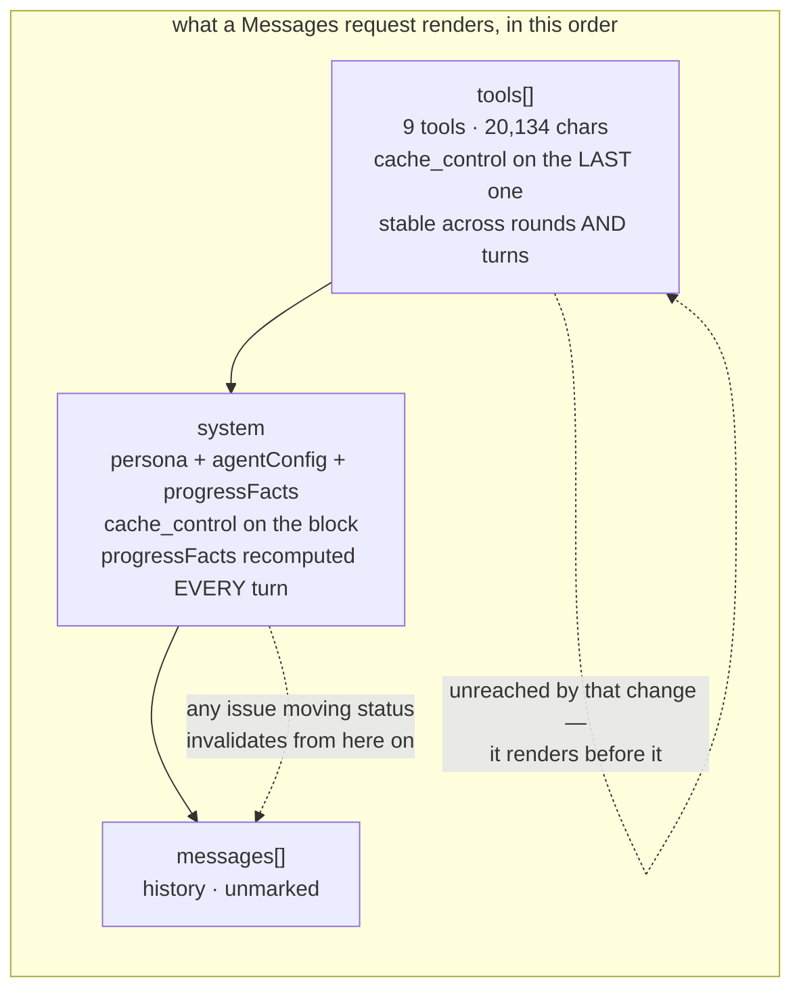

# Tool catalog cost

**What the chat tool catalog costs per request, separated from the context around it.** Every
figure below is printed by `pnpm --filter @forge/core measure:catalog-cost`
(`core/src/assistant/measure-catalog-cost.ts`, over `tool-catalog-cost.ts`), which needs no
deployment environment of its own; a census additionally needs `FORGE_CENSUS_DATABASE_URL`.
**The catalog this report measured** is the one at commit `58afbd5`, re-derived on 2026-09-12 rather
than carried over: it had moved 61 chars since the first draft, which is why the script re-derives
and this table does not cite. It moves again whenever a factory joins `CHAT_TOOL_ALLOWLIST` or a
`forge_*` description is edited — ISS-984 is trimming those descriptions in parallel, so a figure
below that disagrees with a fresh run means the trim landed after this.

## The answer

**Nothing in this fleet has ever cached.** Of 79 `chat_logs` rows on forge-beta — every logged chat
request, 2026-07-03 to 2026-09-03 — **0 carry `usage.cachedPromptTokens` at all.** That census was
run 2026-09-11 and is the figure on ISS-983's own record; no host this report was written from
reaches the forge-beta database, so it is cited at its date rather than re-run, and re-running it is
one `FORGE_CENSUS_DATABASE_URL` away. Both adapters map the
field when a backend reports one (`anthropic.ts:toUsage` from `cache_read_input_tokens`,
`openai.ts` from `prompt_tokens_details.cached_tokens`), so absence is a reading, not a missing
mapping. Every one of those rows is `gemini/gemini-2.5-flash`, reached over the Completions wire
through the LiteLLM proxy, which honours no per-block `ephemeral` marker.

The Anthropic adapter became the default on 2026-09-04 (`providers/bootstrap.ts`) and **no chat
request has been logged since 2026-09-03**, so that path has never run here. The markers
`toRequestBody` sets are, on this fleet's evidence, unexercised.

**Verdict: the ~790-tokens-per-request figure a command layer was argued from does not exist.** The
catalog costs its full size every turn today. That is not an argument for the command layer either —
it is an argument for finding out whether the Anthropic path caches at all, which costs one live
chat turn and which no amount of catalog-trimming substitutes for. Build nothing on a cache-hit
rate until a row in `chat_logs` reports one.

## Catalog, as the provider sees it

| | |
|---|---|
| tools | 9, the factories `assistant/tools/registry.ts:CHAT_TOOL_ALLOWLIST` names |
| serialized | 20,134 chars (**measured**) — `toRequestBody`'s own `tools` array, `input_schema` and the `cache_control` marker included |
| tokens | 5,034 (**estimated**, chars/4) |
| minimum cacheable prefix | 1,024 tokens on `claude-sonnet-5` — the catalog clears it |

`forge_issues` alone is 7,487 chars, 37% of the catalog.

The issue that commissioned this measurement cited 28,343 chars. That figure does not reproduce
under any shape the script prints:

| Serialization | Chars |
|---|---|
| wire, project-bound — what is priced above | 20,134 |
| wire, unbound — `projectId` left in every schema | 21,767 |
| OpenAI-shaped toolset, project-bound | 20,358 |
| wire, project-bound, pretty-printed at two spaces | 35,042 |

Nothing lands on 28,343, which is why the script re-derives rather than cites, and why it prints
all four: a size quoted somewhere else can be matched against the shape that produced it.

## Pricing assumptions

Anthropic list price for `claude-sonnet-5`, declared in `tool-catalog-cost.ts:PRICING`:

| Rate | Value |
|---|---|
| input | $2.00 / MTok |
| output | $10.00 / MTok |
| cache write, 5-minute `ephemeral` | 1.25x the input rate |
| cache read | 0.1x the input rate |

## Input-side cost of one request

| Uncached context | No cache | Cold (catalog written) | Warm (catalog read) |
|---|---|---|---|
| 2,000 tokens | $0.014068 | $0.016585 | $0.005007 |
| 20,000 tokens | $0.050068 | $0.052585 | $0.041007 |

**A cold request costs more than never caching at all** — the 1.25x write premium. Two requests
inside the five-minute window break even (1.25x + 0.1x against 2x); one does not. A room quiet
enough to miss the window therefore pays *more* for the markers than for no markers, which is a
second reason the question "does anything cache" comes before any estimate.

## Why the ratio in `chat_logs.usage` answers a different question

`cachedPromptTokens / promptTokens` is an aggregate over the whole prompt. Two requests sharing an
identical cached catalog and differing only in history:

| History | promptTokens | cachedPromptTokens | Ratio reported | Prefix saving |
|---|---|---|---|---|
| 2,000 | 7,034 | 5,034 | **71.6%** | 4,531 tokens · $0.009061 |
| 20,000 | 25,034 | 5,034 | **20.1%** | 4,531 tokens · $0.009061 |

Same catalog, same saving, ratios a factor of 3.6 apart. A report quoting that ratio has measured
the history. `tool-catalog-cost.test.ts` asserts the divergence and the invariance together.

## Render order, and which breakpoint the volatility reaches

A Messages request renders `tools` → `system` → `messages`, so the catalog is the *first* thing in
the prefix and the marked system block sits behind it.

`buildSystemPrompt` appends `progressFacts`, and `issues/progress.ts:buildProgressFactsBlock`
renders five counters — `shipped`, `closedUnshipped`, `inFlight`, `remaining`, `total` — recomputed
from live data on every turn. Any issue moving status anywhere in the project changes those bytes.

**That costs the system breakpoint and not the tools one.** The tool catalog renders before the
volatile text, so a tools-only prefix still matches byte for byte; what is lost is persona plus
`agentConfig` plus the counters. The `cm:guard` on `toRequestBody` used to claim both were stable
across turns; it now says which is which.

Moving `progressFacts` into a second unmarked block — the treatment `jsonInstruction` already has —
would recover the system breakpoint. **It is not done here**: it protects a cache no request in this
fleet has been shown to get, and churn that defends nothing is not a fix. It becomes worth doing the
day a `chat_logs` row reports a cache read.

## What could not be measured, and what stands in its place

| Not measured | Why | What stands instead |
|---|---|---|
| Exact catalog tokens | no `ANTHROPIC_API_KEY` on the measuring host, so `/v1/messages/count_tokens` was never called | chars/4, the divisor `context-budget.ts` elides on. Where a key is configured the script counts the request twice, with the tools and without, and labels the **difference** `measured` — that endpoint prices a whole request, so the count with tools in it is not the catalog |
| Cache behaviour of the Anthropic path | it has never run in this fleet | nothing. Stated as unknown rather than assumed from the markers the code sets |
| Provider behind each logged request | `chat_logs` records `model` and no provider column (`schema.ts:chatLogs`) | the census groups by model and prints that shortfall; two backends under one model name would be one row |
| Whether the 5-minute window is missed in real rooms | the issue gates this on caching being live, and it is not | nothing |
| The census **at this commit** | no forge-beta database URL reaches the host this was re-derived on | the 2026-09-11 census above, cited at its date. The query itself was exercised at this commit against a seeded `chat_logs` carrying both a row with `cachedPromptTokens` and rows without, so what is unverified here is the fleet's numbers and not the census |
