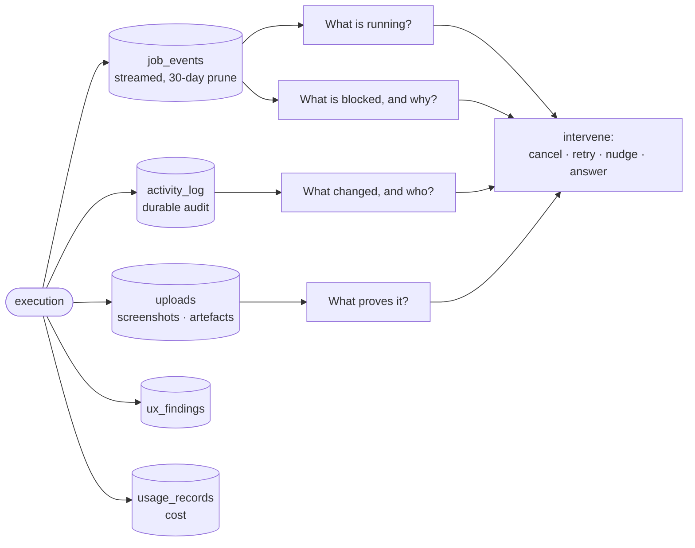

# Control & Observability

**The dashboard is not where the work happens — it is the control plane.** Its job is: see →
understand → control → intervene.

## What it owns

| Concern | Where it lives |
|---|---|
| Live event stream, replay | `schema.ts:jobEvents`, `core/src/ws/` |
| Durable audit trail | `schema.ts:activityLog` |
| Evidence retention policy | `core/src/jobs/retention-sweeper.ts` |
| Attachments and artefacts | `core/src/uploads/`, `core/src/storage/` |
| UX contract findings | `schema.ts:uxFindings`, `schema.ts:uxContractRules` |
| Metrics and analytics | `core/src/metrics/`, `core/src/pipeline/analytics-routes.ts` |
| Cost and usage | `core/src/usage-records/` |
| Telemetry helpers, secret scrubber | `packages/observability` |
| Operator-facing feedback loops | `core/src/feedback/`, `core/src/improvement-messages/` |
| Instance administration | `core/src/admin/` |
| UI | web `features/overview/`, `operator/`, `project-dashboard/`, `recent-changes/`, `usage/`, `whats-new/`, `activity/` |

## The retention split

| Surface | Lives | Use it for |
|---|---|---|
| `job_events` | pruned 30 days after the job goes terminal | what a run did, moment by moment |
| `activity_log` | durable | who changed what, and when |
| `uploads` | durable | evidence a human or agent must be able to re-open later |

Anything that must outlive 30 days does **not** belong in the event stream.

## Guards

- **A state transition without evidence is a kernel bug** (`VISION: state-never-lies`). Forge must
  always be able to distinguish what happened · what was verified · what failed · what may retry ·
  what needs human judgment.
- **Do not drive an intervention count to zero by stopping the surfacing of what needs one.** A
  single operating number is a number that can be gamed
  (`VISION: measured-together-never-apart`).
- **The secret scrubber is not optional on this path.** Telemetry carries agent output verbatim;
  `packages/observability` is where that is handled, and no surface here may bypass it.

## Boundaries

*Which human* an intervention should reach is [human-routing](../human-routing/). This domain makes
the state visible and the intervention possible; it does not decide who acts.
