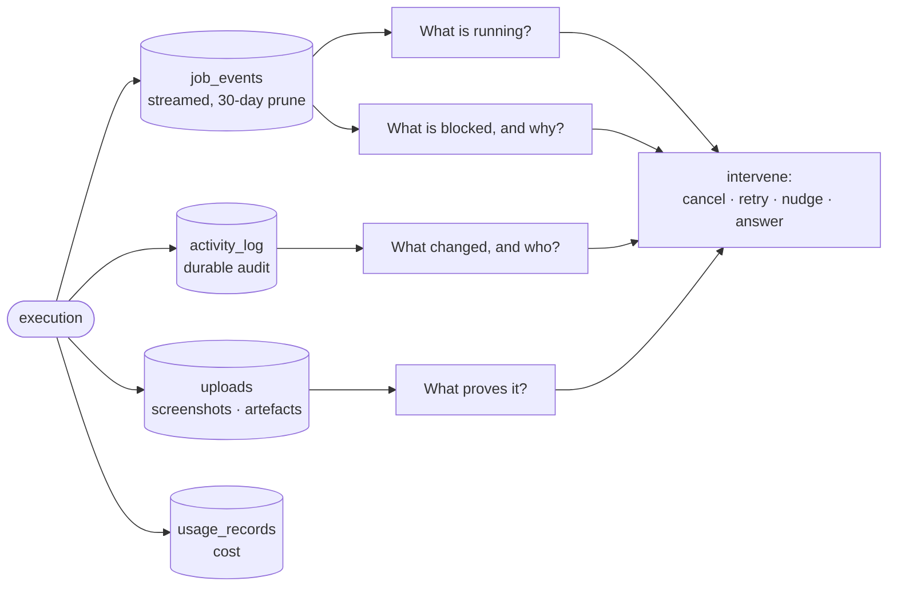

# Control & Observability

**The dashboard is not where the work happens — it is the control plane.** Its job is: see →
understand → control → intervene.

## What it owns

| Concern | Where it lives |
|---|---|
| Live event stream, replay | `schema.ts:jobEvents`, `core/src/ws/` |
| Durable audit trail | `schema.ts:activityLog` |
| Evidence retention policy | `core/src/pipeline/retention/policy.ts` (the stated rules), `core/src/pipeline/retention/sweep.ts` (the nightly sweep) |
| Attachments and artefacts | `core/src/uploads/`, `core/src/storage/` |
| Metrics and analytics | `core/src/metrics/`, `core/src/pipeline/analytics-routes.ts` |
| Cost and usage | `core/src/usage-records/` |
| Telemetry helpers, secret scrubber | `packages/observability` |
| Operator-facing feedback loops | `core/src/feedback/`, `core/src/improvement-messages/` |
| Instance administration | `core/src/admin/` |
| UI | web `features/overview/`, `operator/`, `project-dashboard/`, `recent-changes/`, `usage/`, `whats-new/`, `activity/` |

## The retention split

| Surface | Lives | Use it for |
|---|---|---|
| `job_events` | 30 days after the job goes terminal, and not before its transcript is recorded as finalised | what a run did, moment by moment |
| `queue_snapshots`, `runner_events`, `kernel_transitions`, `retrieval_analytics` | 90 days | the operational record the metrics read |
| `mcp_audit_log` | no window — see `pipeline/retention/policy.ts` for why | lifetime per-tool call counts |
| `activity_log` | durable | who changed what, and when |
| `uploads` | durable | evidence a human or agent must be able to re-open later |

Anything that must outlive 30 days does **not** belong in the event stream.

**Every append-only table takes an entry in `core/src/pipeline/retention/policy.ts`, including the ones that
are never swept.** A table with no rule and a table whose rule is "keep it all" look identical from
the outside, which is how six of them reached production with the deletion question deferred and
invisible (ISS-1027). Each entry carries its window, the environment variable that moves it, the
floor an override may not cross, and the reason. The nightly sweep reports what it removed and what
its predicates held back, per table, on every tick. Those two are different facts and the report
keeps them apart: the held count is the negation of that table's own delete predicate, so it is what
a rule keeps and never a backlog the tick ran out of budget for — a tick that stopped at its batch
cap says so in `capped` instead. Fold them together and `deleted: 0, heldBack: n` stops telling a
wedged rule from a sweep that simply has more to do.

## The interventions metric, defined by the event and not by the recorder

The north star is **interventions per issue closed**, and the thing counted is *a human hand
entering a run that was supposed to proceed without one*. That sentence is the definition. It is
written this way on purpose, because ISS-452 originally defined the metric as *"wedge events plus
audited manual cancels"* — by its own instrument — and a metric defined as what its recorder
recorded cannot undercount by construction. Manual SQL was therefore never missing from the number;
it was outside the definition. It is inside it now, and the instrument was widened to reach it
(ISS-884).

`issue_intervention_events` is that instrument. Four arms, one row per event, per project and per
issue:

| Arm | Event it counts | Written by |
|---|---|---|
| `wedge` | a hop stopped progressing and a human was told | `notifications` type `pipeline_wedge` |
| `manual_<action>` | someone cancelled, resumed, answered or injected through an audited surface | `job_events` kind `intervention` |
| `user_run_flip` | someone flipped a run terminal | `kernel_transitions`, `entity='run'`, `actor_type='user'` |
| `direct_sql` | someone changed a job, session or run's status, or deleted one of those rows, **by hand, outside the app** | the `forge_detect_unaudited_transition` and `forge_detect_unaudited_deletion` triggers |

The fourth arm counts what the first three cannot see, and it counts by ABSENCE of a marker rather
than by presence of a record. `db/kernel-marker.ts` stamps `forge.kernel_txn` with the
transaction's own txid inside every transaction this application uses to write a status or delete a
row on `jobs`, `agent_sessions` or `pipeline_runs`; a write on those tables arriving without the
stamp did not come from this application, and the trigger records it with the database role, the
client's `application_name` and both statuses. A DELETE records `to_status = 'deleted'` and the
status the row held.

Two mechanisms hold the arm up, and they answer different questions:

| | Question | Answer | Gate |
|---|---|---|---|
| `applyKernelTransition` | who may write a TERMINAL status | one module | `lifecycle/transition-guard.test.ts` |
| `withKernelMarker` | who may write ANY status, or delete a kernel row, without stamping | nobody | `db/kernel-marker-guard.test.ts` |

The second gate reads the SHAPE of a `.set()` argument, not its status literal: a literal object is
cleared when it carries no `status` key, and any other argument — a variable, a spread, a helper
call — is a violation, because nothing static can prove it carries no status. That is what makes it
catch `PATCH /api/agent-sessions/:id` writing `patch.status`, the writer whose invisibility to the
first gate's literal scan is the whole reason the session class went uncounted. Its enclosure test
is lexical, so a marker gated on a runtime condition is a marker it cannot see — which is why the
session PATCH stamps unconditionally and pays a round-trip for it.

They are deliberately not merged. Routing every dispatch and heartbeat through the chokepoint would
give each one a `kernel_transitions` audit row, and the `user_run_flip` arm reads that table — so
auditing an operator's run pause there would count it a second time against the `manual_*` arm that
already has it. The marker answers *did code write this*; the audit row answers *who flipped this
terminal, and why*.

**What it deliberately does not reach.** One class, and it is not a shape of write:

- **A migration that backfills a `status` column** is charged to the metric. A migration is
  reviewed, merged code, so charging it overcounts — and excluding migrations by
  `application_name` would put a spoofable hole in the instrument, which is worse than the
  overcount. The rule instead is that a migration touching `status` on these three tables stamps
  the marker itself (`SELECT set_config('forge.kernel_txn', txid_current()::text, true)` in the same
  transaction), stated in `0219`'s header because nothing can detect the difference. No such
  migration exists today.

The three classes that were outside it until ISS-943 — `agent_sessions`, non-terminal flips, and row
deletion — are inside now, and none of them needed a different discriminator. Each was uncounted
because only the TERMINAL writers stamped the marker; widening the stamp to every legitimate writer
was the whole fix. Two of the reasons recorded here for leaving them out also did not survive
contact with the tree: the retention sweeper deletes `job_events`, never `jobs`, and there is no
in-code delete of a `jobs` or `pipeline_runs` row at all, so deletion was the cheapest class rather
than the undiscriminable one.

Manual SQL is **not blocked**. Sometimes it is the only way to free a stuck fleet. The work was to
make it countable.

## Guards

- **A state transition without evidence is a kernel bug** (`VISION: state-never-lies`). Forge must
  always be able to distinguish what happened · what was verified · what failed · what may retry ·
  what needs human judgment.
- **Do not drive an intervention count to zero by stopping the surfacing of what needs one.** A
  single operating number is a number that can be gamed
  (`VISION: measured-together-never-apart`). The same rule forbids the quieter version: narrowing
  the metric's definition until the interventions it misses stop being interventions.
- **The secret scrubber is not optional on this path.** Telemetry carries agent output verbatim;
  `packages/observability` is where that is handled, and no surface here may bypass it.

## Boundaries

*Which human* an intervention should reach is [human-routing](../human-routing/). This domain makes
the state visible and the intervention possible; it does not decide who acts.
