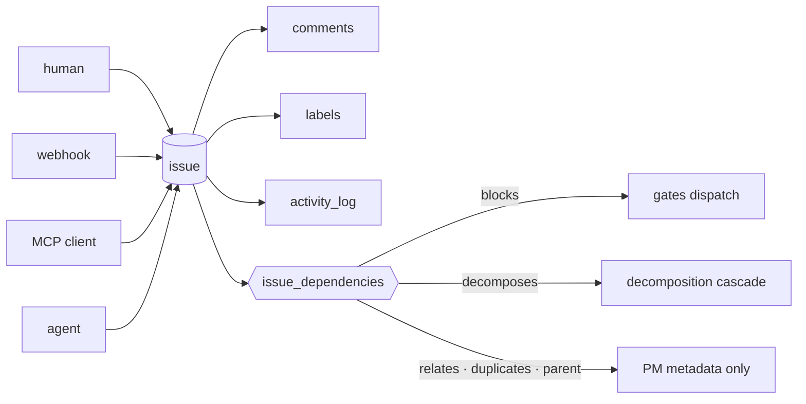

# Issue & Work Management

**The currency of Forge.** A business request, a production risk, a Sentry error and an agent's
finding all become the same lifecycle object: an issue.

## What it owns

| Concern | Where it lives |
|---|---|
| The issue row and its write path | `core/src/issues/`, `schema.ts:issues` |
| Discussion and audit trail | `core/src/comments/`, `schema.ts:activityLog` |
| Labels | `core/src/labels/`, `schema.ts:labels` |
| Relations between issues | `schema.ts:issueDependencies`, `schema.ts:issueDependencyKinds` |
| Epic decomposition | `core/src/pipeline/decomposition.ts`, `decomposition-subscribers.ts` |
| Human sub-work under an issue | `core/src/tasks/`, `schema.ts:tasks` |
| Inbound creation from outside | `core/src/webhooks/`, `core/src/mcp/tools/` |
| UI | web `features/issues/`, `activity/` |

## Vocabulary

| Set | Values |
|---|---|
| `schema.ts:issuePriorities` | `critical` · `high` · `medium` · `low` · `none` (default `medium`) |
| `issues.complexity` | t-shirt size; `NULL` means **not yet sized**, not "small" |
| `issues.category` | free text — no closed set |
| `issues.reportedBy` | set by webhook/MCP imports; `NULL` when `createdById` already names the actor |
| `schema.ts:issueDependencyKinds` | `blocks` · `relates` · `duplicates` · `parent` · `decomposes` |

## Guards

- **Only `kind='blocks'` gates dispatch.** An edge `(from=A, to=B, 'blocks')` means A must reach a
  terminal status before B may dispatch, and cross-project edges are legal. `relates` / `duplicates`
  / `parent` are metadata a dispatch path must never read. The `cm:guard` is on
  `schema.ts:issueDependencyKinds`.
- **`decomposes` does not go through that gate** — epic→child engages the decomposition cascade
  instead.
- The status ladder itself belongs to [lifecycle-pipeline](../lifecycle-pipeline/). This domain owns
  the issue as an object, not the machine that moves it.

## What an issue is not

A note, a question, an audit finding, or a record of something already done. The four admission
gates and where each of those goes instead are served from code: `core/src/guides/registry.ts`,
guide `what-is-an-issue`.
