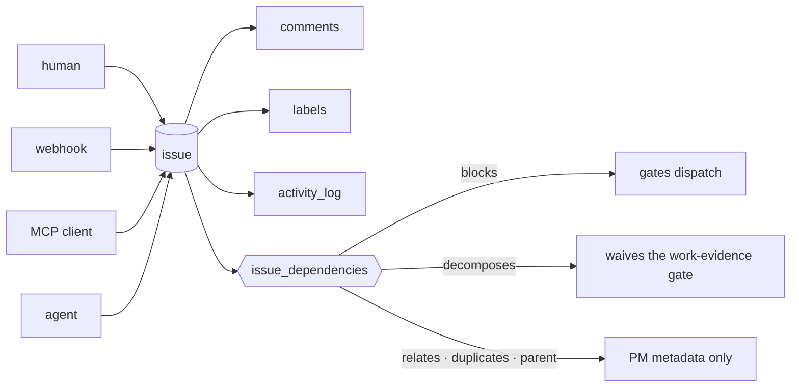

# Issue & Work Management

**The currency of Forge.** A business request, a production risk, a Sentry error and an agent's
finding all become the same lifecycle object: an issue.

## What it owns

| Concern | Where it lives |
|---|---|
| The issue row and its write path | `core/src/issues/`, `schema.ts:issues` |
| Discussion and audit trail | `core/src/comments/`, `schema.ts:activityLog` |
| Labels and modules | `core/src/labels/`, `schema.ts:labels` |
| Relations between issues | `schema.ts:issueDependencies`, `schema.ts:issueDependencyKinds` |
| Human sub-work under an issue | `core/src/tasks/`, `schema.ts:tasks` |
| Inbound creation from outside | `core/src/webhooks/`, `core/src/mcp/tools/` |
| UI | web `features/issues/`, `activity/` |

## Vocabulary

| Set | Values |
|---|---|
| `schema.ts:issuePriorities` | `critical` · `high` · `medium` · `low` · `none` (default `medium`) |
| `issues.complexity` | t-shirt size; `NULL` means **not yet sized**, not "small" |
| `issues.category` | free text — no closed set |
| `issues.reportedBy` | set by webhook/MCP imports; `NULL` when `createdById` already names the actor |
| `schema.ts:issueDependencyKinds` | `blocks` · `relates` · `duplicates` · `parent` · `decomposes` |
| `schema.ts:labelKinds` | `label` · `module` — a module IS a label, told apart only by this column |
| `labels.slug` · `labels.knowledge_entry_id` | modules only, and every module has a slug — the CHECK pair makes both halves of that unrepresentable otherwise |

## Guards

- **An issue's primary module is `issue_labels.is_primary`, and nothing else.** No column on
  `issues`, no second table; a client reads the issue's `labels[]` and picks the entry flagged
  `isPrimary`. At most one per issue, held by `issue_labels_primary_uq` and by
  `resolveLabelIdsForWrite`, which also refuses a primary that is not `kind='module'` — SQL cannot
  see `labels.kind` from a junction row, so that half has no database backstop. Drawn in
  [`docs/flows/issue-work-module-attribution.html`](../../flows/issue-work-module-attribution.html).
- **A module's identity is `labels.slug`, and its knowledge node is `labels.knowledge_entry_id`.**
  The slug is derived from the name on create and on promotion and never on a rename, so retitling
  a module cannot move what its node is found by; `module-${slugify(name)}` computed at a call site
  is the convention this column exists to replace. The binding is 1:1 in both directions, held by
  `labels_knowledge_entry_id_uq`, and a plain label may carry neither field —
  `labels_slug_chk` and `labels_knowledge_entry_chk` make that row unrepresentable rather than
  leaving it to the service. Deleting a node clears the link (`ON DELETE SET NULL`) and deleting a
  module leaves the node, so a NULL link means "no node written yet" and never "the node is gone".
  Drawn in
  [`docs/flows/web-v2-module-taxonomy.html`](../../flows/web-v2-module-taxonomy.html).
- **A module's knowledge node refreshes itself when a passing test lands, and never on a status
  change.** A `test` handoff whose `result` is `pass` or `verified_by_test` appends the issue to the
  primary module's node (`knowledge_entries.related_issue_ids`, deduped) and re-stamps
  `metadata.moduleFlow`; the secondaries it touched get the append and nothing else. Exactly one
  primary means there is never a question about whose flow to touch. Every declining case is a
  no-op that says so rather than an error: no primary refreshes nothing and records nothing, and a
  module with no `knowledge_entry_id` refreshes nothing and names itself in the issue's activity
  feed rather than getting a node invented under a guessed slug. `metadata.moduleFlow` is a claim
  about a specific body (`bodyHash`), which is why nothing clears it — a redrawn flow changes the
  hash and the next landing re-arms against the new body. A refresh that throws is reported to the
  log and the activity feed and never fails the handoff that triggered it. Drawn in
  [`docs/flows/issue-work-module-knowledge-refresh.html`](../../flows/issue-work-module-knowledge-refresh.html).
- **A module pair the issue stream keeps linking, which the hierarchy never declares, is reported
  as a signal — never as an error.** `GET /api/projects/:id/modules/drift` compares two edge sets
  over the same nodes: *observed* is a self-join of `issue_labels` with `kind='module'` on both
  sides (both sides re-check `kind` and `project_id`, because `issue_labels` can see neither), and
  *declared* is the transitive closure of `labels.parent_id`. What is observed and not declared is
  the finding, weighted by the issues it rests on; what is declared and not observed is the same
  difference read the other way. A pair seen on one issue is a coincidence, so the default
  threshold is 2. Three things the report states rather than assumes: `layer: 'module-taxonomy'`,
  because `.arch.json`'s source-path globs are a different granularity this must not conflate with
  a product domain; `declaration.state: 'absent'` for a project that declares nothing, which is a
  legal state and not zero drift; and `nearestCommonAncestor` on every finding, so two cousins
  under one parent read differently from two unrelated subtrees. The signal adds no gate and always
  answers 200 — a gate here would be satisfied by declaring edges nobody means. Drawn in
  [`docs/flows/issue-work-module-drift.html`](../../flows/issue-work-module-drift.html).
- **Only `kind='blocks'` gates dispatch.** An edge `(from=A, to=B, 'blocks')` means A must reach a
  terminal status before B may dispatch, and cross-project edges are legal. `relates`, `duplicates`
  and `parent` are metadata no dispatch path may read. The `cm:guard` is on
  `schema.ts:issueDependencyKinds`.
- **`decomposes` gates no dispatch, but it is not inert.** `work-evidence.ts:hasChildIssues` reads
  this one kind, so a single live outgoing `decomposes` edge waives the ISS-786 work-evidence gate
  for the `from` issue: it can be marked merged and moved to `developed`/`testing` with no branch,
  no commit and no code handoff of its own. That exemption is for grouping parents whose children
  carry the code. The sentence every agent-facing surface renders is
  `issues/dependency-effects.ts:WORK_EVIDENCE_WAIVER_NOTE`, and the kind that query reads is
  `WORK_EVIDENCE_WAIVER_KIND` in the same file — the two moved apart once and three documents
  called the edge inert for it (ISS-935). Ordering under an epic is still a `blocks` edge; the
  parent lifecycle this kind once drove was removed 2026-09.
- The status ladder itself belongs to [lifecycle-pipeline](../lifecycle-pipeline/). This domain owns
  the issue as an object, not the machine that moves it.

## What an issue is not

A note, a question, an audit finding, or a record of something already done. The four admission
gates and where each of those goes instead are served from code: `core/src/guides/registry.ts`,
guide `what-is-an-issue`.
