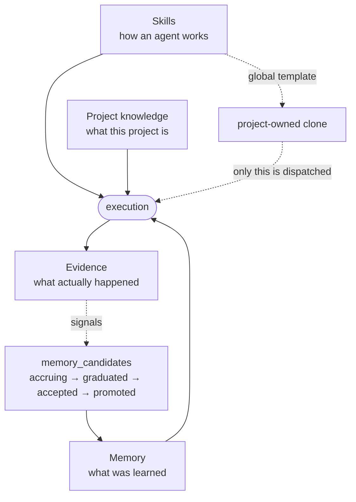

# Knowledge · Memory · Skills

**The context layer.** Four different things that must not be collapsed into one "AI memory" — each
answers a different question, and each has its own lifecycle.

| | Question it answers | Lifecycle |
|---|---|---|
| **Skills** | how does an agent do this kind of work? | authored, versioned, synced to devices |
| **Memory** | what has this project already learned? | accrued from signals, decayed, promoted |
| **Project knowledge** | what *is* this project? | authored per project, edited when the project changes |
| **Evidence** | what actually happened on this run? | written by execution, pruned — owned by [control-observability](../control-observability/) |

## What it owns

| Concern | Where it lives |
|---|---|
| Skill registry, scope, adoption | `core/src/skills/`, `schema.ts:skills`, `schema.ts:skillScopes` |
| Skill-authoring facts (`{{forge:}}` / `{{project:}}`) | `core/src/prompt/facts/registry.ts`, `core/src/skill-facts/`, `core/src/projects/project-facts.ts` |
| Prompt assembly per state | `core/src/prompt/`, `core/src/prompt/state-prompts/` |
| Guides served by slug from code | `core/src/guides/registry.ts` |
| Device-scoped plugin channel | `core/src/plugins/`, runner `workspace/plugin_sync.rs` |
| Semantic memory | `core/src/memory/`, `schema.ts:memories`, `schema.ts:memorySources` |
| Chunked memory model (per project) | `schema-memory-chunks.ts:memoryChunks`, `core/src/memory/chunker.ts`, `chunk-writer.ts`, `chunk-reindex.ts`, `core/src/app-config/memory-model-routes.ts` |
| Candidate accrual and promotion | `schema.ts:memoryCandidates`, `core/src/memory/candidates-*.ts` |
| Step handoffs between stages | `core/src/memory/step-handoff-schema.ts` |
| Project knowledge graph | `core/src/knowledge/`, `core/src/knowledge-edges/`, `schema.ts:knowledgeEntries` |
| Embeddings | `core/src/embeddings/`, `schema.ts:MEMORY_EMBEDDING_DIM` (1536) |
| Domain bootstrap templates | `core/src/domain-templates/` |
| UI | web `features/skills/`, `memory/`, `knowledge/`, `library/`, `skill-updates/` |

## Vocabulary

| Set | Values |
|---|---|
| `schema.ts:skillScopes` | `global` · `project` |
| `schema.ts:memorySources` | `issue` · `comment` · `job` · `note` · `knowledge` · `decision` · `policy` |
| `schema.ts:memoryCandidateSignalTypes` | `reopen_loop` · `repeated_fix_type` · `handoff_gap_rescue` · `agent_self_report` |
| `schema.ts:memoryCandidateStatuses` | `accruing` · `graduated` · `accepted` · `rejected` · `promoted` |
| `schema.ts:memoryModels` | `flat` · `chunked` |
| `schema-memory-chunks.ts:memoryReindexStates` | `queued` · `running` · `completed` · `failed` · `cancelled` |
| `schema.ts:knowledgeKinds` | `overview` · `scenario` · `workflow` · `rule` · `guide` · `reference` · `glossary` |

## Guards

- **A global skill is never registered or dispatched.** `global` is a read-only template; choosing
  it for a stage materialises a project-owned clone and registers *that*. The `cm:guard` is on
  `core/src/skills/service.ts` and `core/src/skills/bootstrap-service.ts`.
- **Project facts land on disk.** `projectFacts` values are spliced verbatim into the
  device-installed `SKILL.md`, so they are never a place for secrets — test credentials live in the
  project's credential store.
- **Memory retrieval is hybrid, and the keyword arm has two halves.** `memories` carries a pgvector
  embedding and two generated `tsvector` columns, never written by the app: `text_search`
  (English-stemmed) and `ident_search` (ISS-907), the same text with camelCase, `_`, `/`, `.`, `:` and
  `-` split into `simple`-config words by the one immutable SQL function `forge_identifier_words`
  (migration `0207`; `schema-types.ts:identSearchColumn`). The keyword strategy matches
  `text_search @@ websearch_to_tsquery('english', q) OR ident_search @@ phraseto_tsquery('simple',
  forge_identifier_words(q))` and ranks by the sum, so `LITELLM_API` finds `LITELLM_API_URL`,
  `cascade` finds `runs-cascade.ts` and `memory/rerank.ts` finds the full path, while `ISS-26` stays a
  phrase and does not match `iss` and `26` apart. `memory_chunks`, `knowledge_entries` and `issues`
  carry the same column; `knowledge/search.ts:keywordSearchKnowledge` and both issue text matches
  (`issues/search.ts`, `issues/list-service.ts`) OR the identifier arm in the same way.
- **Hybrid fuses the two arms with equal weights.** `search.ts:reciprocalRankFusion` at `HYBRID_ALPHA`
  0.5, k = 60. At the former 0.7 / 0.3 a hit the keyword arm ranked first and the semantic arm never
  returned scored 0.3/61, below the semantic rank 8 at 0.7/68 and rank 24 at 0.7/84, so nothing found
  only by the keyword arm ever reached the caller; measured on six live corpora (2026-09-05) equal
  weights put 93–100% of identifier lookups in the top 8 and changed nothing on natural-language
  queries. `knowledge/search.ts:rrfFuse` carries the same constant.
- **Every hybrid search says what each list contributed.** `search-service.ts:buildRetrievalMetadata`
  writes `semanticHits`, `keywordHits` and `overlap` into `retrieval_analytics.metadata` beside
  `strategy` / `requestedStrategy`; semantic-only and keyword-only rows carry none of the three, so
  absence means "one list ran", never zero. `GET /api/admin/retrieval/breakdown?projectId&since`
  aggregates them per resolved strategy over the window (default seven days).
- **Per-project retrieval flags live on `app_config` and default to today.** `schema.ts:appConfig`
  carries `retrievalRerank` (false), `memoryModel` (`flat` | `chunked`, `schema.ts:memoryModels`),
  `retrievalExpandRelations` (false) and `memoryReindex` (`{}`). `retrieval-flags.ts:loadRetrievalFlags`
  reads the first three on every search and every memory write. A project admin sets the two booleans
  through `PUT /api/app-config/:projectId`; `memoryModel` is refused there because flipping it is an
  operation with a job behind it (below), and `memoryReindex` because it is that job's own state.
- **The chunked memory model is a sibling table, joined on generation.** With `memoryModel` `chunked`,
  a write of an `issue` / `note` / `knowledge` / `decision` / `policy` row (`chunker.ts:CHUNKED_SOURCES`,
  the only place the set lives — `comment` and `job` are never chunked) bumps `memories.chunk_generation`,
  nulls `chunked_at` and deletes the old passages in the same transaction as the parent upsert, then
  `chunk-writer.ts:chunkAndPublish` embeds the prefixed ~1,200-character passages (200 overlap, one
  chunk under 1,500) and inserts them into `memory_chunks` with that generation, stamping `chunked_at`
  only if the generation is still current. The search arms in `search.ts:chunkedSearch` join
  `c.generation = m.chunk_generation AND m.chunked_at IS NOT NULL`, `UNION ALL` the flat arm on
  `chunked_at IS NULL`, so a superseded or half-written passage set is unreachable and a project that
  flipped a minute ago is correct to search. A hit found through a passage carries
  `matchedChunk: { index, text }`. A degraded write leaves `chunked_at` NULL and
  `embedding-backfill.ts:runChunkBackfill` completes it once embeddings return.
- **Flipping the model is an operation with five states, not a setting.** `memory-model-routes.ts`:
  `GET …/memory-model/estimate` (rows, chars, chunks, embed calls, minutes; nothing enqueued),
  `POST …/memory-model { model: 'chunked' }` (admin; 409 `REINDEX_LIVE` while a reindex is queued or
  running; writes the `queued` state sized by `chunk-reindex.ts:countPending` so a resume shows the
  rows already done, THEN enqueues the `memory-chunk-reindex` pg-boss job), `GET …/memory-model/reindex`,
  `DELETE …/memory-model/reindex` (cancel between batches; finished rows stay chunked), and
  `POST … { model: 'flat' }` (immediate read-path switch, cancels a live run, enqueues
  `memory-chunk-purge` seven days out — the purge is a no-op if the project flipped back meanwhile).
  `runChunkReindex` re-reads the state before every batch of 50, fails with `lastError` on an
  embeddings outage, is resumable by construction (it walks `chunked_at IS NULL`), and stamps
  `app_config.last_backfill_at` on `completed`. Project Settings → **Memory**
  (`web-v2/src/features/project-settings/components/memory-tab.tsx`) draws exactly one of the five
  states from those two GETs and never infers one: flat shows the estimate and *Switch to chunked*;
  queued/running shows done / total with a progress bar, the last batch time and *Cancel*, polling every
  5 s only in those two states; failed shows `lastError` and *Retry*; cancelled shows the partial counts
  and *Resume*; completed offers *Switch back to flat* behind a type-to-confirm whose copy names the
  seven-day purge. A 409 is drawn as "A reindex is already running." and never retried; buttons render
  only for a project admin or org owner/admin, the server's 403 being the second fence.
- **Every memory search names its surface, and only `agent` is ever reranked.**
  `search-service.ts:runMemorySearch` requires `surface: 'agent' | 'web'`; the MCP tool
  `forge_memory.search` (which the chat toolset registers too) and `forge_knowledge` search pass
  `agent`, `POST /api/memory/search` passes `web`. With `retrievalRerank` on, an agent's `hybrid`
  search fuses `3 × topK` candidates (cap 50) and `rerank.ts:rerankHits` asks the fast model
  (`RERANK_MODEL`, else `LITELLM_FAST_MODEL`) for one listwise order — showing it, per candidate, the
  text that matched (`rerank.ts:shownText`: the matched passage on a chunked project, the row otherwise,
  cut at 1,500 characters — ISS-914; at 600 the model judged a ~1,400-character passage by its opening), which is also what the rerank cache key hashes; the response says
  `reranked: true`, each hit carries `rerankPosition`, and `score` stays the RRF value, so callers read
  the list in order rather than sorting by score. Prose, an out-of-range index or a failed call keep
  the RRF order with `reranked: false` and never throw; an omitted candidate is appended, never dropped.
  One eligible search in five is a deliberate holdout (`rerankHoldout: true`), the control the pilot's
  exit criterion compares against. `semantic` and `keyword` are never reranked.
- **Relation expansion is context, not retrieval.** With `retrievalExpandRelations` on,
  `expand-relations.ts:expandIssueRelations` takes the first five `issue` hits, walks their unexpired
  `blocks` / `relates` edges in both directions and appends the neighbours' memory rows after the ranked
  hits with `score: 0` and `via: { relation, from: 'ISS-n' }`, at most `topK` of them, on both surfaces.
  The analytics row of a hybrid agent search carries `hitIds` (the returned ids, in order) beside
  `reranked` / `rerankMs` / `rerankHoldout` / `expanded` / `expandedCount` when they apply. Feedback
  lands on the memory row, so attributing a later `verdict=confirmed` to a search is a rule, not a
  key: the proposal's phase 1 defines it as a `hitIds` member verified within 24 hours of the search,
  with cross-arm collisions counted for both and reported.
