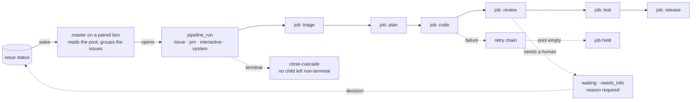
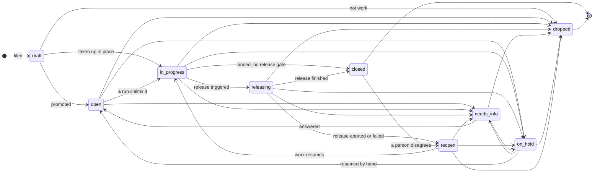

# Lifecycle & Pipeline

**The engine that turns an issue into work.** Not one fixed company workflow — each project defines
its own lifecycle over kernel primitives that stay strict.

## What it owns

| Concern | Where it lives |
|---|---|
| Run and job lifecycle | `core/src/pipeline/`, `core/src/jobs/`, `schema.ts:pipelineRuns`, `schema.ts:jobs` |
| The claim and what it refuses | `core/src/devices/claim.ts`, `core/src/jobs/prepare-claimed-job.ts` |
| Why a queued job is not running | `core/src/jobs/queued-gates.ts` |
| Advisory status map | `core/src/pipeline/state-machine.ts:transitions` |
| Retry, escalation, failure class | `core/src/jobs/retry.ts`, `core/src/pipeline/failure-classifier.ts` |
| Failure cause taxonomy | `core/src/pipeline/failure-causes.ts:FAILURE_CAUSES`, `core/src/pipeline/failure-patterns.ts:CAUSE_RULES` |
| Orphan hygiene | `core/src/pipeline/runs-cascade.ts`, `core/src/jobs/loop-monitor.ts`, `core/src/jobs/kill-gate.ts` |
| Autonomous driver mode | `core/src/pipeline/autonomous-mode.ts:AUTONOMOUS_DRIVER_STATUSES` |
| What a box is offered, and the wake that says so | `core/src/devices/admissible.ts`, `core/src/ws/master-wake.ts` |
| The run session a box opens over a group of issues | `core/src/devices/run-session.ts`, `core/src/devices/run-session-reaper.ts` |
| What that box says it is running, read by anyone off it | `core/src/devices/run-ledger.ts`, `packages/runner/crates/forge-runner-core/src/transport/session_ledger.rs` |
| Release gate and batches | `core/src/release-batch/`, `core/src/issues/release-gate-hold.ts` |
| Branch resolution | `core/src/branches/`, `core/src/git/` |
| Cron-fired work | `core/src/schedules/`, `schema.ts:scheduleKinds` |
| UI | web `features/pipeline/`, `automation/`, `schedules/` |

## Vocabulary

| Set | Values |
|---|---|
| `schema.ts:issueStatuses` | 16 statuses today, **nine decided** (owner, 2026-09-09) — see *The issue flow* below. The enum still holds seven the lane retired; `docs/proposals/one-status-vocabulary-and-a-real-transition-table.md` prices the removal and names the order |
| `schema.ts:pipelineRunKinds` | `issue` · `pm` · `interactive` · `system` |
| `schema.ts:pipelineRunStatuses` | `running` · `paused` · `completed` · `failed` · `cancelled` |
| `schema.ts:jobStatuses` | `queued` · `dispatched` · `running` · `held` · `done` · `failed` · `cancelled` |
| `schema.ts:jobTypes` | one per stage, `forge-<jobType>` names the skill |
| `schema.ts:scheduleKinds` | `prompt` (fires an agent session) · `script` (sandboxed Node, no LLM) · `release_batch` |

## The issue flow

Decided by the owner 2026-09-09. **Nine statuses**, and the table below is the target: every hop
absent from it is refused. Today it is not — `canTransitionFree` permits any non-`draft` hop, which
is the next guard in this file.

One dispatch door (`open`), one worker (`in_progress`), one release middle (`releasing`), two parks
reachable from every rung, one park a person routes (`reopen`), two ends differing only in whether
`merged_at` is stamped.

| From | May go to |
|---|---|
| `draft` | `open` · `in_progress` · `dropped` |
| `open` | `in_progress` · `needs_info` · `on_hold` · `dropped` |
| `in_progress` | `releasing` · `closed` · `needs_info` · `on_hold` · `dropped` |
| `releasing` | `closed` · `reopen` · `needs_info` · `on_hold` |
| `needs_info` | `open` · `on_hold` · `dropped` |
| `on_hold` | `open` · `needs_info` · `dropped` |
| `reopen` | `in_progress` · `needs_info` · `on_hold` · `dropped` |
| `closed` | `reopen` |
| `dropped` | — terminal, no exit |

- **`needs_info` and `on_hold` are enterable from every rung and from each other.** This is what
  `prompt/facts/registry.ts` already tells agents ("From ANY state you may set `needs_info` … don't
  force the ladder"); the map was the narrow half.
- **`draft` cannot park** — it already is a resting place, and `DRAFT_EXIT_TARGETS` is the one
  existing real gate. **`closed`/`dropped` cannot park** — a park after an end is a reopen.
- **`releasing` is written out of by `finish` and `abort` only.** They own the outcome edges
  (`closed`, `reopen`); a park off `releasing` is a person stopping to ask, which a half-landed
  batch needs. What must not exist is an agent declaring its own release finished.
- **`reopen → in_progress`, never `→ open`** — a reopened issue has a branch and a worktree, and
  offering it to the pool races a fresh agent against the tree that already exists.
- **`reopen` is a park a person routes, and the autonomous rewrite of it is retired.**
  `issues/autonomous-park.ts` rewrites `reopen → open` for every actor because the staged pipeline
  read `reopen` as "a step rejected this"; this vocabulary reads it as "a person disagreed with a
  close", which is not a step at all. Measured 2026-09-10: the reconciler's every-60s wedge pass
  reads `AUTONOMOUS_INFLIGHT_STATUSES`, which resolves to `['in_progress']` and never sees
  `reopen`; `notify-transitions.ts` already classes it in `PROBLEM_STATUSES`; `attention-buckets.ts`
  puts it in `NEEDS_REVIEW_STATUSES`. Two readers already treat it as a human's business and the
  third does not read it, so the ISS-141 wedge cannot return through this door. Cost: a failed
  release parks at `reopen` and does not self-heal.
- **`released` is retired as a status**, replaced by the release button
  (`POST /:projectId/release-batches`) plus `releasing` for the middle. Today an issue keeps
  standing at `released` during a batch while the in-flight fact lives only in
  `issues.release_batch_run_id`, so one status means both "waiting for a person to press it" and
  "being released right now".

Drawing: `docs/flows/issue-status-lifecycle.html` · edge-by-edge rationale and the removal order:
`docs/proposals/status-flow.md`.

## Guards

- **The transition map is advisory, not a gate — and the flow above is the target, not the state.**
  `state-machine.ts:transitions` covers all 16 statuses and its own first guard says nothing
  enforces it; `canTransitionFree` permits any non-`draft` → any non-`draft`. So a hop missing from
  *that* map is not illegal today, and reading it as illegal has produced wrong conclusions and
  pointless multi-hop workarounds. Its consumers are prompt generation and UI next-state
  suggestion. Making the nine-status table the gate is step 5 of the proposal.
- **No child `jobs` row stays non-terminal under a terminal `pipeline_run`** — one orphan wedges a
  `cap=1` runner slot. Three defences move in lockstep, plus `held` as a deliberate fourth shape
  that is *not* an orphan. New code that flips `pipelineRuns.status` terminal must route through a
  cascade-calling helper.
- **A stop must say why.** `reopen`, `waiting` and `needs_info` are rejected without a `reason`;
  `waiting` additionally requires `waitingKind`. A stopped pipeline that does not say what it waits
  for is a question nobody can answer.
- **Core mints no drive work.** An issue reaching the entry status publishes a wake; the master on
  a paired box decides what runs. A `pipeline_run` for autonomous work is opened BY the box, over a
  group of issues, and closes on three marks it read back — the session went terminal, the worktree
  left disk, and each issue's lease came back. A declaration by an agent sets none of them.
  Drawn in [`../../flows/run-session-lifecycle.html`](../../flows/run-session-lifecycle.html),
  [`run-session-close.html`](../../flows/run-session-close.html) and
  [`run-session-registry-read.html`](../../flows/run-session-registry-read.html).
- **A park no master picks up is not representable.**
  `core/src/issues/autonomous-park.ts` rewrites at write time to the only two statuses the driver
  reads: `reopen` → `open` for **any** actor, and `waiting` → `needs_info` for an **agent** only. A
  human's `waiting` and their `on_hold` pass through. A project
  whose config cannot be parsed is untouched — that is broken, not a second lane.

## Boundaries

Which machine runs a job is [agent-execution](../agent-execution/). Which human answers a stop is
[human-routing](../human-routing/). Per-project policy (states, gates, prompts) is configuration —
the kernel owns the invariants above and nothing else.
