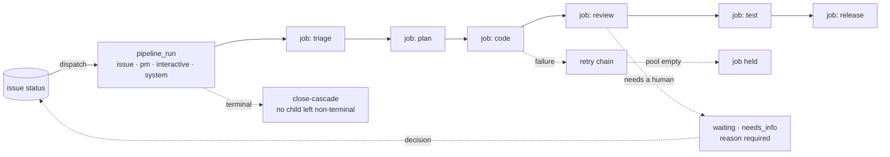

# Lifecycle & Pipeline

**The engine that turns an issue into work.** Not one fixed company workflow — each project defines
its own lifecycle over kernel primitives that stay strict.

## What it owns

| Concern | Where it lives |
|---|---|
| Run and job lifecycle | `core/src/pipeline/`, `core/src/jobs/`, `schema.ts:pipelineRuns`, `schema.ts:jobs` |
| Dispatch and its gates | `core/src/jobs/dispatcher.ts`, `core/src/jobs/dispatch-gates.ts` |
| Advisory status map | `core/src/pipeline/state-machine.ts:transitions` |
| Retry, escalation, failure class | `core/src/jobs/retry.ts`, `core/src/pipeline/failure-classifier.ts` |
| Failure cause taxonomy | `core/src/pipeline/failure-causes.ts:FAILURE_CAUSES`, `core/src/pipeline/failure-patterns.ts:CAUSE_RULES` |
| Orphan hygiene | `core/src/pipeline/runs-cascade.ts`, `core/src/jobs/loop-monitor.ts`, `core/src/jobs/kill-gate.ts` |
| Autonomous driver mode | `core/src/pipeline/autonomous-mode.ts:AUTONOMOUS_DRIVER_STATUSES` |
| Release gate and batches | `core/src/release-batch/`, `core/src/issues/release-gate-hold.ts` |
| Branch resolution | `core/src/branches/`, `core/src/git/` |
| Cron-fired work | `core/src/schedules/`, `schema.ts:scheduleKinds` |
| UI | web `features/pipeline/`, `automation/`, `schedules/` |

## Vocabulary

| Set | Values |
|---|---|
| `schema.ts:issueStatuses` | 16 statuses. Happy path: `open → confirmed → clarified → approved → in_progress → developed → testing → tested → released → closed`. Off-ladder: `waiting` · `needs_info` · `on_hold` · `reopen` · `draft` · `dropped` |
| `schema.ts:pipelineRunKinds` | `issue` · `pm` · `interactive` · `system` |
| `schema.ts:pipelineRunStatuses` | `running` · `paused` · `completed` · `failed` · `cancelled` |
| `schema.ts:jobStatuses` | `queued` · `dispatched` · `running` · `held` · `done` · `failed` · `cancelled` |
| `schema.ts:jobTypes` | one per stage, `forge-<jobType>` names the skill |
| `schema.ts:scheduleKinds` | `prompt` (fires an agent session) · `script` (sandboxed Node, no LLM) · `release_batch` |

## Guards

- **The transition map is advisory, not a gate.** `state-machine.ts:transitions` documents the happy
  path; `canTransitionFree` permits any non-`draft` → any non-`draft`. Reading a missing pair as
  "illegal" has produced wrong conclusions and pointless multi-hop workarounds. Its consumers are
  prompt generation, UI next-state suggestion and the soft-skip resolver.
- **No child `jobs` row stays non-terminal under a terminal `pipeline_run`** — one orphan wedges a
  `cap=1` runner slot. Three defences move in lockstep, plus `held` as a deliberate fourth shape
  that is *not* an orphan. New code that flips `pipelineRuns.status` terminal must route through a
  cascade-calling helper.
- **A stop must say why.** `reopen`, `waiting` and `needs_info` are rejected without a `reason`;
  `waiting` additionally requires `waitingKind`. A stopped pipeline that does not say what it waits
  for is a question nobody can answer.

## Boundaries

Which machine runs a job is [agent-execution](../agent-execution/). Which human answers a stop is
[human-routing](../human-routing/). Per-project policy (states, gates, prompts) is configuration —
the kernel owns the invariants above and nothing else.
