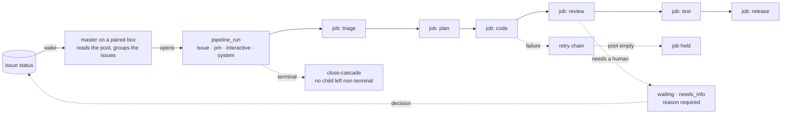

# Lifecycle & Pipeline

**The engine that turns an issue into work.** Not one fixed company workflow — each project defines
its own lifecycle over kernel primitives that stay strict.

## What it owns

| Concern | Where it lives |
|---|---|
| Run and job lifecycle | `core/src/pipeline/`, `core/src/jobs/`, `schema.ts:pipelineRuns`, `schema.ts:jobs` |
| The claim and what it refuses | `core/src/devices/claim.ts`, `core/src/jobs/prepare-claimed-job.ts` |
| Why a queued job is not running | `core/src/jobs/queued-gates.ts` |
| Advisory status map | `core/src/pipeline/state-machine.ts:transitions` |
| Retry, escalation, failure class | `core/src/jobs/retry.ts`, `core/src/pipeline/failure-classifier.ts` |
| Failure cause taxonomy | `core/src/pipeline/failure-causes.ts:FAILURE_CAUSES`, `core/src/pipeline/failure-patterns.ts:CAUSE_RULES` |
| Orphan hygiene | `core/src/pipeline/runs-cascade.ts`, `core/src/jobs/loop-monitor.ts`, `core/src/jobs/kill-gate.ts` |
| Autonomous driver mode | `core/src/pipeline/autonomous-mode.ts:AUTONOMOUS_DRIVER_STATUSES` |
| What a box is offered, and the wake that says so | `core/src/devices/admissible.ts`, `core/src/ws/master-wake.ts` |
| The run session a box opens over a group of issues | `core/src/devices/run-session.ts`, `core/src/devices/run-session-reaper.ts` |
| What that box says it is running, read by anyone off it | `core/src/devices/run-ledger.ts`, `packages/runner/crates/forge-runner-core/src/transport/session_ledger.rs` |
| Release gate and batches | `core/src/release-batch/`, `core/src/issues/release-gate-hold.ts` |
| Branch resolution | `core/src/branches/`, `core/src/git/` |
| Cron-fired work | `core/src/schedules/`, `schema.ts:scheduleKinds` |
| UI | web `features/pipeline/`, `automation/`, `schedules/` |

## Vocabulary

| Set | Values |
|---|---|
| `schema.ts:issueStatuses` | 17 statuses today, **fourteen live** — see *The issue flow* below. The enum still holds `clarified`, `waiting` and `tested`, which nothing on the ladder names; `docs/proposals/one-status-vocabulary-and-a-real-transition-table.md` prices the removal and names the order |
| `schema.ts:pipelineRunKinds` | `issue` · `pm` · `interactive` · `system` |
| `schema.ts:pipelineRunStatuses` | `running` · `paused` · `completed` · `failed` · `cancelled` |
| `schema.ts:jobStatuses` | `queued` · `dispatched` · `running` · `held` · `done` · `failed` · `cancelled` |
| `schema.ts:jobTypes` | one per stage, `forge-<jobType>` names the skill |
| `schema.ts:scheduleKinds` | `prompt` (fires an agent session) · `script` (sandboxed Node, no LLM) · `release_batch` |

## The issue flow

The status set, every legal hop, what each status claims and who owes the next move at it:
**`docs/flows/lifecycle-pipeline.html`** — the drawing, the per-status claims table and the
full transition matrix, in one place. `docs/proposals/status-flow.md` carries the edge-by-edge
rationale and the removal order **as proposed** — it is the record of a proposal, not of the
current set, and it predates both revisions. The agent-facing copy of the same set is the
`pipeline-and-issue-lifecycle` guide (`core/src/guides/registry.ts`).

This file carried a second drawing and a second transition table until 2026-09-11, and by then it
was two revisions behind: it said nine statuses and its table had no `developed`, `testing` or
`awaiting_release` row at all, while the paragraph under it discussed the `awaiting_release`
rename. A module README is the map — what lives where, and which file is authoritative for what —
so the figure has one home and this points at it (ISS-976).

## Guards

- **The transition map is advisory, not a gate — and the flow above is the target, not the state.**
  `state-machine.ts:transitions` covers all 16 statuses and its own first guard says nothing
  enforces it; `canTransitionFree` permits any non-`draft` → any non-`draft`. So a hop missing from
  *that* map is not illegal today, and reading it as illegal has produced wrong conclusions and
  pointless multi-hop workarounds. Its consumers are prompt generation and UI next-state
  suggestion. Making that table the gate is step 5 of the proposal, and it has a prerequisite:
  `pipeline/answer-resume.ts` sends every answered park back through `open` unconditionally,
  because nothing records the rung a park left.
- **No child `jobs` row stays non-terminal under a terminal `pipeline_run`** — one orphan wedges a
  `cap=1` runner slot. Three defences move in lockstep, plus `held` as a deliberate fourth shape
  that is *not* an orphan. New code that flips `pipelineRuns.status` terminal must route through a
  cascade-calling helper.
- **A stop must say why.** `reopen`, `waiting` and `needs_info` are rejected without a `reason`;
  `waiting` additionally requires `waitingKind`. A stopped pipeline that does not say what it waits
  for is a question nobody can answer.
- **Core mints no drive work.** An issue reaching the entry status publishes a wake; the master on
  a paired box decides what runs. A `pipeline_run` for autonomous work is opened BY the box, over a
  group of issues, and closes on three marks it read back — the session went terminal, the worktree
  left disk, and each issue's lease came back. A declaration by an agent sets none of them.
  Drawn in [`../../flows/lifecycle-pipeline.html`](../../flows/lifecycle-pipeline.html).
- **A park no master picks up is not representable.**
  `core/src/issues/autonomous-park.ts` rewrites at write time to the only two statuses the driver
  reads: `reopen` → `open` for **any** actor, and `waiting` → `needs_info` for an **agent** only. A
  human's `waiting` and their `on_hold` pass through. A project
  whose config cannot be parsed is untouched — that is broken, not a second lane.

## Boundaries

Which machine runs a job is [agent-execution](../agent-execution/). Which human answers a stop is
[human-routing](../human-routing/). Per-project policy (states, gates, prompts) is configuration —
the kernel owns the invariants above and nothing else.
