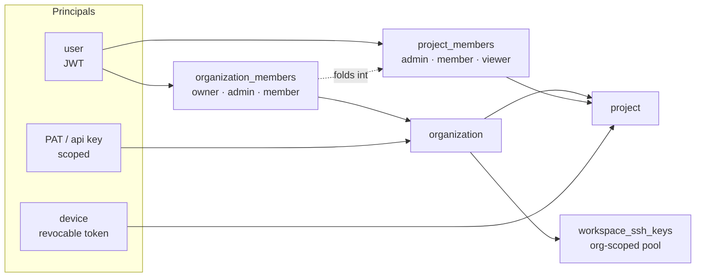

# Organization & Access

**Who participates in the lifecycle, and what they may reach.** Not one user driving N projects —
an organization with many participants, and work routed to the right one.

## What it owns

| Concern | Where it lives |
|---|---|
| Orgs, membership, invitations | `core/src/orgs/`, `schema.ts:organizations`, `schema.ts:organizationMembers`, `schema.ts:projectInvitations` |
| Projects and their kind | `core/src/projects/`, `schema.ts:projects`, `schema.ts:projectKinds` |
| Role resolution across the two scopes | `core/src/lib/authz.ts:effectiveProjectRole` |
| Dual-principal auth (user vs device) | `core/src/auth/`, `core/src/security/` |
| Personal access tokens, scoped | `core/src/pat/`, `schema.ts:personalAccessTokens` |
| Org-scoped SSH key pool | `schema.ts:workspaceSshKeys`, web `features/resources/` |
| UI | web `features/orgs/`, `projects/`, `project-settings/`, `settings/` |

## Vocabulary

| Set | Values |
|---|---|
| `schema.ts:orgMemberRoles` | `owner` · `admin` · `member` — `owner` is never invitable; granting it is an explicit in-app act |
| `schema.ts:projectMemberRoles` | `admin` · `member` · `viewer` |
| `schema.ts:projectKinds` | `standard` · `website` |
| `organizationMembers.lenses` | soft working lens(es), owner/admin-assigned, validated at the route layer — a view hint, never an authority check |

## Boundaries

- **Roles are flat.** There are no teams, and no expertise or capability model. `effectiveProjectRole`
  folds an org `owner`/`admin` into project `admin`; nothing else crosses the two scopes.
- **A private key never leaves the vault as plaintext.** `workspaceSshKeys.privateKeyEnc` is
  decrypted only at provision dispatch; `publicKey` and `fingerprint` are the non-secret display
  halves.
- Routing work to a participant is [human-routing](../human-routing/), not this domain. This one
  answers *may they*, not *should they*.
