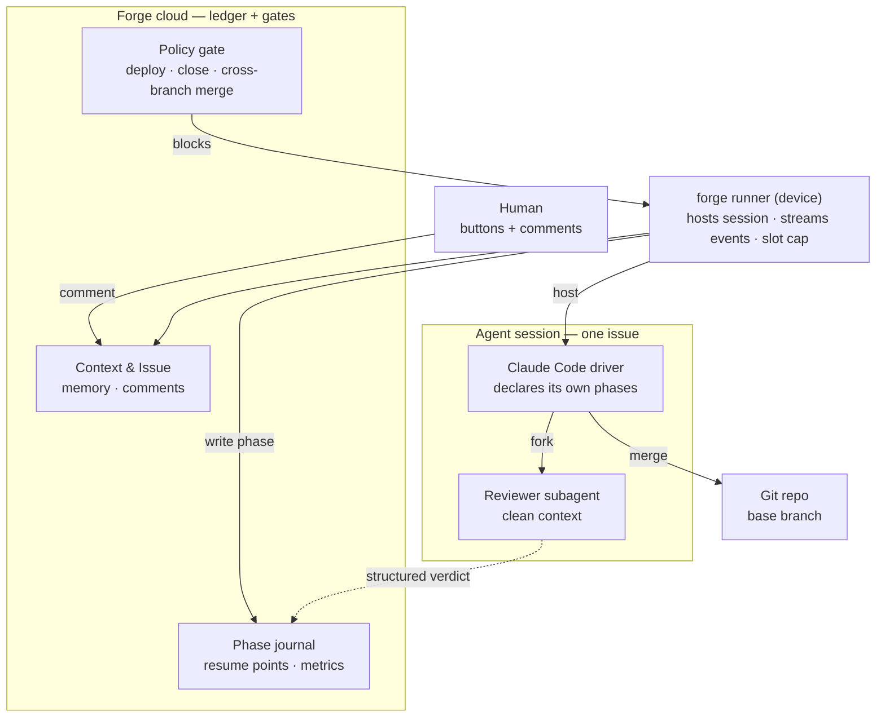
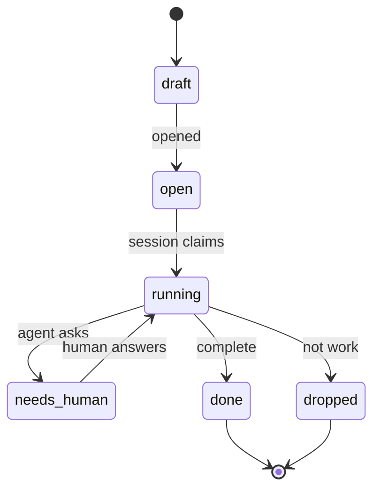
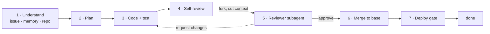
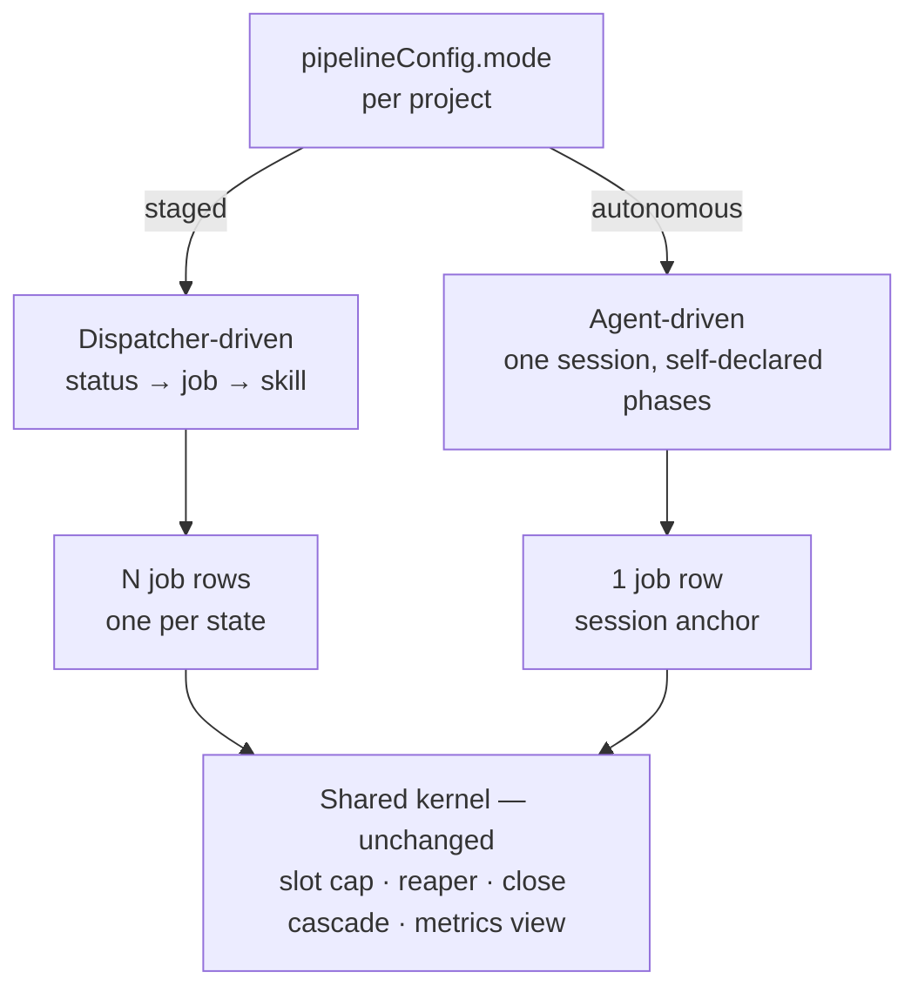

# Agent-driven pipeline

- Status: **Phases 0–4 shipped; phase 5 instrumented and awaiting evidence** — owner sessions 2026-08-19/20.
- Upgrade path: this becomes an RFC once the mode switch and the status vocabulary are agreed — both are cross-surface (REST, MCP, web, runner).
- Related: [RFC 0002](../rfcs/0002-park-axis-separation.md) (park axis) · [skill-delivery ADR](../architecture/skill-delivery.md) · [runner-daemon](../architecture/runner-daemon.md)

## Summary

One issue becomes **one long-lived agent session** instead of seven dispatcher-driven jobs. The
agent decides its own next step, declares phases into a journal, forks a clean-context reviewer,
and merges into the base branch it checked out. The cloud stops being the controller and becomes
the ledger plus two gates.

The seven-stage process is **policy**. It currently lives in the **kernel**, which is what
principle №11 forbids.

## Motivation

`issues.status` carries eight unrelated jobs at once:

| # | What status does today | Where it goes |
|---|---|---|
| 1 | Decide what work to dispatch next | agent, in context |
| 2 | Select the skill / prompt | agent, per phase |
| 3 | **Independent review gate** | **stays outside the session** — forked subagent |
| 4 | Observability ("where is it stuck") | agent-declared phase journal |
| 5 | Human interception point | comment into the live session |
| 6 | Resume point after a crash | **journal checkpoint** |
| 7 | Context / cost boundary | one derivation instead of seven |
| 8 | Slot accounting | unchanged — job row |

Rows 3, 6 and 8 are the constraints. The other five are strictly better under agent control.

The measurable case: today the context is re-derived seven times per issue, each handoff is lossy,
and every stage boundary is a place where a finding can be dropped without anyone lying — the
failure mode `forge-skill-audit` exists to catch.

## Design

### Inversion of control

Two hard boundaries:

- **The reviewer is a subagent, not a phase.** It receives diff + acceptance criteria, never the
  driver's transcript. Self-review is kept as a cheaper first pass, but it is not the gate.
- **The verdict is written by the runner from a structured result, never narrated by the driver.**
  A driver that authors its own review record can launder `request_changes` into "reviewed, fine",
  and with no job boundary left there is nothing to expose it.

### Six statuses

A status is kept only if the kernel enforces it. That is the whole selection rule.

| Status | The one kernel rule it enforces | Absorbs |
|---|---|---|
| `draft` | never claimed by a session | `draft` |
| `open` | claimable, unless a `blocks` edge holds it | `open` |
| `running` | **exactly one live session per issue** | `confirmed` `clarified` `approved` `developed` `testing` `tested` `released` `reopen` |
| `needs_human` | no session, holds no slot, resumed by the answer | `needs_info` `waiting` `on_hold` |
| `done` | stamps `merged_at` → unblocks every dependent | `closed` |
| `dropped` | closes **without** stamping — replaces close + `unmark` | `closed` + `unmark` |

`dropped` is a status rather than a flag because the two-step "close then unmark" silently unblocks
every dependent when the second step is forgotten.

**`status` and `phase` are separate columns.** `status` is the six values above and the kernel reads
it. `phase` is agent-declared, free vocabulary, and **no gate reads it** — a wrong phase can never
wedge an issue.

### Phases inside a session

`forge-test` disappears as a stage: the reviewer runs build and tests, and merge moves into phase 6.
Post-deploy live E2E stays as a skill invoked at phase 7, not as a stage.

### Output contract

Defined by what survives the session dying.

| Tier | Content | Written by |
|---|---|---|
| Git | branch · commits · merge into base | agent |
| **Phase journal** | per phase: name, timestamps, artifact produced → resume point + metrics | **runner, from structured events** |
| Issue | `plan`, `acceptanceCriteria`, one closing comment incl. `Extra fixes:` and anything left | agent |

`pipeline_run_step_durations` is rebuilt from the journal instead of from one job row per step.

## Skill delivery

Adopt the Claude Code CLI model. Measured against the installed CLI (2.1.235,
`~/.local/share/claude/versions/`):

| Property | Claude Code CLI | forge-runner today |
|---|---|---|
| Where skills live | embedded in the artifact | separate repo + server DB + MCP |
| How they arrive | extracted to `bundled-skills/<version>/` at startup | a sync protocol: manifest fetch, hash diff, staged temp dir, atomic publish, per-skill file lock, hash report-back |
| Same-name conflict | variants coexist, selected by path proximity | shadow-by-name **destroys** the base |
| Non-overridable | a lock flag in managed settings | achieved by picking the plugin channel |
| Disable a bad skill | live kill switch with per-skill survivors | edit a DB row or cut a plugin release |
| Failure modes | none — no network in the path | sync races, stale shadows, unreachable marketplace |

Cost of the difference: `skill_sync.rs` (704 lines) + `plugin_sync.rs` (437 lines) on the runner,
plus the effective/sync layer in `packages/core/src/skills/`. The CLI delivers skills with no sync
protocol at all.

What to adopt:

1. **Embed the canonical skill set in the `forge-runner` binary** and extract to a version-keyed
   directory at daemon start. This returns the skills to this monorepo, so a skill change and the
   code that depends on it land in the same PR — impossible today, because they live in
   `SidCorp-co/forge-pipeline-skills`.
2. **Replace shadow-by-name with path-scoped variants.** A project skill becomes a variant beside
   the base rather than a replacement for it.
3. **Separate the lock from the channel.** A skill is non-overridable because a flag says so, not
   because of where it ships from. `META_SKILL_NAMES` returns to being name reservation only.
4. **Kill switch with survivors**, served in the config the runner already polls, so a bad skill
   never requires a runner release to disable.
5. **Shrink the sync protocol to overrides only.** It already runs off the job path — three call
   sites, none per-job: `workspace/provision.rs`, `daemon/dispatch.rs::handle_skill_sync`,
   `daemon/skill_pull.rs`. Once the canonical set ships inside the binary, what remains to sync is
   the per-project delta, which is small enough that the hash cache, the staged publish and the
   report-back can go with it.

## Running both modes

Per-project mode selection, on one condition: **fork the driver, never the kernel.** The seam is the
`jobs` row.

| Layer | staged | autonomous |
|---|---|---|
| Status vocabulary | 12 values | 6 values |
| Who picks the next step | dispatcher | agent |
| Job rows per issue | 7 | 1 |
| Skills | server registry | embedded in runner + project overrides |
| Slot cap · reaper · close cascade | shared, untouched | shared, untouched |
| Board UI | already renders from `pipelineConfig.states` | same |

**Design test: there must be no second reaper.** If autonomous mode needs its own orphan hygiene,
the seam is in the wrong place. It must be a degenerate case of the existing kernel, not a second
kernel.

The one genuine exception: the loop monitor's quiet threshold (`RESULT_QUIET_MINUTES = 60`,
`jobs/loop-monitor.ts`) assumes staged job cadence. A long session can be legitimately quiet longer,
or alive-but-lost for hours. The signal must become **progress-based** — a new commit, a new journal
phase — parameterised per mode. A mode-aware parameter is acceptable; a second reaper is not.

Running both is also the evaluation: same runner, same repo, same issue mix, only the driver differs.
Compare *interventions per issue closed* and *request → running*. If autonomous does not win on both,
it does not ship.

## The autonomous skill set

Written from scratch. `packages/core/skills/` (13 skills, seeded into the `skills` table by
`src/skills/builtin-seed.ts`) stays untouched and keeps serving `staged` mode — both sets live in
this repo side by side.

| Skill | Owns | Project may override? |
|---|---|---|
| `forge-drive` | the phase loop · when to fork the reviewer · when to escalate to `needs_human` · what to journal | **no** |
| `forge-understand` | triage + clarify merged: is this work, and is it reproduced? | no |
| `forge-plan` | what a plan in this repo must touch | no |
| `forge-review` | the rubric handed to the subagent — diff + acceptance criteria, never the transcript | no |
| `forge-ship` | merge target · deploy gate · changelog · close | no |

`forge-code` `forge-fix` `forge-test` `forge-staging` `forge-release` get no successor: their content
is staging ceremony, which moves into `forge-drive`.

**No skill is project-overridable in this mode.** Per-project specificity moves to project config
instead — the same knowledge, in a place that cannot fork the pipeline logic. This is the one place
the design deliberately gives up flexibility for uniformity.

Delivery is hybrid: the binary is the source (embedded, extracted at daemon start, version-keyed),
and the server additionally seeds the set **read-only** so Skill Studio can display it. Displayed,
never edited — the binary wins by construction.

## Decisions

| # | Question | Decision |
|---|---|---|
| 1 | Post-deploy live E2E | **Dropped for now.** Verification after deploy is separate work, revisited after the mode lands. |
| 2 | UI buttons | Write a **comment**. One write path, one read path — the agent cannot be half-blind. |
| 3 | Sunset condition for `staged` | Deferred until there is data from phase 5. |
| 4 | Progress-based watchdog | A new commit **or** a new journal phase counts as progress. 90 min without either → alert; 180 min → `held`. Never reap — RFC 0002 already separated the park axis. |
| 5 | First test projects | `KineTrak` and `archmap` — smaller blast radius than forge-dev, and both are real work rather than a synthetic fixture. |

## Goals

A phase is done when its acceptance criteria hold, not when its code is written. Phases 0–2 carry
no risk to the running pipeline and are independently valuable — if 3–5 are abandoned, they still
paid for themselves.

### Phase 0 — the skill set ships inside the binary · **done, released as `runner-v0.7.7`**

- `packages/runner/skills/` is the source; `build.rs` walks it, so a file added there cannot be
  missing at runtime.
- Daemon start materialises the enabled set into a version-keyed directory and logs the result.
- `[skills] bundled_disabled` / `bundled_overrides` disable a bad skill from config, without a new
  binary; `forge-drive` and `forge-review` survive the global switch.
- **Nothing consumes the tree.** Pipeline behaviour is byte-for-byte unchanged.

### Phase 1 — the lock is a flag, and per-project knowledge has a home — **done**

- `pipelineConfig.lockedSkills` makes a skill non-overridable. Being locked no longer depends on
  which channel delivered it, and `meta-skills.ts` is back to name reservation only.
  `skills/lock.ts` owns the rules; `SKILL_LOCKED` maps to 400 at all three write boundaries.
- Per-project specificity has a declared home: `projects/autonomous-contract.ts` names the six
  `projectFacts` keys the bundled skills read, and `updatePipelineConfig` refuses the switch to
  autonomous while `build-commands` or `test-commands` is unanswered.
- Acceptance met: a project expresses what the forked skills expressed, without forking one.

> **A hole this closed.** `pipelineConfigSchema` STRIPS unknown keys, so `lockedSkills` could never
> have survived `PATCH /pipeline-config` or `forge_config`. The lock would have reported every
> project unlocked while looking implemented. Both it and `mode` are now declared in the schema,
> with a test that proves the round-trip.

> Path-scoped skill variants — the Claude Code model where `apps/web:deploy` coexists with `deploy`
> instead of destroying it — are **deferred, not dropped**. They would change resolution for the
> live staged pipeline, and the autonomous set is not overridable anyway, so the risk buys nothing
> yet. Revisit if the staged set outlives phase 5.

### Phase 2 — the journal exists and staged history is in it

- A phase journal records, per issue attempt: phase name, start, end, and the artifact produced.
  **done** — `phase_journal`, migration 0183, live on forge-beta.
- **Entries are written from structured events, never from agent narration.** A reviewer verdict is
  recorded by the runner from a returned result; the driver cannot author it. **done** — enforced by
  the `phase_journal_verdict_is_runner_written` CHECK, and observed rejecting an agent-authored
  verdict in `tests/integration/phase-journal-e2e.test.ts`.
- Staged phases are **derived** from `jobs` + `agent_sessions`, not written by a lifecycle hook.
  **done** — `pipeline/phase-journal-backfill.ts`, hourly, skipping any run with an unfinished job.
- `phase_step_durations` (migration 0184) is rebuilt on the journal and **agrees with today's
  numbers on staged data** — EXCEPT returns nothing in both directions across done, failed,
  cancelled, no-session and inverted-span steps. **done.**

> **The derivation is SQL, not TypeScript, and that was not a style choice.** The first version
> derived in node and the two views disagreed on every row: a timestamp round-tripped through a JS
> `Date` loses Postgres microseconds. The TypeScript module and its unit tests were deleted rather
> than kept beside the SQL — two implementations of one rule is the drift this repo gates against.

> **Why derive rather than hook.** Staged mode puts one phase in one job, so `jobs` already holds
> every fact. Deriving reaches backwards over months of finished jobs, so phase 5 opens with real
> history instead of accruing from the day it ships, and it touches no hot path. What it does not
> exercise is the autonomous write path — but that is the agent declaring phases over MCP, which a
> job-lifecycle hook would not have exercised either. `applyKernelTransition` was the tempting hook
> and is the wrong one twice over: it is deliberately a thin primitive with side effects left to its
> callers, and it records terminal flips only, while a phase also needs a start.

### Phase 3 — one issue, one session — **done**

- `pipelineConfig.mode = autonomous` produces one run with **one** `jobs` row, of the new type
  `drive`. "Exactly one" is the existing `(issueId, type)` unique index, not new code.
- The runner seeds its bundled skills into the drive job's worktree, and `skill_sync`'s prune
  predicate keeps those names.
- `forge_phase` (MCP) is how the session declares where it is. Verdicts are absent from it by
  design; `POST /api/jobs/:id/verdict` is device-authenticated with no user-authenticated twin.
- Slot cap, reaper and close cascade are unmodified. The watchdog gained ONE term in its existing
  quiet computation: a declared phase counts as progress alongside `job_events`.
- Acceptance met: no second orphan-hygiene mechanism exists.

> **One thing this phase does NOT do, named rather than discovered later.**
>
> **Verdict attribution is bounded.** The CHECK guarantees the journal ROW was written by the
> runner. It does not, and cannot, prove that the reviewer rather than the driver wrote
> `.forge/review-verdicts.jsonl`, and nothing forces the reviewer to have run in a separate
> context at all. A driver that writes its own verdict file is accepted. What the mechanism buys is
> that the driver cannot RESTATE a review in its own words as the record — the bytes posted are the
> bytes on disk. The rest is skill discipline.

> **Correction: there is no `kind='autonomous'`.** This document asked for one. The kernel says no —
> 21 sites key on `kind='issue'`, including the partial unique index that makes one-open-run-per-
> issue true, the issue-run reaper and the dispatch gates. A new kind means a second copy of each,
> which is precisely the second orphan-hygiene mechanism the acceptance criterion forbids. An
> autonomous run is a `kind='issue'` run with one job; the mode lives on the project and the driver
> on the job type.

### Phase 4 — six statuses — **done**

- `dropped` closes without stamping `merged_at`. Terminal for dispatch, closes the run like
  `closed`, never reaches `markMergedOnClose`, and has **no exit at all** — reopening it would
  carry `merged_at NULL` into an issue that then ships.
- `status` and `phase` are separate: `phase` lives in `phase_journal` and no gate reads it.
- The kernel→label map lives in `contracts/issue-vocabulary.ts`; web reads it through
  `IssueVocabularyProvider` (resolves the project's `mode` once per project route) and
  `useStatusLabeller`. Five surfaces call the hook; outside a provider the label is the kernel
  status, which is what the workspace-tier screens already showed.
- A human comment on a `needs_info` issue returns it to `open` — `pipeline/answer-resume.ts`. The
  agent that asked is gone, so the answer is the only thing that can dispatch a new session. Only
  `needs_info`: `waiting` and `on_hold` were entered by a person and stay that way. The
  orchestrator's `needs_info → open` short-circuit, which exists so a staged project does not
  re-triage, is now staged-only.

> **Correction: only ONE of the six is a new kernel status.** `running` is what `in_progress`
> already enforces, `needs_human` what the three parked statuses do, `done` what `closed` does.
> Adding them would have been two enum values for one rule — the selection rule this document set
> for itself. The other five are a rendering map, and `dropped` is the only rule nothing enforced.
>
> It also fixed a case nobody had named: discarding a **draft** to `closed` stamped `merged_at` on
> an issue whose work never existed. `draft → dropped` is now legal and is the right discard.

### Phase 5 — measured, then decided — **instrument built, evidence pending**

- The measurement exists: `pipeline/driver-comparison.ts` and
  `GET /api/pipeline/driver-comparison` report both metrics per project, with each project's `mode`
  saying which driver produced them. Never grouped across projects — that would compare
  repositories, not drivers.
- Two arithmetic rules carry their own tests, because getting either wrong yields a decision worse
  than no measurement: a project that closed nothing reports `null`, not `0` (a driver must not win
  by never finishing anything), and an issue no session ever started is excluded from the wait
  rather than counted as instant.
- `KineTrak` and `archmap` run autonomous beside staged projects for at least 30 closed issues.
- Acceptance: autonomous wins on both, or it does not ship. A tie is a loss — the staged path is
  already paid for.

> **This phase cannot be finished by writing code.** Everything above is in place; what remains is
> thirty closed issues' worth of elapsed time on two real projects. Reporting it as done before
> that evidence exists would be the failure mode this document was written against.
>
> **The clock has not started, and the reason is the fleet, not the code.** Measured 2026-08-20,
> with both projects' contract facts complete and `runner-v0.7.8` published and served by core:
> KineTrak's runner (`ubuntu6 (ai011)`) is on **0.7.6** — it predates the bundled skill set
> entirely, so a `drive` job would dispatch to a box with no `forge-drive` to run. archmap's
> (`ubuntu2 (ai017)`) is on **0.7.7**, which embeds the skills but does not seed them into the
> worktree or post verdicts. Four of fifteen online devices sat at 0.7.6 while eight reached 0.7.8
> within an hour of the release, so this is auto-update being off on those boxes, not the six-hour
> check cadence. Switching either project to `mode: 'autonomous'` before its runner updates would
> enqueue drive jobs that fail for a reason that has nothing to do with the driver — and that
> failure would then be the evidence. Update the two runners first.
