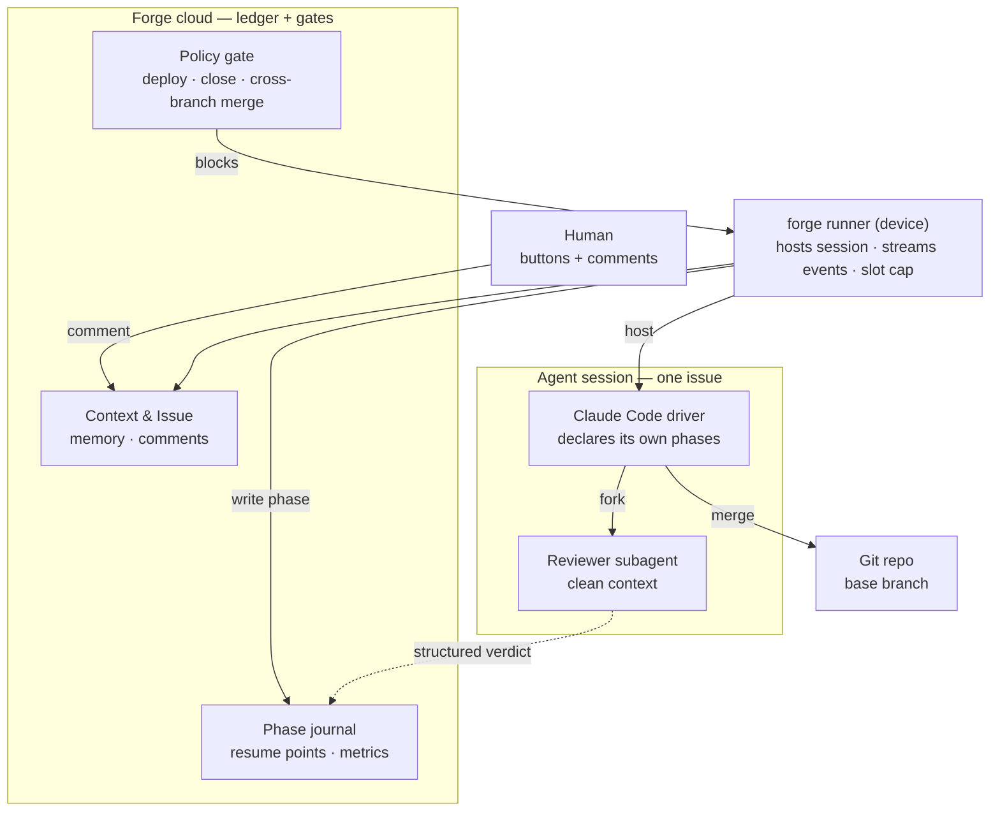
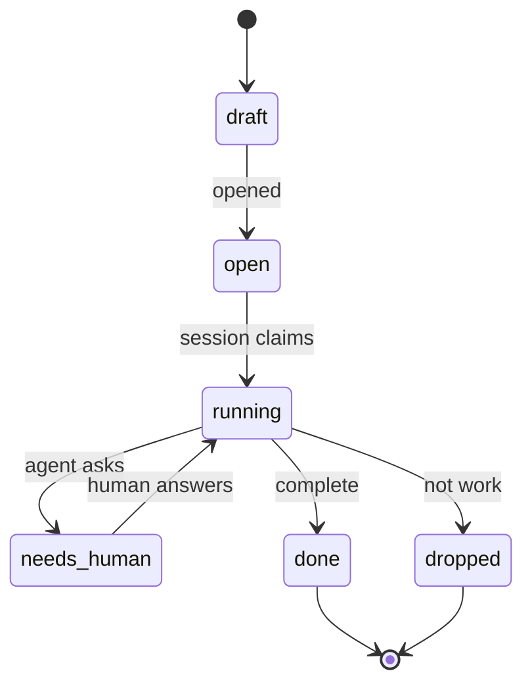
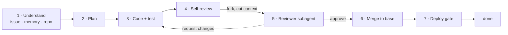
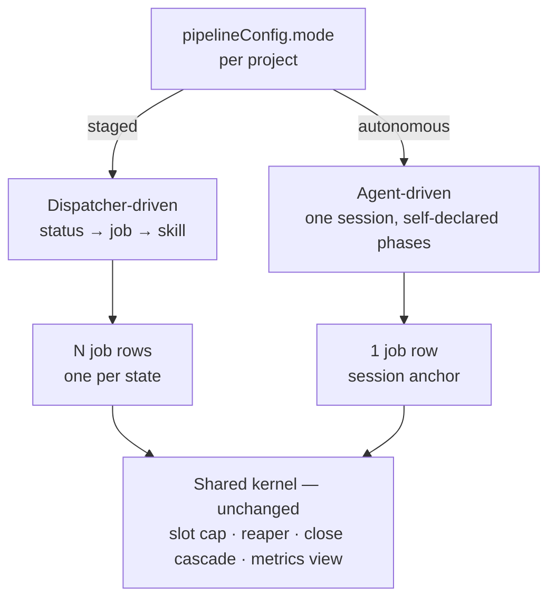

# Agent-driven pipeline

- Status: **Phases 0–4 shipped; phase 5 instrumented and awaiting evidence** — owner sessions 2026-08-19/20. **Two of those phases were reversed on 2026-09-02 — see the section directly below before reading anything else here as current.**
- Upgrade path: this becomes an RFC once the mode switch and the status vocabulary are agreed — both are cross-surface (REST, MCP, web, runner).
- Related: `packages/runner/README.md` · skill delivery: `runner/crates/forge-runner-core/src/workspace/skill_sync.rs`

## Reversed 2026-09-02 — skill delivery and the reviewer verdict

Owner decision, recorded here so the shipping record below stays readable as history rather than
being rewritten. The mode itself, the phase journal, resume-point and the five-status vocabulary
**stand**. Two mechanisms came out:

| Removed | Was | Why |
|---|---|---|
| Bundled skill set (`packages/runner/skills/`, `include_str!`, `bundled_skills.rs`, `[skills] bundled_*`) | Phase 0 — five skills compiled into the runner binary | Delivery by binary meant a skill fix waited on a runner release the fleet then had to pull: 0.9.9 and 0.9.10 were cut on 2026-09-02 and 8 of 10 runners were still on 0.9.8 hours later. The driver skill is now `issue-flow` from the `forge` Claude Code plugin (github.com/SidCorp-co/forge-plugin), which carries 724 lines of method to forge-drive's 242 and a project-overrides-skill rule this repo never had. Reaches a box through `pipelineConfig.plugins` → `GET /api/devices/me/plugins`, gated by that box's `[plugins] enabled`. |
| Runner-written review verdict (`FORGE_VERDICT_FILE`, `verdict.rs`, the poller in `claude_code.rs`, `POST /api/jobs/:id/verdict`, CHECK `phase_journal_verdict_is_runner_written`) | Phase 3 — the reviewer wrote a file, the runner posted it, the DB refused an agent-authored verdict | Owner chose to drop it rather than port it into `issue-flow`. **The price, stated:** nothing now stops a driver recording its own approval. The 2026-08-21 measurement (9 of 10 closed getcontent issues had a real verdict overwritten by the driver's prose) is the failure this mechanism existed for, and it is reachable again. `endPhase` keeps its `kind IS DISTINCT FROM 'verdict'` clause so the historical rows stay honest; migration 0194 drops the constraint. |

What this reversal does **not** do: it does not install the plugin anywhere. 0 of 31 projects
designated it and every runner ships `[plugins] enabled = false`, so until a project designates and
an operator flips the box switch, a `drive` job is told to use a skill it does not have. Chosen
knowingly as a big-bang cut.

## Summary

One issue becomes **one long-lived agent session** instead of seven dispatcher-driven jobs. The
agent decides its own next step, declares phases into a journal, forks a clean-context reviewer,
and merges into the base branch it checked out. The cloud stops being the controller and becomes
the ledger plus two gates.

The seven-stage process is **policy**. It currently lives in the **kernel**, which is what
principle `VISION: kernel-hard-policy-soft` forbids.

## Motivation

`issues.status` carries eight unrelated jobs at once:

| # | What status does today | Where it goes |
|---|---|---|
| 1 | Decide what work to dispatch next | agent, in context |
| 2 | Select the skill / prompt | agent, per phase |
| 3 | **Independent review gate** | **stays outside the session** — forked subagent |
| 4 | Observability ("where is it stuck") | agent-declared phase journal |
| 5 | Human interception point | comment into the live session |
| 6 | Resume point after a crash | **journal checkpoint** |
| 7 | Context / cost boundary | one derivation instead of seven |
| 8 | Slot accounting | unchanged — job row |

Rows 3, 6 and 8 are the constraints. The other five are strictly better under agent control.

The measurable case: today the context is re-derived seven times per issue, each handoff is lossy,
and every stage boundary is a place where a finding can be dropped without anyone lying — the
failure mode `forge-skill-audit` exists to catch.

## Design

### Inversion of control



Two hard boundaries:

- **The reviewer is a subagent, not a phase.** It receives diff + acceptance criteria, never the
  driver's transcript. Self-review is kept as a cheaper first pass, but it is not the gate.
- **The verdict is written by the runner from a structured result, never narrated by the driver.**
  A driver that authors its own review record can launder `request_changes` into "reviewed, fine",
  and with no job boundary left there is nothing to expose it.

### Six statuses



A status is kept only if the kernel enforces it. That is the whole selection rule.

| Status | The one kernel rule it enforces | Absorbs |
|---|---|---|
| `draft` | never claimed by a session | `draft` |
| `open` | claimable, unless a `blocks` edge holds it | `open` |
| `running` | **exactly one live session per issue** | `confirmed` `clarified` `approved` `developed` `testing` `tested` `released` `reopen` |
| `needs_human` | no session, holds no slot, resumed by the answer | `needs_info` `waiting` `on_hold` |
| `done` | stamps `merged_at` → unblocks every dependent | `closed` |
| `dropped` | closes **without** stamping — replaces close + `unmark` | `closed` + `unmark` |

`dropped` is a status rather than a flag because the two-step "close then unmark" silently unblocks
every dependent when the second step is forgotten.

**`status` and `phase` are separate columns.** `status` is the six values above and the kernel reads
it. `phase` is agent-declared, free vocabulary, and **no gate reads it** — a wrong phase can never
wedge an issue.

What free vocabulary costs is paid by the seed, not by a gate. The drive prompt's worked example in
`autonomous-dispatch.ts` showed the literal `phase-1` from 2026-09-02, agents copied it, and 542
rows landed named `phase-0`..`phase-8` — unreadable, and not the same step from one run to the next.
ISS-921 changed the example, which is the only lever there is: a gate on the name would turn a
descriptive vocabulary into a contract the agent can break by being descriptive. Those rows stay as
written; `phase_step_durations.step_named` is false for them, so an aggregate excludes the era
without a date and without guessing what any of them meant.

**Still open, and not fixable from this repo.** The agent reads two things in one context window,
and the second is `guides/skills/issue-flow/guide.md` in `SidCorp-co/forge-plugin`, whose headings
are `## Phase 4 — Implement` and which says nothing about what to declare. That is the other seed:
`phase-4-implement`, `phase-0-learn-project`, `phase-5-verify` and `phase-5-prove` are what it
produces when a session tries to be descriptive and keeps the ordinal anyway — and the last two are
one step under two names. The change wanted there is a declarable slug on each heading. `forge
feedback` is the route and it is refused from a runner box: the job credential sees only the project
it was minted for (`No Forge project has slug forge-plugin. Seen: forge-dev`, 2026-09-06), so this
needs a person with access to that backlog. The note to file is on ISS-921.

### Phases inside a session



`forge-test` disappears as a stage: the reviewer runs build and tests, and merge moves into phase 6.
Post-deploy live E2E stays as a skill invoked at phase 7, not as a stage.

### Output contract

Defined by what survives the session dying.

| Tier | Content | Written by |
|---|---|---|
| Git | branch · commits · merge into base | agent |
| **Phase journal** | per phase: name, timestamps, artifact produced → resume point + metrics | **runner, from structured events** |
| Issue | `plan`, `acceptanceCriteria`, one closing comment incl. `Extra fixes:` and anything left | agent |

`pipeline_run_step_durations` is rebuilt from the journal instead of from one job row per step.

## Skill delivery

Adopt the Claude Code CLI model. Measured against the installed CLI (2.1.235,
`~/.local/share/claude/versions/`):

| Property | Claude Code CLI | forge-runner today |
|---|---|---|
| Where skills live | embedded in the artifact | separate repo + server DB + MCP |
| How they arrive | extracted to `bundled-skills/<version>/` at startup | a sync protocol: manifest fetch, hash diff, staged temp dir, atomic publish, per-skill file lock, hash report-back |
| Same-name conflict | variants coexist, selected by path proximity | shadow-by-name **destroys** the base |
| Non-overridable | a lock flag in managed settings | achieved by picking the plugin channel |
| Disable a bad skill | live kill switch with per-skill survivors | edit a DB row or cut a plugin release |
| Failure modes | none — no network in the path | sync races, stale shadows, unreachable marketplace |

Cost of the difference: `skill_sync.rs` (704 lines) + `plugin_sync.rs` (437 lines) on the runner,
plus the effective/sync layer in `packages/core/src/skills/`. The CLI delivers skills with no sync
protocol at all.

What to adopt:

1. **Embed the canonical skill set in the `forge-runner` binary** and extract to a version-keyed
   directory at daemon start. This returns the skills to this monorepo, so a skill change and the
   code that depends on it land in the same PR — impossible today, because they live in
   `SidCorp-co/forge-pipeline-skills`.
2. **Replace shadow-by-name with path-scoped variants.** A project skill becomes a variant beside
   the base rather than a replacement for it.
3. **Separate the lock from the channel.** A skill is non-overridable because a flag says so, not
   because of where it ships from. `META_SKILL_NAMES` returns to being name reservation only.
4. **Kill switch with survivors**, served in the config the runner already polls, so a bad skill
   never requires a runner release to disable.
5. **Shrink the sync protocol to overrides only.** It already runs off the job path — three call
   sites, none per-job: `workspace/provision.rs`, `daemon/dispatch.rs::handle_skill_sync`,
   `daemon/skill_pull.rs`. Once the canonical set ships inside the binary, what remains to sync is
   the per-project delta, which is small enough that the hash cache, the staged publish and the
   report-back can go with it.

## Running both modes

Per-project mode selection, on one condition: **fork the driver, never the kernel.** The seam is the
`jobs` row.



| Layer | staged | autonomous |
|---|---|---|
| Status vocabulary | 12 values | 6 values |
| Who picks the next step | dispatcher | agent |
| Job rows per issue | 7 | 1 |
| Skills | server registry | embedded in runner + project overrides |
| Slot cap · reaper · close cascade | shared, untouched | shared, untouched |
| Board UI | already renders from `pipelineConfig.states` | same |

**Design test: there must be no second reaper.** If autonomous mode needs its own orphan hygiene,
the seam is in the wrong place. It must be a degenerate case of the existing kernel, not a second
kernel.

The one genuine exception: the loop monitor's quiet threshold (`RESULT_QUIET_MINUTES = 60`,
`jobs/loop-monitor.ts`) assumes staged job cadence. A long session can be legitimately quiet longer,
or alive-but-lost for hours. The signal must become **progress-based** — a new commit, a new journal
phase — parameterised per mode. A mode-aware parameter is acceptable; a second reaper is not.

Running both is also the evaluation: same runner, same repo, same issue mix, only the driver differs.
Compare *interventions per issue closed* and *request → running*. If autonomous does not win on both,
it does not ship.

## The autonomous skill set

Written from scratch. `packages/core/skills/` (13 skills, seeded into the `skills` table by
`src/skills/builtin-seed.ts`) stays untouched and keeps serving `staged` mode — both sets live in
this repo side by side.

| Skill | Owns | Project may override? |
|---|---|---|
| `forge-drive` | the phase loop · when to fork the reviewer · when to escalate to `needs_human` · what to journal | **no** |
| `forge-understand` | triage + clarify merged: is this work, and is it reproduced? | no |
| `forge-plan` | what a plan in this repo must touch | no |
| `forge-review` | the rubric handed to the subagent — diff + acceptance criteria, never the transcript | no |
| `forge-ship` | merge target · deploy gate · changelog · close | no |

`forge-code` `forge-fix` `forge-test` `forge-staging` `forge-release` get no successor: their content
is staging ceremony, which moves into `forge-drive`.

**No skill is project-overridable in this mode.** Per-project specificity moves to project config
instead — the same knowledge, in a place that cannot fork the pipeline logic. This is the one place
the design deliberately gives up flexibility for uniformity.

Delivery is hybrid: the binary is the source (embedded, extracted at daemon start, version-keyed),
and the server additionally seeds the set **read-only** so Skill Studio can display it. Displayed,
never edited — the binary wins by construction.

## Decisions

| # | Question | Decision |
|---|---|---|
| 1 | Post-deploy live E2E | **Dropped for now.** Verification after deploy is separate work, revisited after the mode lands. |
| 2 | UI buttons | Write a **comment**. One write path, one read path — the agent cannot be half-blind. |
| 3 | Sunset condition for `staged` | Deferred here, then **answered by ISS-897 (2026-09-03)** without waiting for phase-5 evidence: 0 of 38 projects had ever declared `staged`, so the lane was removed as unchosen rather than sunset as outcompeted. |
| 4 | Progress-based watchdog | A new commit **or** a new journal phase counts as progress. 90 min without either → alert; 180 min → `held`. Never reap — RFC 0002 already separated the park axis. |
| 5 | First test projects | `KineTrak` and `archmap` — smaller blast radius than forge-dev, and both are real work rather than a synthetic fixture. |

## Goals

A phase is done when its acceptance criteria hold, not when its code is written. Phases 0–2 carry
no risk to the running pipeline and are independently valuable — if 3–5 are abandoned, they still
paid for themselves.

### Phase 0 — the skill set ships inside the binary · **done, released as `runner-v0.7.7`**

- `packages/runner/skills/` is the source; `build.rs` walks it, so a file added there cannot be
  missing at runtime.
- Daemon start materialises the enabled set into a version-keyed directory and logs the result.
- `[skills] bundled_disabled` / `bundled_overrides` disable a bad skill from config, without a new
  binary; `forge-drive` and `forge-review` survive the global switch. *(Removed 2026-09-02 with the
  bundled set — see the reversal section at the top.)*
- **Nothing consumes the tree.** Pipeline behaviour is byte-for-byte unchanged.

### Phase 1 — the lock is a flag, and per-project knowledge has a home — **done**

- `pipelineConfig.lockedSkills` makes a skill non-overridable. Being locked no longer depends on
  which channel delivered it, and `meta-skills.ts` is back to name reservation only.
  `skills/lock.ts` owns the rules; `SKILL_LOCKED` maps to 400 at all three write boundaries.
- Per-project specificity has a declared home: `projects/autonomous-contract.ts` names the six
  `projectFacts` keys the bundled skills read, and `updatePipelineConfig` refuses the switch to
  autonomous while `build-commands` or `test-commands` is unanswered.
- Acceptance met: a project expresses what the forked skills expressed, without forking one.

> **A hole this closed.** `pipelineConfigSchema` STRIPS unknown keys, so `lockedSkills` could never
> have survived `PATCH /pipeline-config` or `forge_config`. The lock would have reported every
> project unlocked while looking implemented. Both it and `mode` are now declared in the schema,
> with a test that proves the round-trip.

> Path-scoped skill variants — the Claude Code model where `apps/web:deploy` coexists with `deploy`
> instead of destroying it — are **deferred, not dropped**. They would change resolution for the
> live staged pipeline, and the autonomous set is not overridable anyway, so the risk buys nothing
> yet. Revisit if the staged set outlives phase 5.

### Phase 2 — the journal exists and staged history is in it

- A phase journal records, per issue attempt: phase name, start, end, and the artifact produced.
  **done** — `phase_journal`, migration 0183, live on forge-beta.
- **Entries are written from structured events, never from agent narration.** A reviewer verdict is
  recorded by the runner from a returned result; the driver cannot author it. **done** — enforced by
  the `phase_journal_verdict_is_runner_written` CHECK, and observed rejecting an agent-authored
  verdict in `tests/integration/phase-journal-e2e.test.ts`.
- Staged phases are **derived** from `jobs` + `agent_sessions`, not written by a lifecycle hook.
  **done** — `pipeline/phase-journal-backfill.ts`, hourly, skipping any run with an unfinished job.
- `phase_step_durations` (migration 0184) is rebuilt on the journal and **agrees with today's
  numbers on staged data** — EXCEPT returns nothing in both directions across done, failed,
  cancelled, no-session and inverted-span steps. **done.**

> **The derivation is SQL, not TypeScript, and that was not a style choice.** The first version
> derived in node and the two views disagreed on every row: a timestamp round-tripped through a JS
> `Date` loses Postgres microseconds. The TypeScript module and its unit tests were deleted rather
> than kept beside the SQL — two implementations of one rule is the drift this repo gates against.

> **Why derive rather than hook.** Staged mode puts one phase in one job, so `jobs` already holds
> every fact. Deriving reaches backwards over months of finished jobs, so phase 5 opens with real
> history instead of accruing from the day it ships, and it touches no hot path. What it does not
> exercise is the autonomous write path — but that is the agent declaring phases over MCP, which a
> job-lifecycle hook would not have exercised either. `applyKernelTransition` was the tempting hook
> and is the wrong one twice over: it is deliberately a thin primitive with side effects left to its
> callers, and it records terminal flips only, while a phase also needs a start.

### Phase 3 — one issue, one session — **done**

- `pipelineConfig.mode = autonomous` produces one run with **one** `jobs` row, of the new type
  `drive`. "Exactly one" is the existing `(issueId, type)` unique index, not new code.
- The runner seeds its bundled skills into the drive job's worktree, and `skill_sync`'s prune
  predicate keeps those names.
- `forge_phase` (MCP) is how the session declares where it is. Verdicts are absent from it by
  design; `POST /api/jobs/:id/verdict` is device-authenticated with no user-authenticated twin.
- Slot cap, reaper and close cascade are unmodified. The watchdog gained ONE term in its existing
  quiet computation: a declared phase counts as progress alongside `job_events`.
- Acceptance met: no second orphan-hygiene mechanism exists.

> **One thing this phase does NOT do, named rather than discovered later.**
>
> **Verdict attribution is bounded.** The CHECK guarantees the journal ROW was written by the
> runner. It does not, and cannot, prove that the reviewer rather than the driver wrote
> `.forge/review-verdicts.jsonl`, and nothing forces the reviewer to have run in a separate
> context at all. A driver that writes its own verdict file is accepted. What the mechanism buys is
> that the driver cannot RESTATE a review in its own words as the record — the bytes posted are the
> bytes on disk. The rest is skill discipline.

> **Correction: there is no `kind='autonomous'`.** This document asked for one. The kernel says no —
> 21 sites key on `kind='issue'`, including the partial unique index that makes one-open-run-per-
> issue true, the issue-run reaper and the dispatch gates. A new kind means a second copy of each,
> which is precisely the second orphan-hygiene mechanism the acceptance criterion forbids. An
> autonomous run is a `kind='issue'` run with one job; the mode lives on the project and the driver
> on the job type.

### Phase 4 — six statuses — **done**

- `dropped` closes without stamping `merged_at`. Terminal for dispatch, closes the run like
  `closed`, never reaches `markMergedOnClose`, and has **no exit at all** — reopening it would
  carry `merged_at NULL` into an issue that then ships.
- `status` and `phase` are separate: `phase` lives in `phase_journal` and no gate reads it.
- The kernel→label map lives in `contracts/issue-vocabulary.ts`; web reads it through
  `IssueVocabularyProvider` (resolves the project's `mode` once per project route) and
  `useStatusLabeller`. Five surfaces call the hook; outside a provider the label is the kernel
  status, which is what the workspace-tier screens already showed.
- A human comment on a `needs_info` issue returns it to `open` — `pipeline/answer-resume.ts`. The
  agent that asked is gone, so the answer is the only thing that can dispatch a new session. Only
  `needs_info`: `waiting` and `on_hold` were entered by a person and stay that way. The
  orchestrator's `needs_info → open` short-circuit, which existed so a staged project did not
  re-triage, was deleted with that lane by ISS-897.

> **Correction: only ONE of the six is a new kernel status.** `running` is what `in_progress`
> already enforces, `needs_human` what the three parked statuses do, `done` what `closed` does.
> Adding them would have been two enum values for one rule — the selection rule this document set
> for itself. The other five are a rendering map, and `dropped` is the only rule nothing enforced.
>
> It also fixed a case nobody had named: discarding a **draft** to `closed` stamped `merged_at` on
> an issue whose work never existed. `draft → dropped` is now legal and is the right discard.

### Phase 5 — measured, then decided — **instrument built, evidence pending**

- The measurement exists: `pipeline/driver-comparison.ts` and
  `GET /api/pipeline/driver-comparison` report both metrics per project **and per driver**, where
  the driver is derived from whether the issue carries a `drive` job — not from the project's
  current `mode`. Reading the config would let a flip relabel every issue the project ever closed,
  and the flip is exactly when someone opens the report. A project that switched mid-stream reports
  one row per driver. Never grouped across projects — that would compare repositories, not drivers.
- Two arithmetic rules carry their own tests, because getting either wrong yields a decision worse
  than no measurement: a project that closed nothing reports `null`, not `0` (a driver must not win
  by never finishing anything), and an issue no session ever started is excluded from the wait
  rather than counted as instant.
- The trial runs on `KineTrak`, `archmap` and `getcontent`, for at least 30 closed issues.
  **`KineTrak` and `archmap` alone could never have supplied them** — measured 2026-08-20, the two
  had 19 issues between them in their entire history (10 and 9), of which 8 were already closed
  under the staged driver. Naming two small projects and a 30-issue bar was an acceptance criterion
  that could not be met by the projects it named, and no amount of waiting would have fixed it;
  `getcontent` was added because it closes ~7 issues a day and has 455 in its history, which makes
  30 reachable in about a week.
- Acceptance: autonomous wins on both, or it does not ship. A tie is a loss — the staged path is
  already paid for.

> **Switching a project does not start the clock — queued work does.** `getcontent` went autonomous
> with 320 issues closed, 127 in `draft` and **zero at `open`**, so nothing dispatched. `draft` never
> dispatches, and neither do the parked statuses; only an issue somebody moves to `open` produces a
> drive job. On a project whose merges deploy straight to production, which issues those are is the
> owner's call and not the measurement's.
>
> **This phase cannot be finished by writing code.** Everything above is in place; what remains is
> thirty closed issues' worth of elapsed time on two real projects. Reporting it as done before
> that evidence exists would be the failure mode this document was written against.
>
> **The clock has not started, and the reason is the fleet, not the code.** Measured 2026-08-20,
> with both projects' contract facts complete and `runner-v0.7.8` published and served by core:
> KineTrak's runner (`ubuntu6 (ai011)`) is on **0.7.6** — it predates the bundled skill set
> entirely, so a `drive` job would dispatch to a box with no `forge-drive` to run. archmap's
> (`ubuntu2 (ai017)`) is on **0.7.7**, which embeds the skills but does not seed them into the
> worktree or post verdicts. Four of fifteen online devices sat at 0.7.6 while eight reached 0.7.8
> within an hour of the release, so this is auto-update being off on those boxes, not the six-hour
> check cadence. Switching either project to `mode: 'autonomous'` before its runner updates would
> enqueue drive jobs that fail for a reason that has nothing to do with the driver — and that
> failure would then be the evidence. Update the two runners first.

#### First production run — what it proved, 2026-08-20

KineTrak switched to `mode: 'autonomous'` and drove ISS-1. Every mechanism phase 3 built has now
run somewhere other than a test:

| Mechanism | Evidence |
|---|---|
| bundled skills reach the box | runner log: `bundled set ready at .../bundled-skills/0.7.8 — 5 installed` |
| `drive` dispatches | job reached the runner with a session, after the capability gate was fixed |
| the session declares its phases | `phase_journal` row `understand / attempt 1 / source 'agent'` — written by the agent over MCP, not by the backfill |
| orphan hygiene covers the new type | a drive job stranded by a core restart was reaped in ~4 min as `infra` / *"agent session terminated without job completion"*, and the reconciler then re-dispatched on its own. This covers a job that gets **reaped**; a job that exits `done` leaving the issue at `in_progress` is a different shape, uncovered until ISS-890 added `resetAutonomousWedgesOnce` |

The one thing that broke was self-inflicted and worth writing down: the first drive job dispatched
during a core deploy, so the runner's websocket was down and the session timed out. **Deploy when a
project is quiet** — the reconciler re-dispatches every minute, so a restart window is nearly
certain to catch one. Since ISS-890 that re-dispatch is bounded: after `AUTONOMOUS_RESCUE_CAP`
rescues of one run without the issue advancing, the issue is parked at `needs_info` instead.

#### Switching a live project over — removed by ISS-897

This section held a migration runbook for flipping `mode` from `staged` to `autonomous`. There is
no `mode` any more: ISS-897 removed the key from `pipelineConfigSchema`, migrated it off all 38
project rows, and deleted the staged dispatch path with it. The runbook is kept out rather than
kept stale — it named a config key that no longer parses and a driver that no longer exists, and a
reader who followed it would be writing a value the next settings save silently drops.

The one durable finding from it, which is still true and is about the DRIVER rather than the
switch: a `held` job still counts against the L1 `issueBusyJob` gate, so a drive job for that issue
is refused as a duplicate. Measured on KineTrak 2026-08-20 — one `held` triage on ISS-1, parked on
`retry_rounds_exhausted` for fifteen hours, invisible on a board that showed ISS-1 as a plain `open`
issue.

#### The memory profile is the driver's, not the box's — 2026-08-20

The first multi-issue run (getcontent, 46 open issues, `maxConcurrentIssues: 3`) failed three drive
jobs in four hours, all `infra` / *"agent session terminated without job completion"*, all recovered
by the reaper and re-dispatched. The cause was not the driver:

```
systemd-oomd: Killed forge-runner.service due to memory pressure for
user@1000.service being 60.78% > 50.00% for > 20s with reclaim activity
```

`max_concurrent = 1`, so this is **one** session: the runner cgroup peaked at 11.4 GB of ubuntu5's
15.7 GB, because a drive session hosts `claude` plus every MCP child it starts — on getcontent that
includes `playwright-mcp`, i.e. headless Chromium. Two oom-kills in 24 h on each of ubuntu2 and
ubuntu5; ubuntu6 none.

This is a consequence of the inversion, not a box that happens to be small. A staged step is a
3–15 minute process that exits and frees everything; a drive session is one 60–90 minute process
that accumulates for the whole issue. The fleet was sized for the first shape.

What made it expensive is *which* process oomd chose. Killing the daemon reclaims memory a **child**
allocated, and takes the supervisor and every in-flight session down with it — 31 and 44 minutes of
paid session lost per kill, then a full restart from scratch. The mitigation is to take the daemon
out of oomd's candidate set so the kernel picks the largest child instead:

```ini
# ~/.config/systemd/user/forge-runner.service.d/oom.conf
[Service]
ManagedOOMPreference=omit
```

Applied to ubuntu2 and ubuntu5 without a restart (a restart would have killed the live session it
was meant to protect). **This is a mitigation, not the fix.** The daemon still cannot see how much
memory its own session subtree is using, so nothing stops a drive session from taking the box down —
the runner should cap concurrency on available memory rather than on a static `max_concurrent`.
Left as follow-up work; recorded here because it is the first cost of the inversion that is paid in
operations rather than in code.

#### The reviewer is independent — measured, 2026-08-20

The one claim phase 3 could not check in a test is whether the verdict in the ledger is the
reviewer's or the driver's account of it. On getcontent ISS-422 the reviewer refused four rounds
running, every row `source: 'runner'` and `kind: 'verdict'`, none agent-authored:

| Round | Decision | What it caught |
|---|---|---|
| 1 | `request_changes` | AC6 unmet — no published article gained a URL and no owner decision was recorded |
| 2 | `request_changes` | rejected the driver's own CHANGELOG paragraph, proposal section and memory record as a substitute for an owner decision |
| 3 | `request_changes` | a comment **claiming** round 2 was fixed while it was not — the check is a source-text regex, and a regex-literal argument prints as `{slug\}`, so it never matches |
| 4 | `request_changes` | AC6 still unrouted |

Round 3 is the one worth keeping: the reviewer refuted a fix the driver had asserted, on a detail
the assertion was wrong about. The job then finished `done` with the issue at `waiting` — escalated
to a human rather than merged. Before the `FORGE_VERDICT_FILE` fix all four of these rows would
have been the driver's own note, and the issue would have read as reviewed and approved.

#### First measurement — 2026-08-20, n=3 and already pointing one way

`driverComparison` run for the first time, 30-day window, the three projects that
have any autonomous history:

| project | driver | closed | dropped | interventions | per closed | median wait | p95 wait |
|---|---|---|---|---|---|---|---|
| getcontent | autonomous | 2 | 0 | 2 | **1.00** | **0m** | **3.8h** |
| getcontent | staged | 211 | 73 | 83 | 0.39 | 23m | 39.9h |
| kinetrak | autonomous | 1 | 0 | 4 | **4.00** | **14m** | **14m** |
| kinetrak | staged | 3 | 0 | 1 | 0.33 | 8.7h | 10.5h |
| archmap | staged | 8 | 0 | 4 | 0.50 | 16.3h | 19.0h |

The two metrics split, and they split the same way on both projects:

- **① request → running: autonomous wins, decisively.** 0m vs 23m median on
  getcontent, 14m vs 8.7h on kinetrak, and p95 39.9h → 3.8h. This is the
  inversion working exactly as designed — there is no queue of per-stage
  dispatches to wait through, so an issue starts when a runner is free.
- **② interventions per issue closed: autonomous loses, badly.** 1.00 vs 0.39,
  and 4.00 vs 0.33. Against the rule this document set — *"autonomous has to win
  on both or it does not ship; a tie is a loss"* — today's evidence says **do not
  ship**.

Two things make that reading premature rather than wrong, and both are reasons
the bar was set at 30 rather than 3:

1. **n=3.** One issue needing four touches moves kinetrak's ratio from 0 to 4.00.
   Nothing at this size distinguishes a driver from a bad afternoon.
2. **The sample is the bring-up itself.** Every autonomous closure so far ran
   while the driver's own defects were being found — `drive` unclaimable by any
   runner, verdicts written to a path nothing polled, phases left open, oomd
   killing sessions at 31 and 44 minutes. The interventions counted against
   autonomous here are substantially the interventions that *fixed* it. Staged's
   211 closures carry no such tax because staged was already debugged.

So the honest state of phase 5 is: the instrument works, it has been run, and the
metric at risk is **②, not ①**. That is worth knowing now — it says the thing to
watch as evidence accumulates is how often a human is pulled in, not how fast work
starts. Re-run `driverComparison` at n≥30 before reading anything into the ratio.

#### Second measurement — 2026-08-21, n=13, and the instrument was lying

Re-run at 13 autonomous closures on getcontent. Both metrics moved, and the more
important finding is that **one of them was measuring the wrong thing.**

**② interventions per issue closed — autonomous now wins.**

| driver | closed | interventions | per closed |
|---|---|---|---|
| autonomous | 13 | 3 | **0.23** |
| staged | 214 | 83 | 0.39 |

(30-day window, as the tool reports it. All-time it is 0.25 vs 0.31 — staged's
older history is cleaner than its recent history.) At n=3 this read 1.00 vs 0.39. The prediction in the section above — that the
early ratio was bring-up tax, not driver cost — holds: all three interventions
charged to autonomous are infrastructure, none is a driver defect.

| issue | intervention |
|---|---|
| ISS-196 | `wedge` — "No capacity: every runner for this project is limited" |
| ISS-470 | `wedge` — heartbeat hop miss on session |
| ISS-470 | `wedge` — heartbeat hop miss on job |

The margin is **one event wide**: a fourth wedge takes autonomous to 0.33 and it
loses again. This is not yet a result.

**① request → running — the raw column reported the inverse of the truth.**

The 30-day read was autonomous 141.2h median against staged's 23m. That is not
the driver being slow; it is the metric charging a driver for time before it
existed. getcontent's first `drive` job ran 2026-08-20T06:34Z, into a 52-issue
backlog whose issues had been filed weeks earlier. Splitting the cohort:

| driver | issue filed | n | median → running |
|---|---|---|---|
| autonomous | before the switch | 11 | 249.9h |
| autonomous | **after** the switch | 2 | **0m** |
| staged | before the switch | 151 | 23m |

The 0m matches the first measurement exactly. The 141.2h is backlog age — which
is *staged's* failure to pick those issues up, charged to whichever driver
finally did.

Left alone, this would have produced the wrong verdict at n=30 with no signal
that anything was off: a reader of that table concludes autonomous is ~300×
slower to start work. Fixed in `driver-comparison.ts` by measuring a second,
clamped column — `medianDriverWaitSeconds`, charging each driver only from the
moment it existed on that project — and keeping the raw column beside it, since
the raw one is what matches the north-star definition. The clamp is deliberately
**asymmetric**: staged was present for the whole backlog, so an old issue it left
sitting genuinely is staged being slow. `issuesBornUnderDriver` reports the n
behind the clamped figure, so a 2-issue cohort cannot be mistaken for a result.

Measured on production after deploying the fix: the clamped column reads
autonomous **13.2h** median against staged's 23m, with staged unmoved — the
asymmetry behaving as designed. So the clamp removes the 141.2h artefact without
handing autonomous a win it has not earned: **autonomous still loses ① on the
full cohort**, and that loss is real. Eleven of its thirteen closures are backlog
issues draining through a 3-wide queue, so the driver genuinely did make them
wait hours. The 0m figure belongs only to the 2 issues filed after the switch.

**Where phase 5 stands.** ② favours autonomous (0.23 vs 0.39) by a margin one
event wide. ① favours staged on the full cohort (13.2h vs 23m) and autonomous on
the born-after-switch cohort (0m vs 23m, n=2). Nothing here is decidable, and the
split now has a clear cause rather than a mystery: queue depth. The bar stays 30,
and the thing to watch is whether ① converges once the backlog is drained and
every measured issue is one filed under the driver.

What this run settled is not the verdict but the instrument — the sixth defect
found by running the thing rather than testing it, and the only one whose failure
mode was *a confident wrong answer* rather than a crash.

#### Third measurement — 2026-08-21 08:14Z, n=20, and the bar is now exactly the backlog

Two structural things happened between the second and third read, and both change how
phase 5 finishes rather than what it says.

**Consolidation collapsed the population to exactly the bar.** A merge-by-module wave
dropped 42 issues into a handful of `[MODULE]` issues between 03:00 and 06:00Z — full text
appended verbatim, `dropped` rather than `closed` because no code changed, which is the
semantic `issuesDropped` exists for. Nothing was lost and the merges cite concrete
file/function intersections, not topic similarity. But the arithmetic afterwards:

| | count |
|---|---|
| closed under autonomous | 20 |
| still open | 10 |
| **bar** | **30** |

Every one of the 10 remaining must close, with **zero margin**. The bar was set assuming a
deep backlog of independent issues; it now equals the backlog. One more consolidation, or
one issue parked at `waiting`, and 30 is unreachable on this project — the decision would
need a second measurement project, not more patience. All 10 are queued and dispatchable
(the drive-session note warning that a 20k-char description could not be dispatched is a
precaution, not a real cap — `step_start`'s 2000-char threshold degrades to a field
manifest, it does not block), and each now stands in for four or more former issues, so
they will run far longer than the 60–90 minutes that produced the ~1.5 closures/hour rate.

**The binding constraint is not time — it is the org's monthly Claude spend cap.**

```
[RESULT_ERROR] success: You've hit your org's monthly spend limit
               · run /usage-credits to ask your admin for a higher limit
```

Measured fleet-wide at 08:14Z: **7 project-runner rows stamped across 5 distinct accounts**
(ai005, ai011, ai013, ai017, dev1·CLI), 14 jobs burned on it in 24h, 5 of them getcontent
drive jobs in 12h. getcontent is down to **1 usable runner of 4**, against
`maxConcurrentIssues: 3`. First occurrence 2026-07-24, so this recurs monthly.

`limit-detect.ts` handles it correctly and deliberately — the spend-cap string carries no
parseable reset, so `SPEND_LIMIT_COOLDOWN_MS` is a 6h re-probe cadence (4×/day rather than
1h's 24×/day), cleared early by any success. The staggered 2/5/6-hour reset times are
staggered stamp times, not fabricated deadlines. There is no defect here to fix: the exits
are an admin raising the cap, or month rollover.

So the honest close on phase 5's *schedule*: it is not ~9 hours of queue time. It is a
billing decision plus ten long module-sized sessions. Capacity must not be added to make
the number arrive sooner — extra runners would flatter ① and any flakiness in them would
land in ②, which is precisely the contamination the clamped column was added to prevent.

#### The wedge that stopped it at 27 — 2026-08-22

Phase 5 reached 27/30 and stopped. Not capacity: the spend caps had cleared
themselves on the 6h re-probe and all four getcontent runners were idle and
unlimited. The last two issues sat **queued for 53 hours**.

Cause: the merge-by-module wave dropped ISS-463 into ISS-468 but left ISS-463's
`blocks` edge on ISS-455 behind. **A `dropped` blocker never stamps `merged_at`,
and the L2 gate reads `merged_at IS NULL` as unsatisfied** — so the edge held
ISS-455, and through ISS-455 held ISS-457, permanently and silently. The
dependency itself had been delivered: ISS-468 closed and merged (042ec6c,
verified with `git merge-base --is-ancestor`), its own comment stating it
"unblocks ISS-455 §B, which needed G3's write endpoint".

Clearing it surfaced a second defect. `set_dependency` advertises `validUntil`
and `reason`, then discarded both on `onConflictDoNothing`. With `DELETE
/api/issues/:id/dependencies/:edgeId` being JWT-only REST, **no agent could
retract or expire an edge at all** — every dropped-blocker wedge needed DB
surgery. Fixed in `d6d01b72`: the conflict path applies the fields the caller
sent, emits `dependencyChanged` so the gated side dispatches immediately, and
reports `updated`. Expiring the stale edge then released ISS-455 within one
dispatcher tick.

**The systemic hole is still open, and it is a policy call.** Every future
consolidation that drops a blocker mints the same wedge; it is now merely
clearable rather than requiring DB access. Two candidate fixes:

1. the L2 gate treats `dropped` as satisfying a `blocks` edge — defensible
   because `dropped` is terminal and can never merge, unlike `draft`, but it
   contradicts the owner's 2026-08-14 ruling next door (the
   `alarmUnrunnableBlockedDependents` cm:why in `sweeper.ts`,
   "alarm, never a gate change") and loosens a safety gate;
2. dropping an issue expires its own outgoing `blocks` edges — repairs the
   actual failure (the wave forgot to clean up) without touching the gate.

(2) is the better shape. Neither was shipped here: the gate's own history is a
list of incidents caused by widening it, and this one was reachable without.

#### The bar is met — 2026-08-23, n=36 across three projects

**The measurement was being read one project wide, and that was wrong.** The driver is
derived per ISSUE from a dispatched `drive` job, so every project running the new mode
supplies evidence. Three do: getcontent, **apiflow** (`mode: autonomous`,
`maxConcurrentIssues: 2`) and kinetrak.

| project | autonomous closed | dropped |
|---|---|---|
| getcontent | 29 | 42 |
| apiflow | 6 | 0 |
| kinetrak | 1 | 0 |
| **total** | **36** | 42 |

**36 ≥ 30, so the evidence bar is cleared.** getcontent alone is at 29 — one short — which
is why a getcontent-only reading said the bar was still out of reach and needed a human to
open a deferred issue. It never did.

#### What the evidence says, per project — the metrics do NOT aggregate

`driverComparison`'s guard is explicit that a driver aggregated across projects compares
repositories rather than drivers, so the bar counts fleet-wide but the verdict is read
per project. 30-day window, clamped ①:

| project | driver | closed | intv/closed | ① clamped |
|---|---|---|---|---|
| getcontent | autonomous | 29 | **0.69** | 16.6h |
| getcontent | staged | 197 | 0.42 | 39m |
| apiflow | autonomous | 6 | **0.17** | 2m |
| apiflow | staged | 2 | 0.00 | 0m |
| kinetrak | autonomous | 1 | 4.00 | 0m |
| kinetrak | staged | 3 | 0.33 | 8.7h |

**On the only project with real volume on both sides, autonomous loses both metrics.**
getcontent's ② moved 0.23 → 0.69 as more issues closed; the earlier figure is superseded.
By this document's own rule — win on both or do not ship, a tie is a loss — **the verdict
is still do not ship.**

The composition qualifies that without overturning it. All 20 of getcontent's autonomous
interventions are bring-up or bookkeeping, none is the driver producing bad work:

- **8 `manual_cancel`**, every one stamped 2026-08-21T03:23 by the merge-by-module wave
  cancelling jobs on issues it was absorbing ("gộp vào ISS-… và chuyển dropped"). That is
  an agent's own bookkeeping, not a human reaching in — and it is the strongest argument
  that `manual_cancel` from an automated consolidation should not count as an
  intervention at all. Deciding that is a change to the instrument and is not made here.
- **12 `wedge`**, including the dropped-blocker wedge on ISS-455 (×2) and two of the same
  class on ISS-421/ISS-443 — all one defect, fixed in `5fe4ebca`/`d6d01b72` — plus the
  spend-cap "No capacity" on ISS-417 and two heartbeat hop misses on ISS-442.

apiflow is the cleaner signal precisely because it is not the bring-up project: 6 closures,
1 intervention, ① clamped at 2 minutes. But its staged comparator is n=2, so 0.00 is not a
number to lose to.

**Phase 5's honest close.** The bar is met. The verdict on today's evidence is *do not
ship*, driven entirely by getcontent, whose autonomous numbers carry the cost of debugging
the driver itself — six of the nine defects found in this whole effort were found on it.
The next measurement worth taking is apiflow at n≥30, on a project the driver did not have
to be built on.

## Honest costs

The mode is better on the axes it was built for. It is not free on the others:

- **Observability becomes self-reported.** The dispatcher no longer knows where an issue is; the
  phase journal does, and only for phases the agent declared. A session that dies before declaring
  one is invisible in a way seven jobs never were, which is why the watchdog counts a commit *or* a
  journal phase and why `held` exists.
- **A slot is held per issue, not per stage.** One long-lived session occupies its runner for the
  whole issue including the parts that used to release it between stages, so a project's concurrency
  cap now bounds issues in flight rather than steps in flight.
- **Review independence rests on a fork, not on a dispatch.** The reviewer is clean-context because
  the driver forks it that way and passes `FORGE_VERDICT_FILE` through. That is a discipline inside
  one session, where the staged pipeline got it from the process boundary for free.
- **Two modes were the standing cost of not having decided.** Every kernel change had to hold under
  both. ISS-897 ended that by deleting `staged` — the doubled surface is gone, and with it the
  `mode` key, the eight `auto<Stage>` toggles, `sessionGroups` and `mergeStates`.
