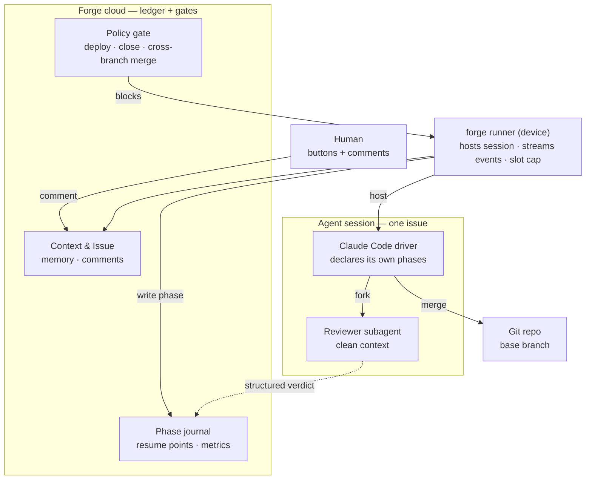
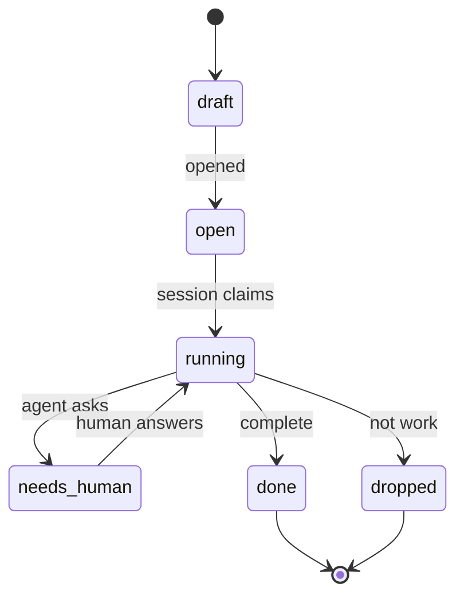
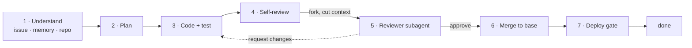
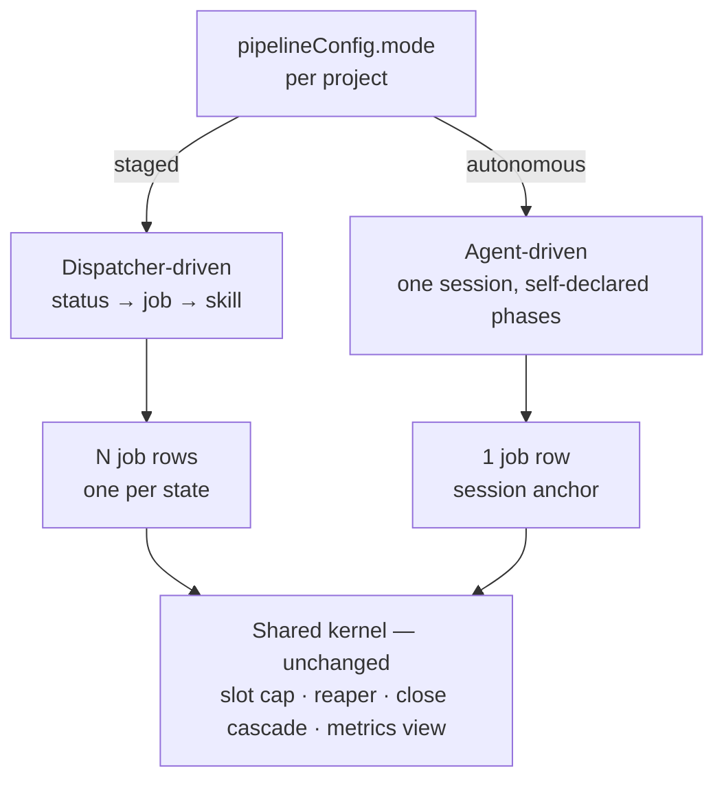

# Agent-driven pipeline

- Status: **Draft** — design capture, owner session 2026-08-19. Not implemented.
- Upgrade path: this becomes an RFC once the mode switch and the status vocabulary are agreed — both are cross-surface (REST, MCP, web, runner).
- Related: [RFC 0002](../rfcs/0002-park-axis-separation.md) (park axis) · [skill-delivery ADR](../architecture/skill-delivery.md) · [runner-daemon](../architecture/runner-daemon.md)

## Summary

One issue becomes **one long-lived agent session** instead of seven dispatcher-driven jobs. The
agent decides its own next step, declares phases into a journal, forks a clean-context reviewer,
and merges into the base branch it checked out. The cloud stops being the controller and becomes
the ledger plus two gates.

The seven-stage process is **policy**. It currently lives in the **kernel**, which is what
principle №11 forbids.

## Motivation

`issues.status` carries eight unrelated jobs at once:

| # | What status does today | Where it goes |
|---|---|---|
| 1 | Decide what work to dispatch next | agent, in context |
| 2 | Select the skill / prompt | agent, per phase |
| 3 | **Independent review gate** | **stays outside the session** — forked subagent |
| 4 | Observability ("where is it stuck") | agent-declared phase journal |
| 5 | Human interception point | comment into the live session |
| 6 | Resume point after a crash | **journal checkpoint** |
| 7 | Context / cost boundary | one derivation instead of seven |
| 8 | Slot accounting | unchanged — job row |

Rows 3, 6 and 8 are the constraints. The other five are strictly better under agent control.

The measurable case: today the context is re-derived seven times per issue, each handoff is lossy,
and every stage boundary is a place where a finding can be dropped without anyone lying — the
failure mode `forge-skill-audit` exists to catch.

## Design

### Inversion of control

Two hard boundaries:

- **The reviewer is a subagent, not a phase.** It receives diff + acceptance criteria, never the
  driver's transcript. Self-review is kept as a cheaper first pass, but it is not the gate.
- **The verdict is written by the runner from a structured result, never narrated by the driver.**
  A driver that authors its own review record can launder `request_changes` into "reviewed, fine",
  and with no job boundary left there is nothing to expose it.

### Six statuses

A status is kept only if the kernel enforces it. That is the whole selection rule.

| Status | The one kernel rule it enforces | Absorbs |
|---|---|---|
| `draft` | never claimed by a session | `draft` |
| `open` | claimable, unless a `blocks` edge holds it | `open` |
| `running` | **exactly one live session per issue** | `confirmed` `clarified` `approved` `developed` `testing` `tested` `released` `reopen` |
| `needs_human` | session alive, holds no slot, reaper never touches it | `needs_info` `waiting` `on_hold` |
| `done` | stamps `merged_at` → unblocks every dependent | `closed` |
| `dropped` | closes **without** stamping — replaces close + `unmark` | `closed` + `unmark` |

`dropped` is a status rather than a flag because the two-step "close then unmark" silently unblocks
every dependent when the second step is forgotten.

**`status` and `phase` are separate columns.** `status` is the six values above and the kernel reads
it. `phase` is agent-declared, free vocabulary, and **no gate reads it** — a wrong phase can never
wedge an issue.

### Phases inside a session

`forge-test` disappears as a stage: the reviewer runs build and tests, and merge moves into phase 6.
Post-deploy live E2E stays as a skill invoked at phase 7, not as a stage.

### Output contract

Defined by what survives the session dying.

| Tier | Content | Written by |
|---|---|---|
| Git | branch · commits · merge into base | agent |
| **Phase journal** | per phase: name, timestamps, artifact produced → resume point + metrics | **runner, from structured events** |
| Issue | `plan`, `acceptanceCriteria`, one closing comment incl. `Extra fixes:` and anything left | agent |

`pipeline_run_step_durations` is rebuilt from the journal instead of from one job row per step.

## Skill delivery

Adopt the Claude Code CLI model. Measured against the installed CLI (2.1.235,
`~/.local/share/claude/versions/`):

| Property | Claude Code CLI | forge-runner today |
|---|---|---|
| Where skills live | embedded in the artifact | separate repo + server DB + MCP |
| How they arrive | extracted to `bundled-skills/<version>/` at startup | a sync protocol: manifest fetch, hash diff, staged temp dir, atomic publish, per-skill file lock, hash report-back |
| Same-name conflict | variants coexist, selected by path proximity | shadow-by-name **destroys** the base |
| Non-overridable | a lock flag in managed settings | achieved by picking the plugin channel |
| Disable a bad skill | live kill switch with per-skill survivors | edit a DB row or cut a plugin release |
| Failure modes | none — no network in the path | sync races, stale shadows, unreachable marketplace |

Cost of the difference: `skill_sync.rs` (704 lines) + `plugin_sync.rs` (437 lines) on the runner,
plus the effective/sync layer in `packages/core/src/skills/`. The CLI delivers skills with no sync
protocol at all.

What to adopt:

1. **Embed the canonical skill set in the `forge-runner` binary** and extract to a version-keyed
   directory at daemon start. This returns the skills to this monorepo, so a skill change and the
   code that depends on it land in the same PR — impossible today, because they live in
   `SidCorp-co/forge-pipeline-skills`.
2. **Replace shadow-by-name with path-scoped variants.** A project skill becomes a variant beside
   the base rather than a replacement for it.
3. **Separate the lock from the channel.** A skill is non-overridable because a flag says so, not
   because of where it ships from. `META_SKILL_NAMES` returns to being name reservation only.
4. **Kill switch with survivors**, served in the config the runner already polls, so a bad skill
   never requires a runner release to disable.
5. **Shrink the sync protocol to overrides only.** It already runs off the job path — three call
   sites, none per-job: `workspace/provision.rs`, `daemon/dispatch.rs::handle_skill_sync`,
   `daemon/skill_pull.rs`. Once the canonical set ships inside the binary, what remains to sync is
   the per-project delta, which is small enough that the hash cache, the staged publish and the
   report-back can go with it.

## Running both modes

Per-project mode selection, on one condition: **fork the driver, never the kernel.** The seam is the
`jobs` row.

| Layer | staged | autonomous |
|---|---|---|
| Status vocabulary | 12 values | 6 values |
| Who picks the next step | dispatcher | agent |
| Job rows per issue | 7 | 1 |
| Skills | server registry | embedded in runner + project overrides |
| Slot cap · reaper · close cascade | shared, untouched | shared, untouched |
| Board UI | already renders from `pipelineConfig.states` | same |

**Design test: there must be no second reaper.** If autonomous mode needs its own orphan hygiene,
the seam is in the wrong place. It must be a degenerate case of the existing kernel, not a second
kernel.

The one genuine exception: the loop monitor's quiet threshold (`RESULT_QUIET_MINUTES = 60`,
`jobs/loop-monitor.ts`) assumes staged job cadence. A long session can be legitimately quiet longer,
or alive-but-lost for hours. The signal must become **progress-based** — a new commit, a new journal
phase — parameterised per mode. A mode-aware parameter is acceptable; a second reaper is not.

Running both is also the evaluation: same runner, same repo, same issue mix, only the driver differs.
Compare *interventions per issue closed* and *request → running*. If autonomous does not win on both,
it does not ship.

## The autonomous skill set

Written from scratch. `packages/core/skills/` (13 skills, seeded into the `skills` table by
`src/skills/builtin-seed.ts`) stays untouched and keeps serving `staged` mode — both sets live in
this repo side by side.

| Skill | Owns | Project may override? |
|---|---|---|
| `forge-drive` | the phase loop · when to fork the reviewer · when to escalate to `needs_human` · what to journal | **no** |
| `forge-understand` | triage + clarify merged: is this work, and is it reproduced? | no |
| `forge-plan` | what a plan in this repo must touch | no |
| `forge-review` | the rubric handed to the subagent — diff + acceptance criteria, never the transcript | no |
| `forge-ship` | merge target · deploy gate · changelog · close | no |

`forge-code` `forge-fix` `forge-test` `forge-staging` `forge-release` get no successor: their content
is staging ceremony, which moves into `forge-drive`.

**No skill is project-overridable in this mode.** Per-project specificity moves to project config
instead — the same knowledge, in a place that cannot fork the pipeline logic. This is the one place
the design deliberately gives up flexibility for uniformity.

Delivery is hybrid: the binary is the source (embedded, extracted at daemon start, version-keyed),
and the server additionally seeds the set **read-only** so Skill Studio can display it. Displayed,
never edited — the binary wins by construction.

## Decisions

| # | Question | Decision |
|---|---|---|
| 1 | Post-deploy live E2E | **Dropped for now.** Verification after deploy is separate work, revisited after the mode lands. |
| 2 | UI buttons | Write a **comment**. One write path, one read path — the agent cannot be half-blind. |
| 3 | Sunset condition for `staged` | Deferred until there is data from phase 5. |
| 4 | Progress-based watchdog | A new commit **or** a new journal phase counts as progress. 90 min without either → alert; 180 min → `held`. Never reap — RFC 0002 already separated the park axis. |
| 5 | First test projects | `KineTrak` and `archmap` — smaller blast radius than forge-dev, and both are real work rather than a synthetic fixture. |

## Goals

A phase is done when its acceptance criteria hold, not when its code is written. Phases 0–2 carry
no risk to the running pipeline and are independently valuable — if 3–5 are abandoned, they still
paid for themselves.

### Phase 0 — the skill set ships inside the binary · **done**

- `packages/runner/skills/` is the source; `build.rs` walks it, so a file added there cannot be
  missing at runtime.
- Daemon start materialises the enabled set into a version-keyed directory and logs the result.
- `[skills] bundled_disabled` / `bundled_overrides` disable a bad skill from config, without a new
  binary; `forge-drive` and `forge-review` survive the global switch.
- **Nothing consumes the tree.** Pipeline behaviour is byte-for-byte unchanged.

### Phase 1 — the lock is a flag, and per-project knowledge has a home

- A `lockedSurfaces` declaration in project config makes a skill non-overridable. Being locked no
  longer depends on which channel delivered it, and `meta-skills.ts` returns to name reservation
  only.
- Per-project specificity that used to live in forked skills (build and test commands, merge
  target, deploy gating, reproduction conventions) has a declared place in project config that the
  autonomous skills read.
- Acceptance: a project can express everything the old forked skills expressed, without forking a
  skill.

> Path-scoped skill variants — the Claude Code model where `apps/web:deploy` coexists with `deploy`
> instead of destroying it — are **deferred, not dropped**. They would change resolution for the
> live staged pipeline, and the autonomous set is not overridable anyway, so the risk buys nothing
> yet. Revisit if the staged set outlives phase 5.

### Phase 2 — the journal exists and staged mode already writes it

- A phase journal records, per issue attempt: phase name, start, end, and the artifact produced.
- **Entries are written from structured events, never from agent narration.** A reviewer verdict is
  recorded by the runner from a returned result; the driver cannot author it.
- Staged jobs journal too, so a baseline accrues before there is anything to compare against.
- `pipeline_run_step_durations` is rebuilt on the journal and **agrees with today's numbers on
  staged data** — that equality is the acceptance criterion, not "the view returns rows."

### Phase 3 — one issue, one session

- `pipelineConfig.mode = autonomous` produces one `pipeline_run` with **one** `jobs` row.
- The driver runs all seven phases, forks the reviewer with diff + criteria only, and merges into
  the base branch it checked out.
- Slot cap, reaper and close cascade are **unmodified** except the watchdog's progress signal.
- Acceptance: no second orphan-hygiene mechanism exists. If one was needed, the seam was wrong.

### Phase 4 — six statuses

- An autonomous project runs on the six-value vocabulary; `dropped` closes without stamping
  `merged_at`.
- `status` and `phase` are separate columns and no gate reads `phase`.
- The board renders both vocabularies, per project.

### Phase 5 — measured, then decided

- `KineTrak` and `archmap` run autonomous beside staged projects for at least 30 closed issues.
- Report *interventions per issue closed* and *request → running*.
- Acceptance: autonomous wins on both, or it does not ship. A tie is a loss — the staged path is
  already paid for.
