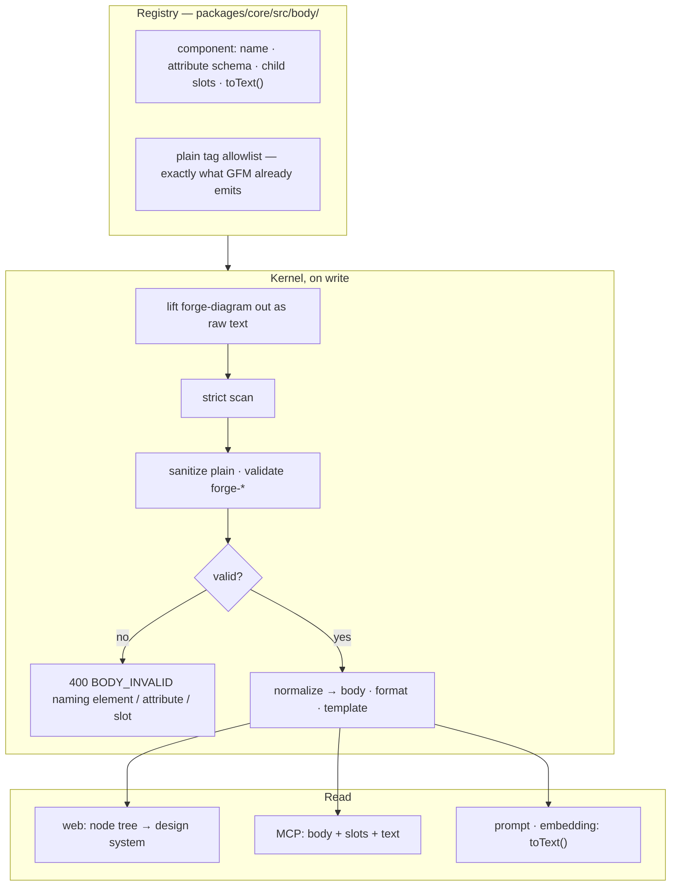

# Body templates

Issue and comment bodies as allowlisted HTML: a set of `forge-*` components with typed
attributes and slots, plus a fixed set of plain text tags. Markdown stays for existing rows.

**Status:** P1 shipped by ISS-898 (2026-09-03) — the registry, the kernel gate, the columns,
`forge_comments.update`, and the read projection. P2 shipped by ISS-967 (2026-09-07) — the web
renderer, the fallback card, the composer's insert menu and preview, and description editing.
P3 (ISS-968) landed 1 and 2 on 2026-09-07 — readers accept both forms, writers switched — and its
landing 3 is open, held until `forge-plugin` ISS-728. P4 shipped by ISS-969 (2026-09-07) — the
per-stage `bodyPolicy` switch and the adoption metric, with no stage mandated anywhere.
Decisions 1–9 were locked by the owner on 2026-09-03; a rejected option in §7 stays rejected.

## 1. Why a guide was not enough

Compliance tracks where the format lives, not how well it is written. Measured on forge-beta
2026-09-03, over rows created since the `writing-an-issue` v2 guide landed 2026-08-12:

| Where the format lives | Compliance |
|---|---|
| Guide, reachable only from a tool description | 14–28 % of issues · 0.02 % of comments |
| The stage skill's own body, which the agent copies | near 100 % |
| A zod `.strict()` refusal (`releaseNotes`) | 100 % |

| Population since 2026-08-12 | Total | Opens with a blockquote | *Who it hurts* | Mermaid | Evidence |
|---|---|---|---|---|---|
| forge-dev issues | 57 | 14 | 8 | 8 | 16 |
| Fleet issues | 1,029 | 98 | 33 | 44 | 87 |
| Fleet agent comments | 5,286 | — | — | 1 | — |

20 fleet issues already contain raw `
` / `
` / `` that render as literal text: the
renderer has no `rehype-raw`. People wanted HTML before the system accepted it.

**Adoption after P1, measured 2026-09-07 on the forge-beta read-only replica.** The kernel accepted
the format on 2026-09-03 and no writer routed to it, which is P1's deliberate design (§6, gap 3)
and not a defect — but the number is what P3 and P4 are measured against, so it is recorded here
rather than in a comment:

| Since P1 landed 2026-09-03 | Count |
|---|---|
| issues with `description_template` not null, all time | 4 — every one an ISS-898 live-walk probe titled *delete me*, created 15:35–15:49 on 2026-09-03 |
| comments with `template` not null, all time | 1 — a `forge-blocked` probe on that same probe issue |
| comments created in the window | 11,684 · 11,683 markdown, 1 html |

Real adoption is therefore **zero rows written by anyone doing real work**. P2 (ISS-967) is what
gives a human an entry path at all — the composer's insert menu and preview — and it is the thing
that can move this count off zero before P3 switches the writers.

## 2. Two kinds of HTML, two paths

|  | Self-contained styled page | Allowlisted component markup |
|---|---|---|
| Path | attachment, rendered in a sandboxed iframe, placed with `<forge-artifact id>` | the body itself |
| Why split | inlining unsandboxed HTML is XSS on content anyone can post, and a full page blows the 8,000-char description cap | no script, style, iframe, event handler, `style=` or `class=`; renders inline with the design system |

## 3. The shape

Storage — `format` and `template` are the only new columns per body. There is no blocks tree:
the body is the single source of truth and the server re-parses on read (Decision 8).

| Column | Meaning |
|---|---|
| `comments.body` / `issues.description` | canonical bytes; for `format='html'`, sanitized and normalized |
| `comments.format` · `issues.description_format` | `markdown` (the default, and every pre-existing row) or `html`. CHECK-constrained |
| `comments.template` · `issues.description_template` | root component name — replaces the regex guess in `deriveCommentKind` |

Two rules with two outcomes, and conflating them is the mistake to avoid:

- **Plain markup is repaired and reported.** Unknown tag unwrapped, disallowed attribute
  dropped, `<script>` removed whole, each named in `warnings[]`. Never a refusal — Decision 3
  makes prose always valid, and tag-free text is wrapped in `
` by blank line.
- **`forge-*` markup is refused and named.** 400 with the element, the attribute and its legal
  set, or the missing slot, in the message.

## 4. The first component set

Roots: `forge-triage` · `forge-plan` · `forge-review` · `forge-qa-report` · `forge-outcome` ·
`forge-blocked` · `forge-close` · `forge-symptom` · `forge-problem` · `forge-diagram` ·
`forge-artifact`. Slots: `forge-finding` · `forge-summary` · `forge-case` · `forge-failure` ·
`forge-extra-fix` · `forge-opening` · `forge-who` · `forge-todo` · `forge-decision` ·
`forge-evidence` · `forge-row` · `forge-relations` · `forge-files`.

The registry is the authority on attributes and slots: `packages/core/src/body/components.ts`.
Each descriptor carries its own `toText()`, which is what the four read paths share.

One level of nesting (Decision 5): a root, its declared slots, plain tags inside. `forge-diagram`
and `forge-artifact` are leaves and are legal inside any slot — a component with no slots opens
no second level to recurse into.

## 5. Where the proposal was wrong about the tree

Three implementation details in the original proposal do not survive contact with this
repository. Recorded here because P2–P4 would repeat them.

| Proposed | Actual | Why |
|---|---|---|
| registry in `packages/contracts/src/body-components.ts` | registry in `packages/core/src/body/`; contracts re-exports the TYPES | `contracts-runtime-boundary.test.ts` forbids core value-importing `@forge/contracts` — type-only, absent from core's production image, so a value import compiles and then crashes at boot (ISS-510). The dependency also runs contracts → core |
| projection at two sites: `prompt/user.ts`, `memory/indexer.ts` | four sites: those two plus both MCP serializers | under thin-init the per-state include lists default EMPTY, so the prompt inlines only the title. `forge-issues.ts:serialize` and `forge-comments.ts:serialize` are what actually carry a description or a comment to an agent |
| parse5 | a strict scanner in `body/parse.ts`, no new dependency | parse5 REPAIRS. Given `<forge-review>
x</forge-review>` it relocates the `
` and reports nothing, so the 400 naming the mis-nested slot cannot exist. Over a closed tag set with one nesting level, strict rejection is the product |

A fourth, smaller: MCP `update` writes through the comments service, not REST
`PATCH /api/comments/:id`, which is `requireAuth()` and refuses a device principal.

## 6. Gaps the use-case walk surfaced, and where each lands

| # | Gap | Fix | Phase |
|---|---|---|---|
| 1 | prompt and embedding would receive raw HTML, so the 8,000-char cap holds fewer requirements | `toText()` in the registry, called at all four read paths | **P1 done** |
| 2 | MCP cannot edit a comment, so `<forge-artifact id>` can never be placed — the attachment needs a comment id that does not exist until after the create | `forge_comments` action `update` | **P1 done** |
| 3 | comment kind is read by string prefix | readers accept both forms, THEN writers switch, THEN the regex goes | P3 — the order is mandatory; landings 1 and 2 shipped by ISS-968, landing 3 is open |
| 4 | web cannot edit a description after create (`PatchIssueInput` carries only priority + complexity) | `description` on the client input; core already accepted it. Edit affordance on the Description card | **P2 done** |
| 5 | `forge-diagram` content contains `-->` and ` ` and confuses any markup scanner | lifted out as raw text at the opening tag | **P1 done** |
| 6 | an older web build meets a component it does not know | the generic block IS the only block: web holds no component list, so a known and an unknown component render identically | **P2 done** |
| 7 | the composer has no preview | debounced pane, the rules tab's own component, fed by `POST /api/body/preview` — the same `prepareBody` a save runs | **P2 done** |

Gap 3 is the largest risk in the whole plan, and it is a sequencing risk rather than a design
one. P1 deliberately changes no writer: `format` absent resolves to `markdown`, so every shipped
`forge_comments → create` example still validates and no reader is blinded.

ISS-968 found the gap's own map stale, and the correction is worth keeping. The "six skills" were
`packages/core/skills/{forge-triage,clarify,plan,code,review,test,fix,release,staging}`; ISS-895
deleted that lane and migration 0208 removed its rows, and `skills/staged-lane-removed.test.ts`
now guards their absence. The five in-repo readers are prompt text —
`prompt/state-prompts/{clarify,plan,code,fix,review}.ts` plus `prompt/facts/drive-rules.ts` — and
`forge-outcome`'s `toText()` emits the literal `Extra fixes:`, so every prompt- and MCP-level
reader has accepted the component form since P1 without knowing it. One reader in this repo saw a
RAW body and would have been blinded: web-v2's `deriveCommentKind`, which landing 1 taught to read
`template` first and to report which form answered.

## 7. Rejected, and staying rejected

| Option | Why not |
|---|---|
| JSON `{template, data}` as the primary write syntax | high fill-in accuracy but rigid: prose and components cannot interleave, and reading it back needs its own projection. Kept as the shape a web form generates HTML from |
| markdown plus `:::who-it-hurts` directives | still free writing inside text, which §1 measures as not spreading; two syntaxes in one body confuse both the parser and the agent |
| `<forge-md>` holding markdown inside HTML | two syntaxes in one body make a nesting error unreportable |
| full raw HTML via `rehype-raw` | XSS on content anyone can post, breaks the prompt cap, and does not address filling it in correctly |
| improve the guide again | already done, in v2. §1 is the result |

## 8. Phases

| Phase | Scope | Touches |
|---|---|---|
| **P1** (ISS-898, shipped) | registry, kernel validate/normalize on write for comments and issue descriptions, the four columns + CHECKs, `forge_comments.update`, `slots`/`text` on read, projection at four sites, tests | `core`, `contracts` |
| **P2** (ISS-967, shipped) | web renderer (components → design system), fallback card, composer insert menu + preview, description editing on the detail screen. Added `GET /api/body/components` and `POST /api/body/preview`, and `descriptionNodes` / comment `nodes` on the read paths | `web-v2`, `core` |
| P3 (ISS-968, landings 1-2 shipped) | readers accept both forms → writers switch → regex removed. The `body-components` fact renders the set from the registry, so adding a component reaches every stage prompt with no prompt edit. Landing 3 waits on adoption data and on `forge-plugin` | `prompt/facts`, `web-v2`, `forge-plugin` |
| **P4** (ISS-969, shipped) | `states[stage].bodyPolicy.requireComponent` — off everywhere, refused by `BODY_COMPONENT_REQUIRED` naming the component and the stage when a project turns it on. `comments.stage` and `comments.author_agency` record the issue's status and the door's own principal at the write, `GET /api/body/adoption` counts what is stored per stage, and the Pipeline settings tab shows the number beside the switch. No stage is mandated anywhere | `core`, `web-v2` |

The mandate ladder is separate from the phases and deliberately lags them: syntax refusal is on
from day one (P1), but *requiring* a component at a stage waits for two weeks of adoption data
(P4). A human writing plain prose is valid at every level.

**P4 built the switch and the number; it raised nothing.** `bodyPolicy` is absent from
`defaultStatesConfig()` and from every project's stored document, including forge-dev's, so no
comment write anywhere changed behaviour. Each mandate is now its own decision, taken against that
stage's own figure and recorded beside the change that raises it. Two weeks is the floor.

**The number at the moment the switch shipped**, measured 2026-09-08 02:29Z on the forge-beta
read-only replica over the preceding 14 days:

| Population | Comments | Carrying a component |
|---|---|---|
| all comments, fleet-wide | 13,564 | 7 |
| `author_agency = 'agent'` — the population `bodyPolicy` applies to | **0** | **0** |

**Zero is the correct reading, and it is a data-migration state rather than a defect.** `agency`
comes from the token OWNER's `users.kind` (ISS-932 wave 4, `middleware/require-pat.ts`), and every
one of the 22 users on the deployment is still `kind = 'human'` — the agent accounts that axis
introduced have not been provisioned. Until they are, no comment anywhere is agent-authored by the
definition the gate and the metric share, so the mandate refuses nothing and the number counts
nothing. Both are correct; neither is useful yet. **That is the condition to re-measure against
before any stage is raised**, and it is why the two-week floor starts when agent accounts land, not
when this shipped.

**The signal this phase nearly built on, and why it did not.** The first draft keyed both the gate
and the metric on `author_device_id IS NOT NULL`, on the strength of that column's own ISS-519
comment calling it "the authoritative *this was posted by an agent* signal". Measured on the same
replica, that read 1,042 agent comments over 14 days and would have looked like a working
denominator. It is no longer that column: ISS-932 wave 4 made it **the box a credential was issued
to**, and all 6 live `job:` tokens carry `device_id = NULL`. A mandate keyed on it would have fired
for almost nobody while its adoption number read a confident zero — a wrong answer indistinguishable
from a right one, which is exactly the failure this phase exists to end. The gate and the metric
both key on `comments.author_agency` instead, written at the write from the door's own principal.

**A person is never refused, and never counted.** Both halves follow from one column, so the
fraction always describes the rule that exists rather than a neighbouring one.

## Honest costs

| Cost | Borne by |
|---|---|
| A ~250-line HTML scanner this repo now owns and maintains, with no HTML5 repair semantics — malformed markup is refused rather than fixed up | whoever next changes the body format |
| A second body syntax exists. Until P3 completes, a reader must handle `markdown` and `html`, and `deriveCommentKind` stays alive beside `template` | every reader of a body, for as long as P3 is unfinished |
| A refused write is a failed call. An agent that gets the component wrong loses a turn to the 400 — the price of the mechanism that produced 100 % compliance for `releaseNotes` | every agent, on its first mistake with a new component |
| Adding a component now means touching the registry — nothing else. Since P2 (ISS-967) web needs no renderer and no fallback path per component; a new one draws as the generic block on the day it ships | whoever adds the next body shape |
| Four new columns and two CHECK constraints on the two largest tables | the migration, and any consumer reading `SELECT *` |
| The registry is core-internal, so web cannot import it. **P2 (ISS-967) did not pay this cost** — it removed it. Core parses and the read paths hand back the node tree (`descriptionNodes`, comment `nodes`), and web holds no component→React map at all: `forge-diagram` and `forge-artifact` get a renderer each, everything else draws one generic block. The price paid instead is a node tree on the wire for every `format:'html'` row, and a `POST /api/body/preview` round-trip per composer pause | paid, differently |

## Evidence

| Date | Measured | Source |
|---|---|---|
| 2026-09-03 | the compliance and population tables in §1 | SQL on the forge-beta read-only replica, `created_at >= 2026-08-12` |
| 2026-09-03 | raw HTML in a body renders as escaped text — no `rehype-raw` | `packages/web-v2/src/design/patterns/markdown.tsx` |
| 2026-09-03 | comment kind is guessed from body text; `comments` had no kind column | `features/issues/derive.ts:deriveCommentKind` |
| 2026-09-03 | REST has `PATCH /api/comments/:id`; MCP `forge_comments` had list/create/delete only | `comments/routes.ts`, `mcp/tools/forge-comments.ts` |
| 2026-09-03 | the prompt injects only the title by default; the MCP serializers carry the bodies | `prompt/user.ts` per-state include lists, `mcp/tools/forge-issues.ts:serialize` |
| 2026-09-03 | `text(col, { enum })` emits no constraint — Postgres accepted `format='rst'` until `0197`/`0198` added the CHECKs | `tests/integration/body-format-e2e.test.ts`, which failed on exactly that before they existed |
