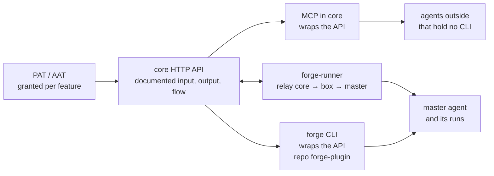

# forge-dev focus: the API is the product, and everything else wraps it

The owner set this direction on 2026-09-30. It says which parts of this repository forge-dev spends
its work on, and what role each part plays. Work that fits none of these roles is not taken while
this holds.

## The four parts, and the role of each

| Part | Role | What is taken | What is not |
|---|---|---|---|
| `packages/core` HTTP API | the product surface. An API plus a token can drive and use every feature | every capability is a route; every route can be granted to a PAT or an AAT | a feature reachable only from the UI or only from MCP |
| `packages/runner` | the relay from core to the box to the master agent | stability, and enough visibility to watch the master agents | runner features beyond relaying and watching |
| forge CLI (repo forge-plugin) | a thin wrapper over the API for agents that run a shell, the runner's master included | commands that call the API | logic the API does not have. That goes into core first |
| MCP (in core) | a wrapper over the API, the same way the CLI is | tools that agents need natively, or that outside agents need without a CLI | a tool for work a CLI already does on a box with a shell |

`packages/web-v2` is not one of the four. While this holds, it takes fixes that block the parts
above, and nothing more.

## Measured against main on 2026-09-30

**Token grants reach 19 of the 44 API mounts.** `auth/pat-permissions.ts:PAT_PERMISSION_RESOURCES`
is the one list of what a token can be granted, and `middleware/pat-rest-surface.ts:PAT_ALLOWED_PREFIXES`
is derived from it. It covers eight resources: `issues`, `tasks`, `pipeline`, `knowledge`,
`skills`, `schedules`, `projects` and `questions`.

The mounts in `packages/core/src/index.ts` that no grant covers are:
- `/api/admin`, `/api/agents`, `/api/agent-sessions`, `/api/app-config`, `/api/auth`, `/api/body`
- `/api/chat-logs`, `/api/conversations`, `/api/devices`, `/api/domain-templates`
- `/api/feedback-reports`, `/api/improvement-messages`, `/api/integration-connections`
- `/api/invitations`, `/api/me`, `/api/notifications`, `/api/org-invitations`, `/api/orgs`
- `/api/pipeline`, `/api/runners`, `/api/skill-activity`, `/api/update-packets`, `/api/uploads`
- `/api/usage-records`, `/api/webhooks`

Some of these are cookie-only by design (`/api/auth`). Each one kept outside the grant grammar is
named with its reason. None is left out silently.

**No API reference exists.** No OpenAPI or other machine-readable description of any route is in
`packages/core/src` or `docs/`. A route's input and output are read today from its handler.

**MCP reaches the database beside the API.** 19 of the 49 tool files under
`packages/core/src/mcp/tools/` import the database module directly, for example
`forge-issues.ts`, `forge-jobs.ts` and `forge-runners.ts`. Whether each one duplicates a route or
shares its service is what the audit answers. What it must end at is one path per capability:
a tool calls what the route calls.

## What this direction owes

1. **An API reference generated from the routes.** It gives each route's exact input and output
   schema, its errors and the permission it needs. It is served by core and checked in CI, so a
   route and its document cannot disagree.
2. **Flow pages beside the reference.** They show, as diagrams, the order of calls for the flows an
   agent drives: pair a runner, claim a job, move an issue through its statuses, grant a token.
3. **Every feature mount grantable to a token.** An exclusion is refused unless it is named with its
   reason.
4. **MCP and the CLI on the API's path.** A capability has one implementation, and every wrapper
   calls it.

Each of these is tracked as an issue. What is built today, and in what order, belongs to the
tracker and not here.
