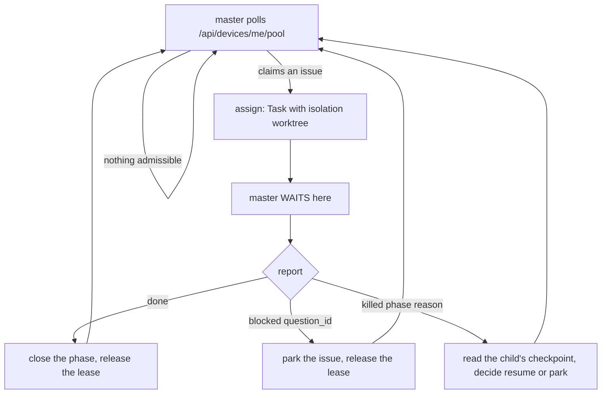

# The master drives its agents as in-session subagents

Decided 2026-09-09 (owner). Nothing here is implemented yet. This file is the design; the drawn
figure is [master-drives-subagents.html](master-drives-subagents.html).

Today a master orchestrates work by opening **run sessions** — separate Claude processes parented by
tmux, spawned `setsid`-detached so they outlive the daemon, tracked by a box-local ledger
(`incarnation`, `revival_token`) and reaped by three independent core-side defences. The owner's
ruling replaces that: **a master assigns work to a subagent inside its own session**, and a child
never outlives its parent.

## Four named protocols

| Protocol | Between | Carrier | Who refuses a violation |
|---|---|---|---|
| `device-transport` | core ⇄ daemon | HTTPS + WS, device token | core (`requireDevice()`) |
| `control-socket` | daemon ⇄ master pane | unix socket, `Request` enum | the daemon's frame decoder |
| `assignment` | master ⇄ child | `Task()` with `isolation: "worktree"` | **the master, by validating the report** |
| `phase` | child ⇄ core | MCP / PAT, phase endpoints | core's phase handlers |

`assignment` is the one that changes shape. It is not a wire type and cannot be: a subagent's
result is a value returned inside one process, so no decoder sits between the two ends. The
enforcement is therefore **a declared report schema the master validates and refuses** — "master
từ chối" rather than "không làm sai được". That is weaker than a socket frame, and it is the price
of the ruling.

## The cycle

The wait sits **between assign and report received** — the owner's second ruling. The parent's
lifetime therefore contains the child's, which is what makes the deletions below safe.

## Three report shapes

| Shape | Means | Master does |
|---|---|---|
| `done` | the phase finished | close the phase, release the lease |
| `blocked{question_id}` | a human owes an answer | park at `needs_info`, release the lease |
| `killed{phase, reason}` | the child died | read the checkpoint, resume or park |

`killed` cannot be emitted by the child that it describes: a child dies **with** the parent that
would receive its report. So the third shape is reconstructed by the *next* master from a per-child
**durable checkpoint written as the child works**, not sent at death. That checkpoint is
load-bearing, not an optimisation — without it a parent's death is indistinguishable from a child
that never started.

## The limit chain

The owner's third ruling: on a session limit, retry every 5 minutes rather than waiting for the
parsed quota reset, because the account can be swapped at any moment.

Measured 2026-09-09 — most of that cadence already exists, and the missing piece is not the one it
looks like:

| Link | State today |
|---|---|
| master poll cadence | already ≤5 min — `next_poll_delay` clamps to `[30s, 300s]` (`daemon/master.rs:52`) |
| `rateLimitedForSeconds` → master | already sent, already advisory (`devices/me-runners.ts`) |
| a limited fleet's queued work | already correct — `defer` → `held/all_devices_exhausted`, budget **not** charged, condition re-checked (`jobs/retry.ts:69`, owner call 2026-08-12) |
| a master/run session that hits its cap | **reports nothing.** `detect_usage_limit` has exactly one caller (`claude_code.rs:1025`, the stream-json branch); zero in `run_session.rs`, `run_ports.rs`, `terminal.rs`, `master.rs`, `control.rs` |
| an account swapped mid-window | **invisible.** Nothing re-examines a time-based stamp before its parsed reset; the only early exit is a successful job or the operator's clear+tick button (`projects/runners-routes.ts:291`) |

So the fix is **not** to shorten the exclusion window. It is to make the master the prober: it
already polls every 5 minutes and its limit number is already advisory, so all it lacks is a way to
report *both* "I am capped" and "I am clear". The precedent is `chat-runner-health.ts` — a
text-based, non-job limit report with three guards worth copying verbatim.

### The prober stops being the master at stage 2

Stage 1's clear works because a master **polls between run sessions** today. Under the ruling it
blocks inside `Task()` for the child's whole lifetime, and a master waiting on a child is not
polling — so the moment `clearMasterLimit` is called disappears exactly when stage 2 lands, and it
is the only early exit the master lane has.

Stage 2 must pick one, and this is the open question in this file:

| Option | Cost |
|---|---|
| the master polls during the wait | contradicts "the wait sits between assign and report received" — the ruling's second half |
| the clear moves onto the child's report path | a `done` report becomes the proof the account works, so a litter that never reports never clears |
| the daemon clears it, not the master | the daemon has the device token already, but it does not know whether the *agent account* works — only that its own process is alive |

### The trap that kills the obvious fix

Capping `runners.rateLimitedUntil` at 5 minutes at the single writer looks like a two-line change
and is **strictly worse than today**:

- a hold carries **one** auto-release per lineage (`jobs/hold.ts:52`). The first 5-minute probe
  fails on the same cap, the job holds again, the release is already spent, and the issue waits for
  a human — where today it waits for the reset and then proceeds by itself.
- `devices/heartbeat-runner-mirror.ts:31` clears `limit_reason` once the stamp lapses, so a
  5-minute stamp erases the operator's "this box is capped" signal every 5 minutes.

Both are why the probe must be the master's own poll, which costs no job and spends no auto-release.

## What this deletes

Not carried beside the new path — removed in the stage that lands it:

- `setsid` detach, `incarnation`, `revival_token`, `ProcessLiveness`, the pid-read-back liveness test
- core's three orphan defences reduce to the structural one: a child inside the parent's lifetime
  cannot outlive it, so two of the three defend an impossibility
- the run-session open/close verbs on the control socket, and `Request::RunOpen`

## Blast radius the ruling moves

| | separate session (today) | subagent (decided) |
|---|---|---|
| a cap hits | one child | **the whole litter** — so the retry unit is the MASTER |
| a restart | children survive | children die with the parent |
| observability | one pane per child | children fold into the master's pane — coarser, not blind |
| concurrency on one repo | per-checkout | needs `isolation: "worktree"` |

## Stages

| # | Scope | Needs a runner release |
|---|---|---|
| 1 | the master's limit report + clear reaches core (endpoint, guards, tests) | core half: no · runner half: yes |
| 2 | assignment as `Task()` + the report schema + the per-child checkpoint | yes |
| 3 | the deletions above, once stage 2 is live on the fleet | yes |
| 4 | a gate asserting the master brief names no verb the control socket lacks | no |

Stage 2's brief lives in the binary via `include_str!`, so every master-behaviour change costs a
fleet restart that kills every pane. Batch them; do not dribble brief edits into separate releases.

## Doc worklist for the shipping PR

`docs/flows/` describes what the tree does, so it cannot hold this until stage 2 lands. When it
does, these move in the same PR or become wrong:

| File | Why |
|---|---|
| `human-routing-question-park.html` | names `incarnation` / `work` / `blocker_kind` / `resume_id` as the owner of the decision; the first is deleted |
| `agent-execution.html`, `agent-execution-blocked-branch.html` | describe a child parented by tmux, outliving the daemon |
| `run-session-lifecycle.html`, `run-session-close.html` | the verbs they draw are removed |
| `docs/flows/index.html` | registry entry for whatever replaces them |

## Never executed in production

Two edges this design leans on have **zero** observed executions, so a green test on either proves
nothing until the case is planted and watched go red first:

- a park resume with `questions = 0`
- any limit report on the run/master axis (see the table above — there is no caller)

## Honest costs

| Cost | Paid by |
|---|---|
| `assignment` stops being decoder-enforced; a malformed report is caught by the master's own validation or not at all | whoever debugs a child that reported something the master accepted |
| one cap takes down the whole litter instead of one child, so the retry unit becomes the master | throughput during a limit window |
| the per-child durable checkpoint is new machinery with no equivalent today, and it must be written *while* the child works or `killed` is unreconstructable | stage 2's implementer |
| child panes disappear; per-child observability becomes lines in the master's pane | anyone diagnosing a stuck child |
| N concurrent children on one repo require `isolation: "worktree"`, which multiplies disk per issue | box disk, already the cause of two cleanups |
| stages 2 and 3 each cost a fleet restart that kills every live pane's context | every in-flight issue at restart time |
| the deletions are irreversible on the fleet's clock: boxes auto-update, so a stage-3 bug reaches every box before a fix can be cut | the fleet, for one release cycle |
| stage 1's limit clear is called by a master that polls; stage 2 blocks that master inside `Task()`, so the caller must move or the window stops ending early | stage 2's implementer, who inherits the three-way choice above |
