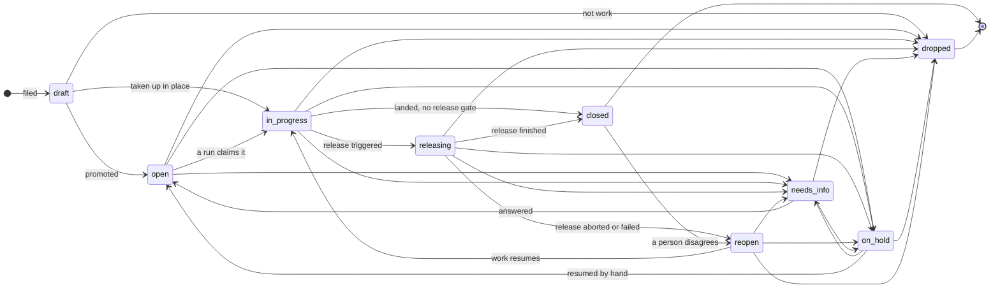

# The status flow, drawn

Nine statuses, and every edge below is a rule something enforces — or is named as
one this proposal adds. Companion to
`one-status-vocabulary-and-a-real-transition-table.md`, which prices the cleanup;
this file is the picture and the table.

## The flow

Read the shape rather than the arrows: **one dispatch door** (`open`), **one
worker** (`in_progress`), **one release middle** (`releasing`), **two parks
reachable from every rung**, one park a person routes (`reopen`), and **two ends**
that differ only in whether `merged_at` is stamped.

## The table

`→` = legal. Everything absent is refused, which is the change: today
`canTransitionFree` permits any non-draft hop to any non-draft status.

| From | May go to | Enforced by |
|---|---|---|
| `draft` | `open` · `in_progress` · `dropped` | `DRAFT_EXIT_TARGETS`, already a real gate |
| `open` | `in_progress` · `needs_info` · `on_hold` · `dropped` | new |
| `in_progress` | `releasing` · `closed` · `needs_info` · `on_hold` · `dropped` | new |
| `releasing` | `closed` · `reopen` · `needs_info` · `on_hold` | new — only `finish` and `abort` write the first two |
| `needs_info` | `open` · `on_hold` · `dropped` | `answer-resume.ts` writes the `open` edge today |
| `on_hold` | `open` · `needs_info` · `dropped` | new |
| `reopen` | `in_progress` · `needs_info` · `on_hold` · `dropped` | new |
| `closed` | `reopen` | already the only exit in the advisory map |
| `dropped` | — | terminal with no exit, deliberately |

**`needs_info` and `on_hold` are reachable from every rung and from each other.**
Owner's decision, 2026-09-09 — and it is what the teaching text already tells
agents: `prompt/facts/registry.ts:109` says *"From ANY state you may set
`needs_info` … `on_hold` … the moment you hit that condition — don't force the
ladder."* Only the table was narrower than the instruction.

Two statuses are deliberately excluded from that rule: `draft` cannot park
because it already is a resting place (`DRAFT_EXIT_TARGETS` is the existing
gate and lists three exits), and `closed`/`dropped` are ends — a park after an
end is a reopen, which is what `closed → reopen` already is.

Three edges carry a payload the transition is refused without: `needs_info` and
`on_hold` need an authored reason (`requiresAuthoredReason`), and
`releasing → reopen` must carry the abort reason.

## What the drawing decides that prose did not

**`in_progress → closed` stays.** A project with no release gate closes
directly — `resolveReleaseGate` returns null for the majority of projects today,
and forcing them through `releasing` would invent a release step they do not have.

**Only `finish` and `abort` write out of `releasing`.** That is what makes the
status a middle rather than a fourth park: an agent cannot leave it, so nothing
can declare its own release finished.

**`closed → reopen → in_progress`, never `reopen → open`.** A reopened issue has
a branch, a worktree and history; sending it to `open` offers it to the pool as
new work and races a fresh agent against the tree that already exists.

**No `draft → releasing`, no `open → releasing`.** A release is over work that
landed, so the only door into it is from `in_progress`.

**A release in flight can still be parked.** `releasing → needs_info` and
`releasing → on_hold` are legal under the owner's rule, and they are not a
contradiction of "only `finish` and `abort` write out of `releasing`": those two
own the *release outcome* edges (`closed`, `reopen`). A park is somebody stopping
the release to ask or to wait, which is exactly what a person needs when a batch
half-lands. What must not exist is an agent declaring its own release finished.

## The `reopen` conflict, and why it dissolves

`issues/autonomous-park.ts` rewrites **`reopen` → `open` for every actor** on an
autonomous project. It was written from an incident: epodsystem ISS-141 sat at
`reopen` for over an hour on 2026-08-24, rendering as a live session while the
reconciler re-read it every 60s and counted a rescue each time.

The reason it gives is a statement about MEANING, and the nine-status set
changes that meaning:

> The staged pipeline reads `reopen` as "a step rejected this; route it back to
> whichever step owns the fix" … The autonomous driver has no steps, so an issue
> an agent lands on `reopen` is queued for a driver that will never look at it.

Under this vocabulary `reopen` does not name a step. It names **a person
disagreed with a close**, and a person routes what follows. So the premise the
rewrite rests on — *"`reopen` names a step and this mode has none"* — is no
longer true of the status, and neither of the two options an earlier draft of
this file offered is needed.

**Three things measured 2026-09-10 say the wedge cannot return through this
door:**

| Reader | What it does with `reopen` today |
|---|---|
| `pipeline/reconciler.ts:183` | selects `AUTONOMOUS_INFLIGHT_STATUSES`, which resolves to **`['in_progress']`** — `reopen` is not a driver status, so the every-60s pass that counted ISS-141's rescues does not read it at all |
| `notifications/notify-transitions.ts:41` | already classes `reopen` in `PROBLEM_STATUSES` — "a person is needed", carrying an auto-resolve key. **The same reading this vocabulary gives it** |
| `me/attention-buckets.ts:100` | `NEEDS_REVIEW_STATUSES = ['developed', 'reopen']` — surfaced to a human, not to a dispatcher |

And `reopen` holds **0 rows across 28 projects**, so nothing is stranded by the
change either way.

**So: retire the rewrite, keep `reopen` as a park a person routes.** What made
ISS-141 a wedge was a status with no work behind it *that something automated
kept reading as live*. The reconciler no longer reads it, and two other readers
already treat it as a human's business. The rewrite is now the only thing
asserting the old meaning.

One consequence to carry, and it is the cost: `releasing → reopen` on a failed
release waits for a person. It does not self-heal. That is the correct trade for
a release that half-landed — a failed release re-driven automatically is how a
half-landed batch becomes two half-landed batches — but it means a fleet with
nobody watching leaves aborted releases parked.

## Honest costs

| Cost | Borne by |
|---|---|
| Enforcing the table breaks every caller that today takes a shortcut, and there is no inventory of those — `canTransitionFree` has permitted anything since it was written, so the shortcuts are unknown until they fail | every agent and operator, at the first refused hop |
| Retiring the `reopen` rewrite removes a net that was written from a real wedge. Three readers now say the wedge cannot return through it, but all three are readings of today's code — a future reader that starts polling `reopen` re-creates ISS-141, and nothing gates that | whoever adds the next reader of `issues.status` |
| `releasing → reopen` does not self-heal: a failed release parks for a person and stays there. On a fleet nobody is watching, aborted releases accumulate at `reopen` | whoever is not watching |
| `in_progress → closed` and `in_progress → releasing` both being legal means the gate decides which one a run may take, and that is derived per project (`resolveReleaseGate`). A reader of the table alone cannot tell which applies to a given project | anyone reading this table without reading the gate |
| Three parks means three "who owes the next move" answers to keep distinct. `needs_info` is comment-wakeable, `on_hold` is manual by design (its `cm:guard` says rewriting it would undo an operator's cancel), `reopen` is undecided above. A reader who conflates them re-creates the ISS-970 defect — a "needs a human" badge on every paused issue | every surface that renders a park |
| The drawing is the ninth status' first drawing. `releasing` has no rows, no reaper, and no crashed-batch story — an issue can die inside it exactly as a run dies holding a lease | whoever finds the first stuck `releasing` row |
