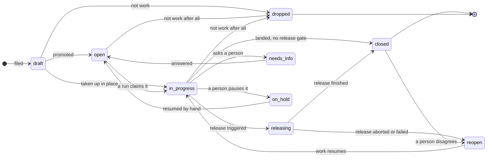

# The status flow, drawn

Nine statuses, and every edge below is a rule something enforces — or is named as
one this proposal adds. Companion to
`one-status-vocabulary-and-a-real-transition-table.md`, which prices the cleanup;
this file is the picture and the table.

## The flow

Read the shape rather than the arrows: **one dispatch door** (`open`), **one
worker** (`in_progress`), **one release middle** (`releasing`), **three parks**
that each name who owes the next move, and **two ends** that differ only in
whether `merged_at` is stamped.

## The table

`→` = legal. Everything absent is refused, which is the change: today
`canTransitionFree` permits any non-draft hop to any non-draft status.

| From | May go to | Enforced by |
|---|---|---|
| `draft` | `open` · `in_progress` · `dropped` | `DRAFT_EXIT_TARGETS`, already a real gate |
| `open` | `in_progress` · `needs_info` · `on_hold` · `dropped` | new |
| `in_progress` | `closed` · `releasing` · `needs_info` · `on_hold` · `dropped` | new |
| `releasing` | `closed` · `reopen` | new — `finish` and `abort` are the only writers |
| `needs_info` | `open` · `dropped` | `answer-resume.ts` writes the `open` edge today |
| `on_hold` | `open` · `dropped` | new |
| `reopen` | `in_progress` · `dropped` | new |
| `closed` | `reopen` | already the only exit in the advisory map |
| `dropped` | — | terminal with no exit, deliberately |

Three edges carry a payload the transition is refused without: `needs_info` and
`on_hold` need an authored reason (`requiresAuthoredReason`), and
`releasing → reopen` must carry the abort reason.

## What the drawing decides that prose did not

**`in_progress → closed` stays.** A project with no release gate closes
directly — `resolveReleaseGate` returns null for the majority of projects today,
and forcing them through `releasing` would invent a release step they do not have.

**Only `finish` and `abort` write out of `releasing`.** That is what makes the
status a middle rather than a fourth park: an agent cannot leave it, so nothing
can declare its own release finished.

**`closed → reopen → in_progress`, never `reopen → open`.** A reopened issue has
a branch, a worktree and history; sending it to `open` offers it to the pool as
new work and races a fresh agent against the tree that already exists.

**No `draft → releasing`, no `open → releasing`.** A release is over work that
landed, so the only door into it is from `in_progress`.

## The conflict this drawing exposes, and it needs a decision

`issues/autonomous-park.ts` rewrites **`reopen` → `open` for every actor** on an
autonomous project, and it was written from an incident: epodsystem ISS-141 sat at
`reopen` for over an hour, rendering as a live session while the reconciler
re-read it every 60s and counted a rescue each time. The reason given is that the
autonomous driver has no steps, so `reopen` names a step that does not exist.

Keeping `reopen` therefore contradicts a live rewrite. Two ways out, and this is
the owner's call:

| Option | Consequence |
|---|---|
| `reopen` becomes dispatchable — the driver is handed an issue at `reopen` as well as `open` | `autonomousStepFor` answers for two statuses. The ISS-141 wedge cannot return, because the status now has work behind it. Costs a second entry door and every reader of "what dispatches" changes. |
| the rewrite stays, and `reopen` is a park a person moves by hand | `reopen` means "a person disagreed and a person routes it", never "a step rejected it". The ISS-141 shape is impossible for a different reason — nothing automated reads it. Costs: an abort or a disagreement waits for a human even when the fix is obvious. |

I lean to the second, because it matches what `reopen` now means under this
vocabulary — a person's disagreement, not a step's rejection — and because it needs
no change to what dispatches. But the first is what makes `releasing → reopen`
self-healing, and a failed release that waits for a person is a slower fleet.

Not answerable from the code: both are consistent with every measurement.

## Honest costs

| Cost | Borne by |
|---|---|
| Enforcing the table breaks every caller that today takes a shortcut, and there is no inventory of those — `canTransitionFree` has permitted anything since it was written, so the shortcuts are unknown until they fail | every agent and operator, at the first refused hop |
| The `reopen` decision above cannot be deferred past step 1: `releasing → reopen` is one of the two edges out of the new status, and building it before the rewrite question is settled means shipping an edge whose target may be rewritten out from under it | whoever ships `releasing` |
| `in_progress → closed` and `in_progress → releasing` both being legal means the gate decides which one a run may take, and that is derived per project (`resolveReleaseGate`). A reader of the table alone cannot tell which applies to a given project | anyone reading this table without reading the gate |
| Three parks means three "who owes the next move" answers to keep distinct. `needs_info` is comment-wakeable, `on_hold` is manual by design (its `cm:guard` says rewriting it would undo an operator's cancel), `reopen` is undecided above. A reader who conflates them re-creates the ISS-970 defect — a "needs a human" badge on every paused issue | every surface that renders a park |
| The drawing is the ninth status' first drawing. `releasing` has no rows, no reaper, and no crashed-batch story — an issue can die inside it exactly as a run dies holding a lease | whoever finds the first stuck `releasing` row |
