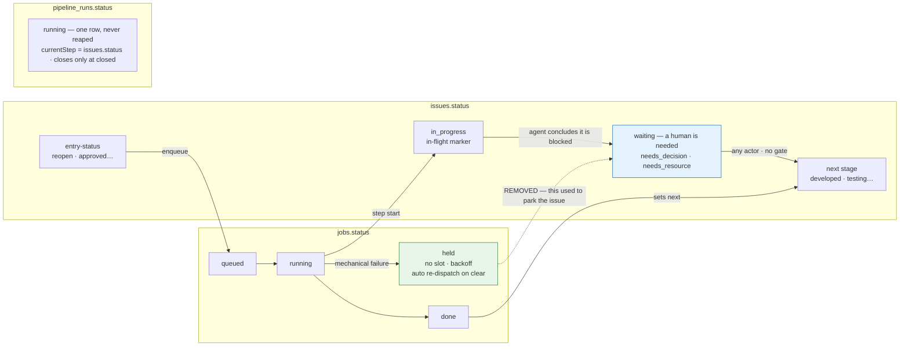
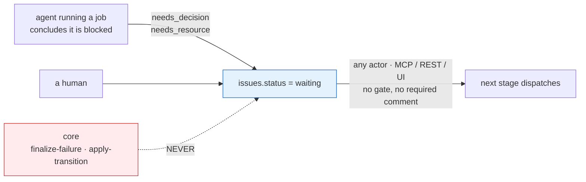
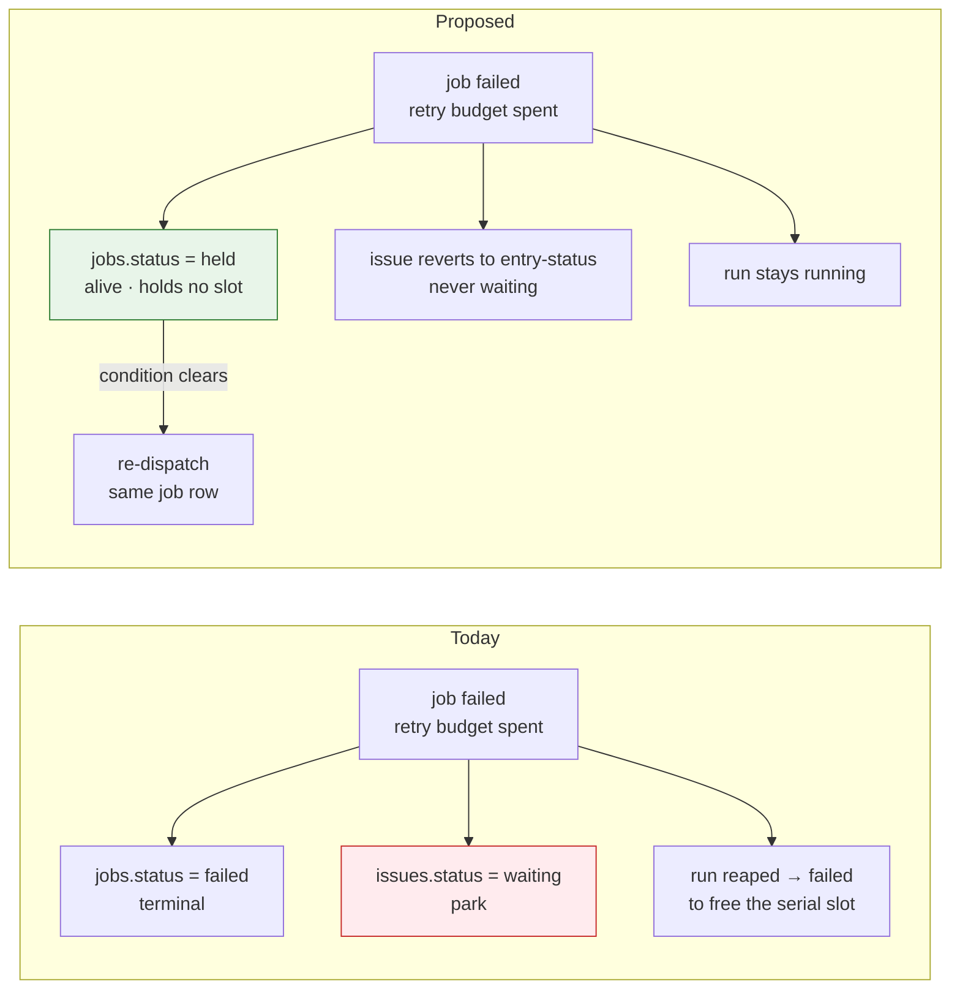

# RFC 0002 — Park axis separation

- Status: **Implemented** — decided by the owner 2026-08-13, shipped 2026-08-14 in three commits (`held` primitive · delete the mechanical park · reopen). See "As shipped" below for the three places the code deviates from this document.
- Author: owner + agent session 2026-08-13
- Supersedes: [`docs/architecture/reopen-loop-guard.md`](../architecture/reopen-loop-guard.md) (ADR, ISS-766) — keep the file and mark it superseded; its ISS-801 cost data is the evidence behind the drawbacks section here.

## Summary

Mechanical failure lives on the `jobs` axis and never touches `issues.status`. A job that cannot run is **held** — alive, holding no scheduling slot, indefinitely if necessary — and reported through `pipelineHealth.waitingOn`. `issues.status = 'waiting'` keeps exactly one meaning, *a human is needed*, and only an agent or a human ever writes it. Every actor-gate on leaving a park is removed: entering and leaving are symmetric, and MCP, REST and the UI behave identically.

## Motivation

`waiting` carries two unrelated meanings and the pipeline cannot tell them apart:

| | Park holding a **conclusion** | Park holding **no conclusion** |
|---|---|---|
| Meaning | a human must decide or provide something | a step was cut off mid-flight |
| Example | plan approval · decompose gate · "5 rounds, no progress" | provider spend limit · all devices exhausted · retry budget spent · preflight failure |
| Needs a human | yes | **no** |
| Today | parks at `waiting` — correct | parks at `waiting` — wrong |

Measured on ISS-163 (sidpeak), 2026-08-12/13:

- **6 manual interventions on one issue** — 4 refused resume attempts, 1 directive comment, 1 admin cap override. The 4 refusals produced no work at all.
- The real blocker was a provider account spend limit that cleared inside the hour. It parked a `fix` step anyway.
- `pipeline_runs.metadata` on the parked run was `{}`: `recordParkReason` (`jobs/finalize-failure.ts`) shipped in the same commit as the reader that depends on it, so `capacityParkCleared` (`pipeline/bounce-replay-guard.ts`) was structurally blind to this issue and read every attempt as an unanswered question.
- 5 reopen rounds reached `REOPEN_CAP`, but each round fixed a *different* blocker, and the last round found a genuinely new defect that earlier rounds could not see because the test data did not exist until QA created it. The cap counted progress as churn.

Three independent guards refused the same issue for three different reasons inside 24 hours: the reopen cap (`issues/apply-transition.ts:193`), the park-exit hard stop (`pipeline/orchestrator.ts:1080`), and the bounce-replay guard (`pipeline/orchestrator.ts:670`). Each is individually defensible; together they made a progressing issue unmovable.

Against the north-star metric — *interventions per issue closed* — the mechanical park is a pure cost: every one of them demands a human answer to a question nobody asked.

## Guide-level explanation

**For a pipeline agent.** If your step cannot proceed because something only a human can supply is missing — a test account, credentials, third-party data, a decision between tradeoffs — say so in a comment and set `waiting` yourself. That is what `waiting` means now, and you are its only author besides a human. If your job dies mechanically (crash, quota, preflight, no runner), do nothing: the system holds the job and re-dispatches it when the condition clears, and the issue stays where it was.

Leaving a park needs nothing special. No required human comment, no `unblock` flag, no admin. Set the next status through MCP, REST or the UI and the next step dispatches.

Reopening requires a `reason`. It is posted as a comment before the status write, so the next step reads why it is running.

**For an operator.** An issue whose job is held reads honestly: it sits at its stage entry-status with `waitingOn` naming what the job is waiting for. It is not `waiting`, because nothing is being asked of you. If a hold outlives its threshold, or an issue churns rounds, you get an **alert** — never a status change and never a blocked dispatch.

Waiting for a runner can last forever, and that is an accepted state, not a wedge: it is visible, it asks nothing, and it resolves itself the moment capacity returns.

The whole design in one picture — three axes, one step:

Three things to read off it: the `jobs` lane has **no** arrow into the `issues` lane (the dashed one is the path this RFC deletes); `waiting` is entered only from an agent's conclusion and left with no condition attached; and the `runs` lane is a single row, because a held job consumes no slot and the run therefore never needs to die to release one.

Who may write `waiting`, and what it takes to leave:

A job that cannot run — before and after:

What changes, per axis:

| Axis | Today | Proposed |
|---|---|---|
| `issues.status` | job out of retries → park `waiting` | unchanged by failures; sits at stage entry-status, reported via `waitingOn` |
| `jobs.status` | `failed` (terminal) when the budget is spent | `held` — alive, slotless, re-dispatches itself when the condition clears |
| `pipeline_runs.status` | reaped to `failed` to release the serial slot | stays `running`; `held` counts toward no cap |
| meaning of `waiting` | 5 causes **derived** from `metadata` jsonb + `merged_at` | 2 kinds **authored**: `needs_decision` · `needs_resource` |
| reopen ceiling | hard redirect at 5 + run paused + admin-only web override | `reopenPolicy.noProgressRounds` — advisory; the agent decides |
| leaving a park | user actor or `operator_unblock` only | no gate |
| reopen rationale | guards inspect afterwards and bounce to `needs_info` | `reason` required on the write |

## Reference-level explanation

### Invariants

| # | Invariant | Enforced in |
|---|---|---|
| INV-1 | No failure-handling path writes `issues.status`. | `jobs/finalize-failure.ts` — delete outcome 2 of ISS-393 |
| INV-2 | An issue never rests at `in_progress` with no live job; it reverts to `JOB_TYPE_ENTRY_STATUS`. | `reconcileIssueStatusAfterFailure` |
| INV-3 | `held` is alive but slotless: excluded from the runner cap (`runner_load`) and the project serial gate (`running_ids`), included in L1 issue-busy (`issueBusyJob`) so no duplicate job is enqueued for the same issue, and never reaped. | `jobs/dispatch-gates.ts:499` · `jobs/loop-monitor.ts` · `pipeline/sweeper.ts` |
| INV-4 | While any of its jobs is `held`, the issue's run stays non-terminal. | `pipeline/runs.ts` + the "no non-terminal job under a terminal run" invariant |
| INV-5 | `waiting` is written **only** by an agent or a human — core has zero writers. Two authored kinds: `needs_decision`, `needs_resource`. | `issues/apply-transition.ts`, plus a test asserting core has no writer |
| INV-6 | Entering and leaving a park are symmetric. No actor gate anywhere — MCP, REST and UI behave identically. | delete `pipeline/park-states.ts` and its consumers |
| INV-7 | A hold that outlives its threshold, or an issue churning rounds, raises an **alert**. It never changes a status and never blocks a dispatch. | ops / alerting |
| INV-8 | A reopen requires a non-empty `reason`; the reason is posted as a comment **before** the status write. | `issues/apply-transition.ts` — the one chokepoint every caller passes through |

INV-3 and INV-4 are a pair and carry all the implementation risk: a held job that still counts toward the project serial gate (default `maxConcurrentIssues: 1`) wedges every other issue in the project. This is the only part of the RFC that can make things worse than today.

INV-5 and INV-6 together: **`waiting` is a marker the agent owns outright — core neither writes it nor guards the way out.**

INV-8 is a required argument, not a state gate: an incomplete write is rejected at the API boundary and the caller retries with a reason. Nothing is ever parked or bounced for lacking one. `isReopenEntry` already excludes `in_progress → reopen` (the system's own mechanical revert), so the retry path needs no exemption.

### New surface

- **`jobs.status = 'held'`** — the one new primitive. Alive, slotless, carries a hold reason and a backoff.
- **Two authored waiting kinds** — `needs_decision` · `needs_resource`, written by the agent in its own words. `classifyWaitingCause` shrinks from a five-way derivation over `metadata` jsonb to reading what was authored.
- **`reason` on reopen** — required; plus a free-text `reason` on the MCP transition, which today carries only `note` and the `unblock` sentinel.
- **`pipelineConfig.reopenPolicy = { noProgressRounds: 5 }`** — advisory, read by the agent. Five rounds *with no movement* is the stop signal; five rounds each making progress is normal work. Orientation for the agent, not a gate. Read with a default, following `session-resume.ts`.
- **Churn ledger** — `sessionContext.churn[] = { round, progressed, whatChanged, verdict }`, written by the review/test step. Progress, not fingerprints: the question is whether the round moved anything, which only the agent can answer.
- **Alerts** — on hold age and on round count. Visibility only.

### Deletion map

This change removes more than it adds.

| Delete entirely | Why nothing consumes it any more |
|---|---|
| `pipeline/bounce-replay-guard.ts` | its release condition (a human comment since the bounce) is gone |
| `pipeline/park-reasons.ts` | with no mechanical park there is no "capacity park that must self-clear" |
| `pipeline/park-states.ts` | `PARK_EXIT_RULE` and `isParkedStatus` lose every caller |
| `pipeline/empty-reopen-guard.ts` + `findUnexplainedReopen` | replaced by INV-8 |

| Trim | Site |
|---|---|
| park-exit hard stop | `pipeline/orchestrator.ts:1080-1107` — the whole block |
| bounce-replay refusal | `pipeline/orchestrator.ts:670-700` |
| reopen cap + run pause | `issues/apply-transition.ts:193-226`, `:350-359` |
| park branch | `jobs/finalize-failure.ts` — outcome 2 |
| `data.unblock` + `operatorUnblockOpts` | `mcp/tools/forge-issues.ts:271`, `:480-492` — remove **both ends in one change**; the `cm:guard` at `:484` records what a half-removal cost (4 issues stranded at `tested`, one for 48h) |
| bounce / needs_info / park comment builders | `pipeline/plan-gate-guard.ts`, `jobs/park-comment.ts` — most callers disappear |

### Lockstep

`PARK_EXIT_RULE` is one constant embedded byte-for-byte in a prompt and a guide, pinned by a drift test. These move together or the build breaks:

| # | Place | What must change |
|---|---|---|
| 1 | `pipeline/park-states.ts` | deleted |
| 2 | `prompt/facts/registry.ts:93` | the park-exit bullet in `PIPELINE_RULES_TEXT` — and line 92's reopen-cap sentence, which teaches the old rule to every agent |
| 3 | `guides/registry.ts:264`, `:268` | the park-exit section and the "To resume" paragraph; the "`waiting` means five different things" table becomes two kinds |
| 4 | `docs/modules/issues-pipeline/status-pipeline.md` | its mermaid diagram *is* the old park-exit rule |
| 5 | `docs/architecture/reopen-loop-guard.md` | mark superseded; keep the ISS-801 data |
| 6 | `CLAUDE.md` — orphan-hygiene table | add `held` to the three defences, so a later reader does not "clean it up" |
| 7 | the `PARK_EXIT_RULE` drift test | deleted in the same commit |

### Ship order

1. **`held` primitive.** Add the state; make it slotless in the runner cap, the serial gate and the reapers (INV-3, INV-4). Nothing produces it yet — this phase is capability plus tests, and it is the only phase that can wedge a project if it is wrong.
2. **Delete the mechanical park.** Route every no-retry outcome to `held` (INV-1, INV-2); authored waiting kinds (INV-5); remove the actor gates (INV-6) and the guards they served.
3. **Reopen.** Required `reason` (INV-8), `noProgressRounds` in config, the churn ledger, delete the cap. Alerts (INV-7) land here.

## As shipped

Three deviations from the design above, each a deliberate call made during implementation:

1. **A hold is a successor row, not the failed row re-labelled.** The figure shows the failed job becoming `held`. `holdJobForReason` instead inserts a NEW job at `held` with `retryOf` pointing at the failed attempt, matching the retry engine's existing clone-per-attempt shape. Reusing the row would have overwritten the failed attempt's error, `agent_session_id` and timings — the forensics for the very failure being held on.
2. **Auto-release is bounded to once per lineage, and only for two reasons.** The RFC left "what re-dispatches a held job" open. `CONDITION_CHECKED_REASONS` = `all_devices_exhausted` · `monthly_budget_exhausted`: both name a condition `releaseHeldJobs` can re-check before re-queueing. The other three (`retry_rounds_exhausted`, `non_retryable_terminal`, `verify_unavailable`) never auto-release — a re-dispatch would fail identically and burn a runner slot per pass — and `autoRelease` is set only when the held job has no prior hold in its chain, so a flapping fleet cannot loop.
3. **One mechanical park survived the deletion map and had to be demoted.** `pipeline/sweeper.ts` parked a dependent at `waiting` when its blocker closed unmerged, and its comment told the reader to "move this issue back to its stage" — an intervention per occurrence, and an INV-5 violation the map missed. It is now `alarmClosedUnmergedBlockedDependents`: a wedge notification only. `pipelineHealth.waitingOn` already reports `waiting_on_dep` naming the closed-unmerged blocker, so the state does not lie without the park, and once the blocker is fixed the dependent dispatches with no manual move.

One accepted regression, beyond the drawbacks table: ISS-635's guard refused a `reopen` on an issue with no prior implementation job before dispatching. That judgement now belongs to the fix agent, which reads the required reason and can conclude `needs_info` itself — one dispatch where the kernel used to spend none, in exchange for no false refusals.

## Drawbacks

Accepted by the owner on 2026-08-13. These are choices, not oversights.

| Drawback | Evidence it is real | Decision |
|---|---|---|
| No ceiling on reopen rounds. An agent that misjudges "no progress" can loop until the provider's own account limit stops it. | ISS-801 ran 8 fix + 9 review rounds serially at opus tier before a human saw it — with the cap rule already taught in `PIPELINE_RULES_TEXT:92`. Prose alone did not bound it. | Accepted. Safety moves to observation (INV-7), not enforcement. |
| No budget backstop, in either form (park or hold). | — | Accepted. The de-facto ceiling is the provider account limit plus `noProgressRounds` as agent orientation. |
| An agent can leave `needs_info` without a human answering, so it can effectively answer its own question. | ISS-820 exists because a fabricated "the owner decided" note overrode a real human answer. | Accepted. |
| **Cancel narrows in meaning.** With no actor gate, Cancel cancels the current attempt (jobs cancelled, run `cancelled`, cascade) but no longer freezes the issue: a later status advance dispatches new work. | ISS-411 built the `on_hold` gate for exactly this. | Accepted. Cancel is a job-axis action and stays there. Freeze semantics would need a gate, which this RFC removes by design. |
| A permanently dead condition (an account with no credit, a runner that never returns) leaves a job held forever with nobody asked. | — | Accepted, mitigated by INV-7 alerts. An honest, visible hold beats a park demanding an answer to a question nobody asked. |

## Rationale and alternatives

- **Self-clearing capacity park** — let the mechanical park release itself once the fleet recovers. Rejected: it repairs the release condition instead of never entering the state, and it keeps the derived-cause chain and its `metadata` jsonb dependency — the exact chain that was blind on ISS-163. Never reaching the issue axis is strictly stronger.
- **Budget-based backstop on the job axis** — hold jobs when an issue exceeds a spend ceiling. Rejected by the owner: Forge should not invent a ceiling. A project that sets its own budget (`monthly_budget_exhausted`) still holds jobs rather than parking the issue, which follows from INV-1.
- **Complexity-scaled reopen cap** — rejected in the superseded ADR and rejected again here: a second tuning axis buys no safety the operator did not already have.
- **Human-comment release for parks** — the mechanism this RFC deletes. It refused ISS-163 four times without producing any work.
- **Fingerprinting failures to detect "the same problem"** — considered as the basis for the stop signal, then dropped: the useful question is not whether two failures are identical but whether the round moved anything, and only the agent can judge that. The ledger records progress instead.

Doing nothing keeps three guards that each refused a progressing issue for a different reason, and keeps `waiting` ambiguous enough that its UI affordance depends on a best-effort jsonb write (a failed `pauseOpenRunForIssue` silently reclassifies a `reopen_cap` park as `merged_parked`, which renders no override button at all).

## Prior art

Within this repo, this RFC consolidates and partly reverses a lineage of point fixes, each correct for its incident and collectively over-constraining:

| Change | What it added | Fate here |
|---|---|---|
| ISS-393 | two outcomes for a failed job: revert on retry, park on no-retry | outcome 2 deleted; outcome 1 becomes the only path |
| ISS-411 / ISS-702 | park-exit hard stop, widened from `on_hold` to every park | deleted |
| ISS-596 | `operator_unblock` sentinel as the sanctioned agent exit | deleted with the gate it served |
| ISS-766 | reopen cap escalation instead of a throw | cap deleted; the ADR is superseded but retained for its data |
| ISS-820 | `needs_info` release requires a human comment | deleted |
| ISS-158 / park-reasons | capacity parks exempt from replay refusal | subsumed: a capacity failure never parks |

Outside the repo, the shape is the standard scheduler separation between a *task* that is retriable and backoff-held, and a *work item* whose state reflects business progress; holding the task without mutating the work item is the conventional arrangement in job-queue systems.

## Unresolved questions

None blocking. `noProgressRounds: 5` is the only tunable and it is advisory; its value can change per project without touching the kernel.

Two questions for the implementation issues rather than this RFC:

- The precise hold-age thresholds for INV-7 alerts, which want production data before being fixed.
- Whether `held` needs a distinct sub-reason vocabulary beyond the existing `RetryOutcome.reason` values, or can reuse them verbatim.
