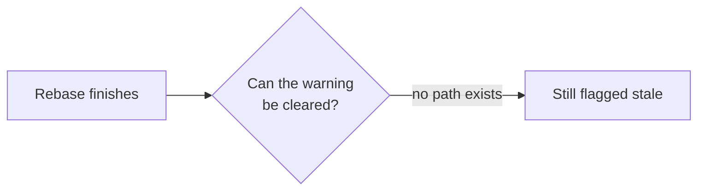

## Writing an issue

A reader must get the problem in about fifteen seconds. How you get them there depends on which of three things you are writing, so pick the shape FIRST — most of the unreadable issue bodies in this tracker are the wrong shape, not bad writing.

| You are writing | Shape | Required |
|---|---|---|
| **One symptom** with one cause — a missing focus ring, a rule to add, a slice already scoped elsewhere | Opening line, then **Evidence** | 2 blocks |
| **A problem** whose cost, spread or mechanism a reader will not guess | The six blocks below | 4 blocks + Evidence |
| **An epic or a design record** — locked decisions, tiers, children | The six blocks below, then a **Decisions** block kept intact | 4 blocks + Decisions + Evidence |

Do not inflate the first shape into the second. A diagram of *"tab to the toggle → no ring appears"* has two nodes and tells the reader nothing the title did not; a *Who it hurts* table with one row is a sentence in a costume. Both make the issue longer and no clearer, which is the one thing this format exists to prevent.

Do not compress the third shape into the second either. In an epic the locked decisions ARE the deliverable, and an agent that re-derives a rejected option has done the work twice. Summarise the problem in the four blocks, then keep every decision, its rejected alternatives and its sequencing under **Decisions**. The four blocks are for the reader deciding whether to care; **Decisions** is for whoever builds it.

The six blocks, in this order. The last two appear only when they earn it.

| Block | Rule |
|---|---|
| **Opening line** | One or two sentences in a blockquote: what is wrong, and what it costs. Plain language — no function, table or file names. |
| **Who it hurts** | A table, at most four rows: *who · what they hit · how often or how wide*. If no row can be filled, this is probably not an issue — check the four gates in `what-is-an-issue`. |
| **Now → wanted** | Exactly one diagram, at most eight nodes. It replaces a paragraph; it never accompanies one. |
| **What to do** | At most six bullets, each an outcome someone can observe. Not function names — and not acceptance criteria, which are decided when the issue RUNS, not when it is filed. |
| **Waiting on a decision** | Only when genuinely blocked. State the question and what each answer costs. |
| **Evidence** | Always last. Every row carries *date · what was measured · source*. If it cannot be measured it is an opinion — cut it. |

### Technical detail is placed, not deleted

`file:line`, column names, SQL, commit hashes, schema fields: these belong in **Evidence**, or in a comment. Never in the first four blocks.

This is a placement rule, not a ban. A verified constraint — *"this table has no `started_at` column"* — cost real work to establish, and whoever builds the thing still needs it. Its problem is standing in the reader's way, not existing.

### Diagrams

A fenced `mermaid` block renders as a diagram in issue descriptions, plans and comments. Prefer it over prose and over ASCII art: it is a few hundred characters, and an agent reading the issue through MCP still understands it as text.

### When mermaid is not enough

Attach a self-contained `.html` file. It renders inline as a sandboxed artifact, in issues and in comments alike.

Do NOT paste that HTML into the description. The description is truncated before it reaches an agent's prompt (8,000 characters by default), and a styled page is large enough on its own to push the real content past that limit — the agent then receives markup and loses the requirements. An attachment sits outside the prompt path, so it costs nothing.

### Comments

Same discipline, shorter. Lead with the outcome, put the trace underneath. A comment is the right home for detail the description should not carry — which is what makes the placement rule above affordable.