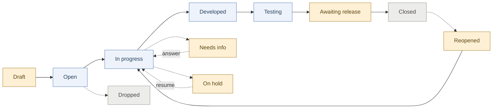

# Read an issue's status

Every issue carries one status. The status answers a single question — **who holds
this work right now** — and from that follows what, if anything, you have to do.

There are only three answers, and the tabs on the Issues list are named after
them: the work is **with an agent**, it **needs you**, or it is **finished**.

## The short version

| Status | Who holds it | What you do |
|---|---|---|
| **Draft** | you | Nothing is running. Open it when you are ready to start it. |
| **Open** | an agent | Nothing. It has been picked up. |
| **In progress** | an agent | Nothing. |
| **Developed**, **Testing** | an agent | Nothing. |
| **Tested** | **you** | Review it for release. It passed its checks and has not been released. |
| **Releasing** | an agent | Nothing. A release carrying it is running; it reads **Closed** once that release finishes. |
| **Needs info** | **you** | **Answer the question.** The work restarts by itself once you do. |
| **On hold** | **you** | **Resume it.** Nothing moves until you do — this is a brake, not a question. |
| **Awaiting release** | **you** | **Release it** with **Release now**, or let the next scheduled release take it — the issue page says which. |
| **Reopened** | **you** | Move it on. Nothing picks a reopened issue up on its own. |
| **Closed** | nobody | Done — see [Tell when an issue is done](?path=what-done-means). |
| **Dropped** | nobody | Decided against. It has no way back — file a new issue instead. |

## How an issue moves

Amber is yours. Blue is the agent's. Grey is over.

The dotted lines are the ones worth knowing: an issue can stop and wait at almost
any point, and it goes back to where it left rather than starting again.

## The three that catch people out

**Needs info and On hold look alike and behave in opposite ways.**
*Needs info* means somebody is asking you something — answer it and the work picks
itself back up. *On hold* means the work was deliberately stopped; answering
nothing restarts it, because there is no question. You resume it by hand.

An issue also lands on hold **whenever a run is cancelled**. That is on purpose:
it parks somewhere nothing will pick up, so a cancel actually stops the work
instead of a fresh run starting seconds later.

**Awaiting release is not finished.** The work is built and verified and is
waiting to be released — by a person choosing **Release now**, or by the next
scheduled release, whichever the issue page names. It sits under *Needs you* on the
Issues list for that reason — counting it as done is how a gate stops being
noticed.

**Reopened does not restart anything by itself.** Reopening an issue puts it back
in your hands, not an agent's. Move it on when you want the work to resume.

## Dropped is final

Dropping an issue records that the work is not going to happen. *Dropped* is its
own ending rather than a kind of close: closing is refused unless the work
shipped, so *Closed* is no way to record something you decided against. There is
no path back out of *Dropped* — if the work turns out to be wanted after all,
file a new issue.
Dropped issues are kept, and appear alongside closed ones under **Finished** on
the Issues list, marked differently: finishing work and deciding against it are
different outcomes and should not read the same.

## While an agent is working

While an agent is running an issue, the fields it writes are read-only: status,
priority, complexity and the description — on the issue page, on the Issues list,
and in the bulk actions for any selection holding one. Each of them says so where
the control was, rather than quietly disappearing. Whatever you set there, the
running agent would write over moments later, and the click would look like it
never landed.

The exception is **Needs info**. An issue there stays editable however busy it is:
answering is the whole point of it, and it is the one pause your answer restarts
by itself.

An issue whose agent is only *queued*, or whose last run *failed*, locks nothing —
nothing is writing it, so there is nothing to lose. A description you had already
opened for editing also keeps its **Save**, so work you have typed is never
discarded out from under you.

## Verify it worked

- Open a project's Issues list. Each tab carries a count, and **Needs you** is the
  one that wants your attention.
- Open an issue at *Needs info*: it shows the question and a box to answer it.
- Open an issue at *On hold*: it shows a resume action and no question.

## Troubleshooting

| Symptom | What is going on |
|---|---|
| An issue sits still and asks nothing | It is probably *On hold* — resume it. On-hold issues never restart on their own. |
| You answered a question and nothing happened | Check the status moved off *Needs info*. If it did not, the answer did not land — answer it again from the issue page. |
| An issue looks finished but never shipped | It is at *Awaiting release*, waiting to be released. The issue page says when. |
| You cannot edit a field | An agent is running the issue and would overwrite what you set. Wait for it to pause or finish — or answer it, if it is at *Needs info*. |
| A dropped issue needs doing after all | File a new issue. Dropped is terminal by design. |

See also [Ask for a change](?path=file-a-request), [Tell when an issue is done](?path=what-done-means)
and [Configure the pipeline & approvals](?path=configure-the-pipeline).
